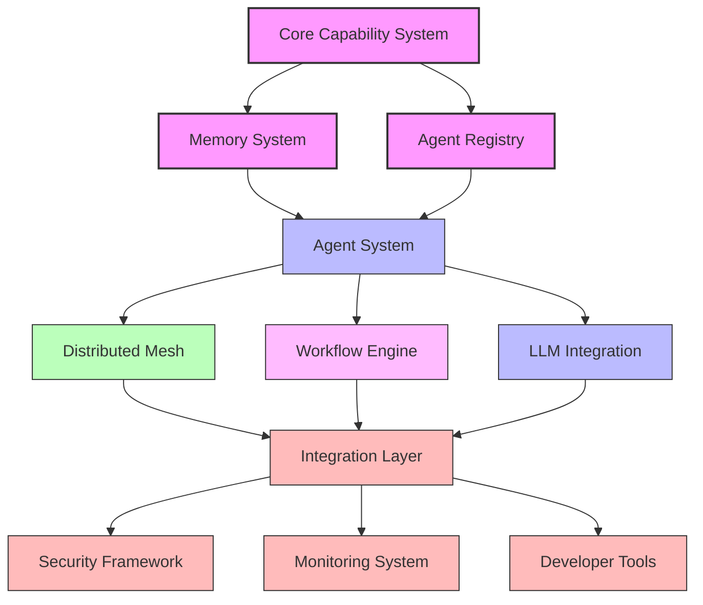

# ZIO Agentic AI Framework V2

[](https://github.com/agentic-ai/zio-agentic-ai/actions)
[](https://github.com/agentic-ai/zio-agentic-ai/releases)
[](LICENSE)
[](https://scala-steward.org)
[](https://zio.dev)

A comprehensive platform for building distributed, autonomous agent systems with Scala 3 and ZIO.

## Table of Contents

- [Introduction](#introduction)
- [Vision & Focus](#vision--focus)
- [Key Features](#key-features)
- [Architecture Overview](#architecture-overview)
- [Module Structure](#module-structure)
- [Getting Started](#getting-started)
- [Usage Patterns](#usage-patterns)
- [Implementation Status](#implementation-status)
- [Contributing](#contributing)
- [License](#license)

## Introduction

Version 2 of the ZIO Agentic AI Framework represents a significant evolution from its predecessor, transforming from a foundational agent library into a comprehensive platform for building sophisticated, distributed multi-agent systems with seamless LLM integration.

This new version embraces a capability-based architecture that enables complex agent composition, robust mesh networking, and sophisticated coordination mechanisms—all while maintaining the functional purity, type safety, and performance that ZIO is known for.

```
 ╭────────────────────────────────────────────────────────────╮
 │                                                            │
 │   ███████╗██╗ ██████╗     █████╗  ██████╗ ███████╗███╗   ██╗████████╗██╗ ██████╗  │
 │   ╚══███╔╝██║██╔═══██╗   ██╔══██╗██╔════╝ ██╔════╝████╗  ██║╚══██╔══╝██║██╔════╝  │
 │     ███╔╝ ██║██║   ██║   ███████║██║  ███╗█████╗  ██╔██╗ ██║   ██║   ██║██║       │
 │    ███╔╝  ██║██║   ██║   ██╔══██║██║   ██║██╔══╝  ██║╚██╗██║   ██║   ██║██║       │
 │   ███████╗██║╚██████╔╝   ██║  ██║╚██████╔╝███████╗██║ ╚████║   ██║   ██║╚██████╗  │
 │   ╚══════╝╚═╝ ╚═════╝    ╚═╝  ╚═╝ ╚═════╝ ╚══════╝╚═╝  ╚═══╝   ╚═╝   ╚═╝ ╚═════╝  │
 │                                                                                    │
 │                     FRAMEWORK VERSION 2                                            │
 ╰────────────────────────────────────────────────────────────╯
```

## Vision & Focus

Version 2 of the framework aims to achieve five key strategic goals:

1. **Enhanced Composability**: Seamlessly compose specialized agents into complex workflows using a capability-based taxonomy
2. **Improved Distributability**: Robust mesh networking for agents across environments with fault-tolerant communication
3. **Advanced LLM Integration**: Deep integration with leading LLM providers with unified interfaces and optimizations
4. **Enterprise Readiness**: Security, monitoring, and performance meeting enterprise requirements
5. **Developer Experience**: Intuitive APIs, comprehensive documentation, and visual debugging tools

## Key Features

### Core Features

- **✅ Capability-Based Agents**: Type-level capability descriptions for agent composition and discovery
- **✅ Multi-Agent Coordination**: Orchestrate complex agent interactions and workflows
- **✅ Distributed Mesh Network**: Connect agents across environments with secure, reliable communication
- **✅ Advanced Memory System**: Efficient, persistent state management with synchronization
- **✅ Workflow Orchestration**: Define and execute complex multi-step agent workflows
- **✅ LLM Integration**: Unified interface for Claude, Vertex AI, and OpenAI providers
- **✅ ZIO-First Architecture**: Built on ZIO for robust functional programming patterns

### Enhanced Version 2 Features

- **🔄 Dynamic Agent Discovery**: Automatically find and utilize agents based on capabilities
- **🔄 Hierarchical Capability System**: Advanced capability inheritance and composition
- **🔄 Compositional Workflow Engine**: Declarative workflow definitions with monitoring
- **🔄 Enhanced Security & Observability**: Comprehensive monitoring, tracing, and security controls
- **🔄 Developer Toolkit**: CLI tools, visual debugging, and comprehensive documentation

### Coming Soon

- **🚧 Visual Workflow Designer**: Graphical interface for designing agent workflows
- **🚧 Dashboard**: Real-time monitoring and control of agent systems
- **🚧 Performance Optimization Engine**: Automatic resource allocation and optimization
- **🚧 Advanced Testing Framework**: Specialized tools for testing multi-agent systems

## Architecture Overview

Version 2 introduces a modular, layered architecture centered around five key components:



### Capability-Based Agent System

The foundation of Version 2 is a capability-based agent system that provides:
- Dynamic agent discovery and composition
- Hierarchical capability inheritance
- Runtime capability verification
- Capability-based access control

### Multi-Agent Systems

Version 2 enables sophisticated agent collaboration through:
- Coordinated goal-directed behavior
- Role-based agent specialization
- Multi-step reasoning pipelines
- Adaptive agent selection based on context

### Distributed Agent Mesh

The enhanced mesh network supports:
- Cross-environment agent communication
- Fault-tolerant message delivery
- Security and access controls
- Optimized resource utilization

### Workflow Orchestration

Complex workflow management is provided through:
- Visual workflow designer
- Declarative workflow definitions
- Monitoring and introspection
- Error handling and recovery

### Memory and State Management

Advanced memory capabilities include:
- Distributed state synchronization
- Memory optimization techniques
- Long-term persistence
- Advanced information retrieval

## Module Structure

The framework is organized into the following modules:

| Module | Description | Status |
|--------|-------------|--------|
| **core** | Core abstractions, capability system, and base utilities | ✅ Enhanced |
| **agents** | Agent implementations and capability-based composition | ✅ Enhanced |
| **memory** | Advanced memory system with distributed synchronization | ✅ Enhanced |
| **mesh** | Mesh networking for distributed agent communication | ✅ Enhanced |
| **workflow** | Workflow engine and composition patterns | ✅ New |
| **http** | HTTP API and service integration | ✅ Enhanced |
| **langchain4j** | Unified LLM provider integration | ✅ Enhanced |
| **dashboard** | Web UI for monitoring and visualization | 🚧 In Progress |
| **tools** | Developer tools and utilities | 🚧 In Progress |
| **examples** | Example applications and patterns | ✅ Enhanced |
| **integration-tests** | Integration tests for the full framework | ✅ Enhanced |

## Getting Started

### Prerequisites

- Java 11 or later
- Scala 3.3.1 or later
- SBT (Scala Build Tool)

### Installation

Add the framework to your `build.sbt`:

```scala
libraryDependencies ++= Seq(
  "com.agentic-ai" %% "agentic-core" % "2.0.0",
  "com.agentic-ai" %% "agentic-agents" % "2.0.0",
  "com.agentic-ai" %% "agentic-memory" % "2.0.0",
  "com.agentic-ai" %% "agentic-mesh" % "2.0.0",
  "com.agentic-ai" %% "agentic-workflow" % "2.0.0",
  "com.agentic-ai" %% "agentic-langchain4j" % "2.0.0"
)
```

### Quick Start Example

Create a simple capability-based agent:

```scala
import com.agenticai.core.capability._
import com.agenticai.agents._
import com.agenticai.workflow._
import zio._

// Define a capability
trait TextAnalysisCapability extends Capability {
  def analyzeSentiment(text: String): Task[SentimentScore]
  def extractKeywords(text: String): Task[List[String]]
}

// Implement an agent with the capability
class TextAnalysisAgent extends BaseAgent with TextAnalysisCapability {
  override def analyzeSentiment(text: String): Task[SentimentScore] = 
    // Implementation
    
  override def extractKeywords(text: String): Task[List[String]] = 
    // Implementation
}

// Register the agent with the registry
val program = for {
  registry <- AgentRegistry.live
  agent = new TextAnalysisAgent()
  _ <- registry.register(agent)
  
  // Find an agent with the required capability
  textAnalyzer <- registry.findByCapability[TextAnalysisCapability]
  
  // Use the agent
  sentiment <- textAnalyzer.analyzeSentiment("I love this framework!")
  keywords <- textAnalyzer.extractKeywords("AI agents with Scala and ZIO")
} yield (sentiment, keywords)

// Run the program
Unsafe.unsafeRun(program)
```

### Building and Testing

```bash
# Compile the project
sbt compile

# Run tests
sbt test

# Run tests with coverage reports
./scripts/run-tests-with-reports.sh --all
```

### Running Examples

```bash
# Run the capability demo
sbt "examples/runMain com.agenticai.examples.CapabilityDemo"

# Run the workflow demo
sbt runWorkflowDemo

# Run the multi-agent collaboration demo
sbt "examples/runMain com.agenticai.examples.MultiAgentDemo"
```

## Usage Patterns

### Capability-Based Agent Composition

```scala
import com.agenticai.core.capability._
import com.agenticai.agents._

// Define capabilities
trait ResearchCapability extends Capability {
  def findInformation(query: String): Task[List[Document]]
}

trait WritingCapability extends Capability {
  def generateText(prompt: String): Task[String]
}

// Create a composed agent that requires both capabilities
val researchWriter = for {
  registry <- AgentRegistry.live
  researcher <- registry.findByCapability[ResearchCapability]
  writer <- registry.findByCapability[WritingCapability]
  
  // Compose the capabilities
  result <- researcher.findInformation("Scala benefits")
    .flatMap(docs => writer.generateText(s"Write about Scala benefits based on: ${docs.mkString}"))
} yield result
```

### Workflow Orchestration

```scala
import com.agenticai.workflow._
import com.agenticai.agents._

// Define a workflow
val researchWorkflow = Workflow.builder
  .addStep("research", "Find information about ZIO", ResearchAction("ZIO benefits"))
  .addStep("summarize", "Summarize the research", SummarizeAction())
  .addStep("format", "Format as markdown", FormatAction("markdown"))
  .withConnection("research", "summarize")
  .withConnection("summarize", "format")
  .build

// Execute the workflow
val result = WorkflowEngine.execute(researchWorkflow)
```

### Distributed Mesh Communication

```scala
import com.agenticai.mesh._
import com.agenticai.agents._

// Create a mesh node
val node = MeshNode.create("node1", "http://localhost:8080")

// Register an agent with the mesh
val agent = new TextAnalysisAgent()
node.registerAgent(agent)

// Connect to another node
node.connect("node2", "http://localhost:8081")

// Send a message to a remote agent
val remoteAgent = node.getRemoteAgent[TextAnalysisCapability]("node2", "textAnalyzer")
val result = remoteAgent.analyzeSentiment("This is amazing!")
```

### Memory Management

```scala
import com.agenticai.memory._
import com.agenticai.core._

// Create a distributed memory cell
val memorySystem = DistributedMemorySystem.create("mySystem")
val cell = memorySystem.createCell[String]("greeting", "Hello, World!")

// Read and update the cell
val program = for {
  value <- cell.read
  _ <- cell.update(current => s"$current Updated!")
  newValue <- cell.read
} yield (value, newValue)
```

## Implementation Status

| Feature | Status | Description |
|---------|--------|-------------|
| Capability Registry | ✅ Complete | Core capability system and registry |
| Memory System | ✅ Complete | Enhanced memory with distributed support |
| Agent Directory | ✅ Complete | Service for agent discovery and registration |
| Multi-Agent Coordination | ✅ Complete | Orchestration of agent collaborations |
| Mesh Network | ✅ Complete | Distributed agent communication |
| Workflow Engine | ✅ Complete | Definition and execution of agent workflows |
| LLM Integration | ✅ Complete | Unified provider interface for LLMs |
| Dashboard UI | 🚧 In Progress | Web interface for monitoring and control |
| Developer Tools | 🚧 In Progress | Tools and utilities for developers |
| Visual Workflow Designer | 🚧 In Progress | Graphical workflow design interface |
| Performance Optimization | 🔮 Planned | Automatic resource optimization |
| Advanced Security Framework | 🔮 Planned | Enhanced security controls |

## Contributing

Contributions to the ZIO Agentic AI Framework are welcome! Please see our [Contributing Guide](CONTRIBUTING.md) for details on how to get involved.

## License

MIT License - see the [LICENSE](LICENSE) file for details.
