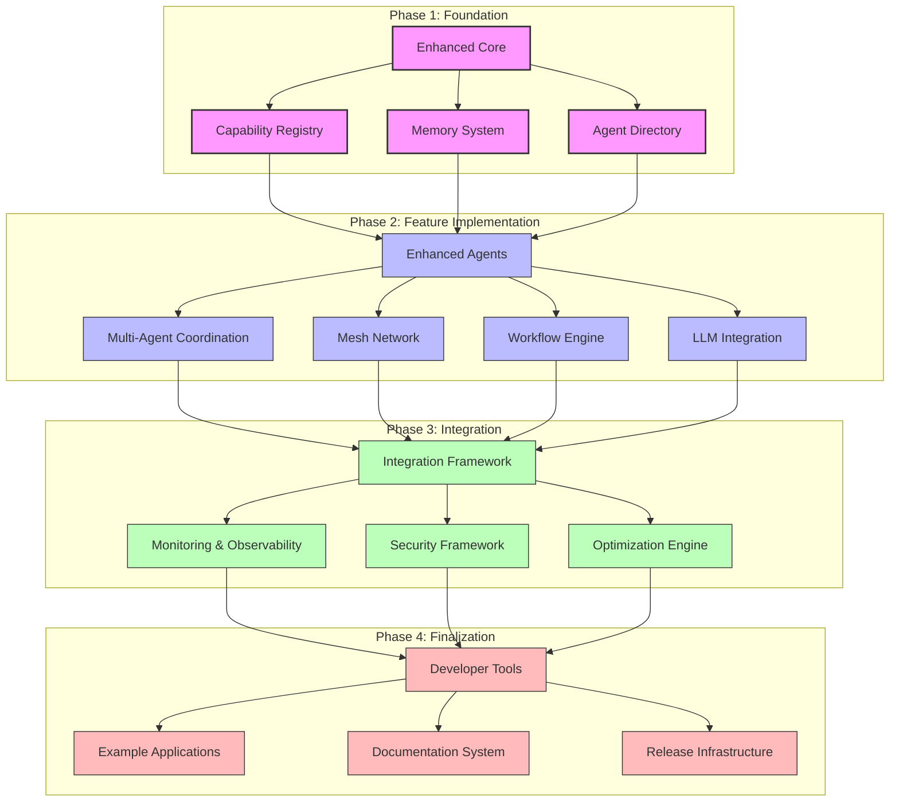

# ZIO Agentic AI Framework Version 2 Roadmap

**Version:** 1.0.0  
**Date:** April 19, 2025  
**Author:** ZIO Agentic AI Framework Team  

## Table of Contents

1. [Vision and Strategy](#vision-and-strategy)
2. [Key Focus Areas](#key-focus-areas)
3. [Phased Implementation Plan](#phased-implementation-plan)
   - [Phase 1: Foundation (2 months)](#phase-1-foundation-2-months)
   - [Phase 2: Feature Implementation (3 months)](#phase-2-feature-implementation-3-months)
   - [Phase 3: Integration and Refinement (2 months)](#phase-3-integration-and-refinement-2-months)
   - [Phase 4: Documentation and Finalization (1 month)](#phase-4-documentation-and-finalization-1-month)
4. [Component Dependencies](#component-dependencies)
5. [Success Criteria](#success-criteria)
6. [Risk Management](#risk-management)

## Vision and Strategy

ZIO Agentic AI Framework Version 2 aims to transform the framework into a comprehensive platform for building distributed, autonomous agent systems based on modern Scala 3 and ZIO principles. Version 2 will expand on the foundational work of the initial release by delivering a fully-featured capability-based agent composition system, enhanced agent mesh networking, and sophisticated multi-agent coordination mechanisms.

The key strategic goals for Version 2 are:

1. **Enhanced Composability**: Enable seamless composition of specialized agents into complex workflows
2. **Improved Distributability**: Provide robust mesh networking for agents across different environments
3. **Advanced LLM Integration**: Deepen integration with leading LLM providers (Claude, Vertex AI, OpenAI)
4. **Enterprise Readiness**: Ensure security, monitoring, and performance meet enterprise requirements
5. **Developer Experience**: Create intuitive APIs, comprehensive documentation, and visual debugging tools

This roadmap outlines the execution plan to achieve these goals through a phased approach over an 8-month timeframe.

## Key Focus Areas

Version 2 development focuses on the following key areas:

### 1. Capability-Based Agent System
Building on the capability taxonomy foundation, expanding to provide:
- Dynamic agent discovery and composition
- Hierarchical capability inheritance
- Runtime capability verification
- Capability-based access control

### 2. Multi-Agent Systems
Enabling sophisticated agent collaboration through:
- Coordinated goal-directed behavior
- Role-based agent specialization
- Multi-step reasoning pipelines
- Adaptive agent selection based on context

### 3. Distributed Agent Mesh
Enhancing the mesh network to support:
- Cross-environment agent communication
- Fault-tolerant message delivery
- Security and access controls
- Optimized resource utilization

### 4. Workflow Orchestration
Providing tools for complex workflow management:
- Visual workflow designer
- Declarative workflow definitions
- Monitoring and introspection
- Error handling and recovery

### 5. Memory and State Management
Advancing memory capabilities with:
- Distributed state synchronization
- Memory optimization techniques
- Long-term persistence
- Information retrieval

### 6. Testing and Verification
Strengthening testing infrastructure for:
- Agent behavior validation
- Multi-agent interaction testing
- Performance benchmarking
- Property-based testing for agent properties

## Phased Implementation Plan

### Phase 1: Foundation (2 months)

**Focus:** Establish the core architecture and abstractions for Version 2

#### Components to Develop:
1. **Enhanced Core Module**
   - Refined agent interfaces and abstractions
   - Advanced effect handling with ZIO 2.x
   - Type-level agent composition patterns
   - Capability type system foundations

2. **Capability Registry System**
   - Capability taxonomy implementation
   - Capability discovery mechanisms
   - Capability validation and verification
   - Capability extension patterns

3. **Memory System Enhancements**
   - Memory cell composition enhancements
   - Bit-packed memory optimization
   - Memory compression strategies
   - Distributed memory primitives

4. **Agent Directory Service**
   - Agent registration and discovery
   - Capability-based agent queries
   - Versioning and compatibility
   - Runtime agent metadata

#### Core Abstractions:
- `CapabilityDescriptor` - Type-level representation of agent capabilities
- `AgentComposer` - Functional agent composition patterns
- `AgentRegistry` - Centralized agent discovery service
- `EnhancedMemoryCell` - Next-generation memory primitives

#### External Integration Points:
- ZIO 2.x ecosystem integration
- Prepare interfaces for LLM provider integration
- Initial containerization support
- Base metrics collection interfaces

#### Testing Requirements:
- Core model unit tests
- Property-based tests for capability system
- Memory system correctness tests
- Agent composition verification tests

#### Documentation Deliverables:
- Version 2 Architecture Overview
- Core Abstraction Documentation
- Memory System Design Document
- Capability System Specification

### Phase 2: Feature Implementation (3 months)

**Focus:** Implement primary features and expand capabilities

#### Components to Develop:
1. **Enhanced Agents Module**
   - Capability-based agent implementations
   - Specialized agent templates
   - Compositional agent patterns
   - Agent lifecycle management

2. **Multi-Agent Coordination System**
   - Agent collaboration protocols
   - Goal decomposition mechanisms
   - Task distribution strategies
   - Result aggregation patterns

3. **Mesh Network Layer**
   - Agent discovery across environments
   - Secure message passing
   - Reliable delivery guarantees
   - Resource-aware routing

4. **Workflow Engine**
   - Workflow definition DSL
   - Execution planning
   - State management
   - Error handling and recovery

5. **LLM Integration Enhancements**
   - Unified LLM provider interface
   - Context management optimizations
   - Response streaming improvements
   - Tool use and function calling

#### Core Abstractions:
- `MultiAgentCoordinator` - Orchestration of agent groups
- `MeshNode` - Distributed communication endpoint
- `WorkflowDefinition` - Declarative workflow specification
- `EnhancedLLMService` - Comprehensive LLM integration

#### External Integration Points:
- Claude API integration
- VertexAI integration
- OpenAI integration
- Database persistence options
- Metrics reporting systems

#### Testing Requirements:
- Agent interaction tests
- Multi-agent collaboration scenarios
- Mesh communication tests
- Workflow execution validation
- LLM integration tests
- Performance benchmarks for key components

#### Documentation Deliverables:
- Agent Development Guide
- Multi-Agent System Design Pattern Catalog
- Mesh Network Architecture Document
- Workflow Engine Documentation
- LLM Integration Guide

### Phase 3: Integration and Refinement (2 months)

**Focus:** Integrate components, optimize performance, and enhance reliability

#### Components to Develop:
1. **Integration Framework**
   - Component interoperability layers
   - System-wide configuration
   - Environment abstraction
   - Resource management

2. **Monitoring and Observability**
   - Agent activity tracking
   - Performance metrics collection
   - Tracing infrastructure
   - Visualization components

3. **Security Framework**
   - Authentication and authorization
   - Capability-based access control
   - Data protection
   - Secure communication

4. **Optimization Engine**
   - Performance profiling
   - Resource allocation
   - Caching strategies
   - Execution planning

#### Core Abstractions:
- `SystemIntegrator` - Component lifecycle and wiring
- `MonitoringFacade` - Consolidated observability
- `SecurityManager` - Centralized security controls
- `OptimizationService` - Performance enhancement service

#### External Integration Points:
- Monitoring systems (Prometheus, etc.)
- Logging aggregators
- Security infrastructure
- CI/CD pipeline integration
- Cloud platform integrations

#### Testing Requirements:
- Integration test suite
- Performance regression tests
- Security validation tests
- Stress and load testing
- Chaos engineering tests
- Cross-component interaction tests

#### Documentation Deliverables:
- System Integration Guide
- Security Best Practices
- Performance Optimization Handbook
- Troubleshooting Guide
- Deployment Patterns

### Phase 4: Documentation and Finalization (1 month)

**Focus:** Comprehensive documentation, developer experience, and release preparation

#### Components to Develop:
1. **Developer Tools**
   - CLI utilities
   - Visual debugging tools
   - Code generators
   - Project templates

2. **Example Applications**
   - Reference implementations
   - Showcases for common patterns
   - Benchmark applications
   - Integration demonstrations

3. **Documentation System**
   - API documentation
   - Interactive tutorials
   - Architecture diagrams
   - Best practice guides

4. **Release Infrastructure**
   - Release automation
   - Version management
   - Dependency validation
   - Compatibility verification

#### Core Abstractions:
- `DeveloperToolkit` - Comprehensive development utilities
- `ExampleFactory` - Pattern-based example generation
- `DocumentationRegistry` - Centralized documentation access
- `ReleaseManager` - Release process orchestration

#### External Integration Points:
- Documentation hosting platforms
- Package repositories
- Developer IDE integrations
- Community platforms

#### Testing Requirements:
- Example application validation
- Documentation accuracy tests
- Installation and setup verification
- Cross-platform compatibility tests
- Backward compatibility tests

#### Documentation Deliverables:
- Comprehensive API Reference
- Architecture Guide
- Tutorial Collection
- Migration Guide from Version 1
- Contribution Guide
- Video Demonstrations
- Pattern Library

## Component Dependencies

The following diagram illustrates the dependencies between major components in Version 2:

## Success Criteria

The success of ZIO Agentic AI Framework Version 2 will be measured against the following criteria:

### 1. Functional Criteria
- **Agent Composition**: Seamless composition of at least 10 different agent types
- **Mesh Network**: Successful communication between agents across at least 3 different environments
- **Workflow Engine**: Support for at least 5 complex workflow patterns
- **LLM Integration**: Unified support for at least 3 major LLM providers
- **Memory System**: Efficient state management with at least 30% improvement in memory usage

### 2. Performance Criteria
- **Response Time**: <100ms for 95th percentile of agent operations
- **Throughput**: >1000 agent operations per second on reference hardware
- **Memory Usage**: <1GB memory footprint for standard agent deployments
- **Network Efficiency**: <5KB overhead per agent message
- **Scalability**: Linear scaling to at least 100 concurrent agents

### 3. Quality Criteria
- **Test Coverage**: >90% line coverage for all modules
- **Documentation**: 100% coverage of public APIs
- **Cross-platform**: Compatibility with at least 3 major platforms
- **Error Handling**: Proper error recovery in >95% of failure scenarios
- **Security**: No critical vulnerabilities in security assessments

### 4. Adoption Criteria
- **Developer Experience**: <30 minutes from installation to first working agent
- **Examples**: At least 10 comprehensive example applications
- **Migration**: Clear migration path from Version 1 with automated tools
- **Community**: Active engagement with early adopters
- **Feedback**: Positive usability ratings from >80% of early adopters

## Risk Management

| Risk | Impact | Likelihood | Mitigation |
|------|--------|------------|------------|
| Integration complexity between components | High | Medium | Implement clear interfaces, incremental integration, comprehensive testing |
| Performance bottlenecks in distributed operations | High | Medium | Early performance testing, profiling, optimization opportunities identified per component |
| LLM provider API changes | Medium | High | Abstract provider interfaces, versioned adaptors, degradation strategies |
| Scope creep in feature implementation | Medium | High | Clear acceptance criteria, regular milestone reviews, prioritization framework |
| Compatibility issues with ZIO ecosystem | High | Low | Early integration testing, close monitoring of ZIO releases, contingency planning |
| Resource constraints for development | Medium | Medium | Modular development approach, prioritized feature delivery, community contributions |
| Security vulnerabilities in distributed agents | High | Medium | Security-first design, regular security reviews, threat modeling |
| Adoption barriers due to complexity | Medium | Medium | Focus on developer experience, comprehensive documentation, incremental complexity |