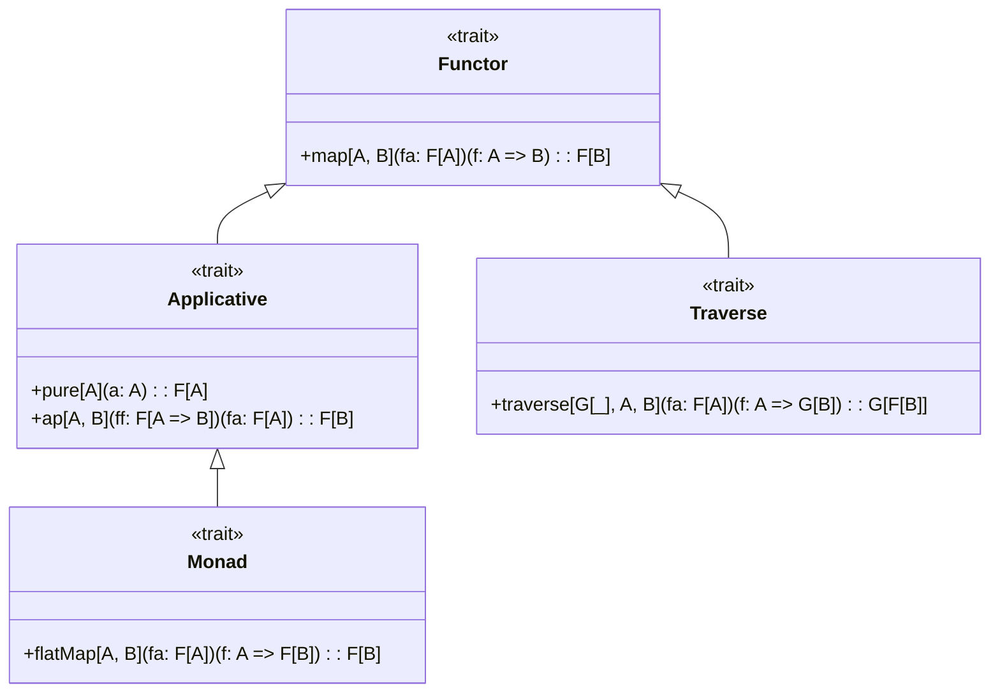

# ZIO Agentic AI Framework Core Module API

**Version:** 1.0.0  
**Last Updated:** April 19, 2025  
**Author:** ZIO Agentic AI Framework Team  

## Table of Contents

1. [Overview](#overview)
2. [Main Types](#main-types)
3. [Core Functions](#core-functions)
4. [Data Structures](#data-structures)
5. [Effect System Integration](#effect-system-integration)
6. [Configuration](#configuration)
7. [Error Handling](#error-handling)
8. [Extension Points](#extension-points)
9. [Best Practices](#best-practices)
10. [Version History](#version-history)

## Overview

The Core module provides the foundational data structures, type classes, and utilities that underpin the entire ZIO Agentic AI Framework. It establishes the baseline abstractions and patterns used throughout the system, with a focus on type safety, functional purity, and composability.

## Main Types

### Effect Types

```scala
// The core effect type for all ZIO Agentic AI Framework operations
type RIO[R, A] = ZIO[R, Throwable, A]

// Effect with logging capability
type RIOL[R, A] = ZIO[R with Logging, Throwable, A]

// Effect with both logging and configuration
type RIOLC[R, A] = ZIO[R with Logging with Configuration, Throwable, A]
```

### Type Classes



### Data Types

```scala
// Immutable data carrier with strongly typed fields
final case class Entity[A](
  id: EntityId,
  data: A,
  metadata: Metadata,
  timestamp: Instant
)

// Strongly typed identifier 
final case class EntityId(value: String) extends AnyVal

// Type-safe metadata container
final case class Metadata(values: Map[String, String]) {
  def get(key: String): Option[String] = values.get(key)
  def add(key: String, value: String): Metadata = copy(values = values + (key -> value))
}
```

## Core Functions

### Entity Management

```scala
// Core entity operations
object EntityOps {
  // Create a new entity with the given data
  def create[A](data: A): RIO[Any, Entity[A]]

  // Retrieve an entity by ID
  def get[A](id: EntityId): RIO[Any, Option[Entity[A]]]
  
  // Update an entity's data
  def update[A](entity: Entity[A], newData: A): RIO[Any, Entity[A]]
  
  // Delete an entity
  def delete[A](id: EntityId): RIO[Any, Boolean]
}
```

### Time Operations

```scala
// Time-related utilities
object TimeOps {
  // Get the current time
  def now(): RIO[Any, Instant]
  
  // Calculate the duration between two instants
  def duration(start: Instant, end: Instant): Duration
  
  // Schedule an operation to run at a specific time
  def scheduleAt[R, A](instant: Instant, zio: RIO[R, A]): RIO[R with Clock, A]
}
```

### Validation

```scala
// Validation utilities
object ValidationOps {
  // Validate a value against a set of predicates
  def validate[A](value: A, predicates: (A => Boolean)*): Either[List[String], A]
  
  // Apply validation and convert to ZIO effect
  def validateEffect[A](value: A, predicates: (A => Boolean)*): 
    RIO[Any, A]
}
```

## Data Structures

### Persistent Data Structures

The Core module provides several highly optimized immutable data structures:

```scala
// Immutable vector optimized for fast indexed access
final class IVector[+A] {
  def apply(i: Int): A
  def updated[B >: A](i: Int, b: B): IVector[B]
  def appended[B >: A](b: B): IVector[B]
  def map[B](f: A => B): IVector[B]
}

// Immutable hash map with structural sharing
final class HashMap[K, +V] {
  def get(k: K): Option[V]
  def put[V1 >: V](k: K, v: V1): HashMap[K, V1]
  def remove(k: K): HashMap[K, V]
}

// Persistent queue with efficient enqueue/dequeue operations
final class Queue[+A] {
  def enqueue[B >: A](b: B): Queue[B]
  def dequeue: Option[(A, Queue[A])]
  def isEmpty: Boolean
}
```

### Streams

```scala
// Streaming abstraction
final class Stream[+A] {
  def map[B](f: A => B): Stream[B]
  def flatMap[B](f: A => Stream[B]): Stream[B]
  def filter(p: A => Boolean): Stream[A]
  def fold[B](z: B)(f: (B, A) => B): RIO[Any, B]
}

object Stream {
  // Create a stream from elements
  def apply[A](as: A*): Stream[A]
  
  // Create an empty stream
  def empty[A]: Stream[A]
  
  // Create an infinite stream from a function
  def unfold[S, A](s: S)(f: S => Option[(A, S)]): Stream[A]
}
```

## Effect System Integration

The Core module provides deep integration with ZIO, establishing patterns for effectful programming:

### Layer Management

```scala
// Type alias for ZIO layers
type RLayer[-RIn, +ROut] = ZLayer[RIn, Throwable, ROut]

// Common layer composition patterns
object Layers {
  // Create a layer from an effect that acquires a resource
  def fromEffect[R, A](effect: RIO[R, A]): RLayer[R, A]
  
  // Create a layer that manages a resource
  def fromManaged[R, A](managed: ZManaged[R, Throwable, A]): RLayer[R, A]
  
  // Combine layers horizontally
  def combine[R1, R2, A, B](l1: RLayer[R1, A], l2: RLayer[R2, B]): RLayer[R1 with R2, A with B]
}
```

### Effect Composition

```scala
// Effect composition utilities
object Effects {
  // Run effects in parallel
  def parallel[R, A](effects: RIO[R, A]*): RIO[R, List[A]]
  
  // Run effects sequentially
  def sequential[R, A](effects: RIO[R, A]*): RIO[R, List[A]]
  
  // Run effect with timeout
  def timeout[R, A](effect: RIO[R, A], duration: Duration): RIO[R with Clock, Option[A]]
  
  // Retry an effect with backoff strategy
  def retry[R, A](effect: RIO[R, A], policy: Schedule[R, Throwable, Any]): RIO[R, A]
}
```

## Configuration

The Core module provides a type-safe configuration system:

```scala
// Configuration descriptor
trait ConfigDescriptor[A] {
  def from(source: ConfigSource): RIO[Any, A]
}

// Type-safe configuration
object Config {
  // Create string config
  def string(path: String): ConfigDescriptor[String]
  
  // Create int config
  def int(path: String): ConfigDescriptor[Int]
  
  // Create boolean config
  def boolean(path: String): ConfigDescriptor[Boolean]
  
  // Create nested config
  def nested[A](path: String)(descriptor: ConfigDescriptor[A]): ConfigDescriptor[A]
  
  // Create optional config
  def optional[A](descriptor: ConfigDescriptor[A]): ConfigDescriptor[Option[A]]
  
  // Create config with default value
  def withDefault[A](descriptor: ConfigDescriptor[A], default: A): ConfigDescriptor[A]
}

// Configuration sources
object ConfigSource {
  // Load from environment variables
  def fromEnv: ConfigSource
  
  // Load from system properties
  def fromProperties: ConfigSource
  
  // Load from HOCON config file
  def fromHoconFile(path: String): ConfigSource
  
  // Combine multiple sources with priority
  def fromSources(sources: ConfigSource*): ConfigSource
}
```

## Error Handling

The Core module provides a structured approach to error handling:

### Error Types

```scala
// Base error trait for all ROO errors
sealed trait RooError extends Throwable {
  // Get the error code
  def code: String
  
  // Get the error message
  def message: String
  
  // Get the cause (if any)
  def cause: Option[Throwable]
}

// Validation error
final case class ValidationError(
  field: String,
  message: String,
  code: String = "VALIDATION_ERROR"
) extends RooError

// Resource not found error
final case class NotFoundError(
  resource: String,
  id: String,
  code: String = "NOT_FOUND_ERROR"
) extends RooError

// Configuration error
final case class ConfigurationError(
  path: String,
  message: String,
  code: String = "CONFIGURATION_ERROR"
) extends RooError
```

### Error Handling Functions

```scala
// Error handling utilities
object ErrorHandlers {
  // Convert exceptions to domain errors
  def mapException[A](zio: Task[A])(f: Throwable => RooError): RIO[Any, A]
  
  // Handle specific error type
  def handleError[R, E <: RooError, A](zio: ZIO[R, E, A])(f: E => A): RIO[R, A]
  
  // Retry on specific error
  def retryOnError[R, E <: RooError, A](zio: ZIO[R, E, A], maxRetries: Int): ZIO[R, E, A]
  
  // Log and rethrow error
  def logError[R, E <: RooError, A](zio: ZIO[R, E, A]): ZIO[R with Logging, E, A]
}
```

## Extension Points

The Core module provides several extension points that can be leveraged by other modules:

### Type Class Instances

```scala
// Define custom type class instances
trait TypeClassDerivation[TC[_]] {
  // Derive a type class instance for a given type
  def derive[A](implicit schema: Schema[A]): TC[A]
}

// Register custom type class instances
object TypeClassRegistry {
  def register[TC[_], A](instance: TC[A]): Unit
  def get[TC[_], A]: Option[TC[A]]
}
```

### Custom Data Types

```scala
// Create custom data type
trait DataTypeExtension[A] {
  // Provide custom serialization
  def serialize(a: A): Array[Byte]
  
  // Provide custom deserialization
  def deserialize(bytes: Array[Byte]): Either[Throwable, A]
  
  // Register the extension
  def register(): Unit
}
```

### Custom Effect Transformers

```scala
// Define custom effect transformer
trait EffectTransformer[R, E, A] {
  // Transform an effect
  def transform[R1, E1, A1](zio: ZIO[R, E, A]): ZIO[R1, E1, A1]
}

// Register custom effect transformer
object EffectTransformers {
  def register[R, E, A](transformer: EffectTransformer[R, E, A]): Unit
  def get[R, E, A]: List[EffectTransformer[R, E, A]]
}
```

## Best Practices

### Functional Style

1. **Prefer Immutability**:
   ```scala
   // Prefer immutable data
   val data = Map("key" -> "value")
   
   // Instead of mutation
   var mutableData = Map.empty[String, String]
   mutableData += ("key" -> "value")
   ```

2. **Use Typeclasses for Polymorphism**:
   ```scala
   // Define behavior via typeclasses
   trait Encoder[A] {
     def encode(a: A): String
   }
   
   // Provide instances
   given Encoder[Int] = new Encoder[Int] {
     def encode(i: Int): String = i.toString
   }
   
   // Use it
   def encodeValue[A](a: A)(using encoder: Encoder[A]): String = encoder.encode(a)
   ```

3. **Leverage Pure Functions**:
   ```scala
   // Pure function
   def addOne(x: Int): Int = x + 1
   
   // Instead of
   var counter = 0
   def incrementCounter(): Unit = { counter += 1 }
   ```

### Error Handling

1. **Use ZIO for Error Handling**:
   ```scala
   // ZIO-based error handling
   val safeOperation: RIO[Any, Result] = 
     ZIO.attempt(riskyOperation())
       .mapError(ex => OperationError(ex.getMessage))
       .tap(result => ZIO.logInfo(s"Operation succeeded with $result"))
       .tapError(error => ZIO.logError(s"Operation failed with $error"))
   ```

2. **Avoid Exceptions for Control Flow**:
   ```scala
   // Prefer Option/Either
   def findUser(id: UserId): Option[User]
   
   // Instead of
   def findUser(id: UserId): User
   ```

3. **Provide Meaningful Errors**:
   ```scala
   // Detailed error
   final case class ValidationError(
     field: String,
     reason: String,
     suggestion: Option[String]
   ) extends RooError
   ```

### Resource Management

1. **Use ZIO's Resource Management**:
   ```scala
   // Safe resource handling
   ZIO.acquireReleaseWith(
     acquire = openFile(path),
     release = file => ZIO.succeed(file.close()),
     use = file => readData(file)
   )
   ```

2. **Prefer Explicit Dependencies**:
   ```scala
   // Explicit dependencies
   def processData[R <: Database](data: Data): ZIO[R, ProcessingError, Result]
   
   // Instead of
   def processData(data: Data): ZIO[Any, ProcessingError, Result] = {
     DatabaseService.getInstance.flatMap { db =>
       // Use db
     }
   }
   ```

## Version History

### 1.0.0 (Current)

Initial stable release with the following features:
- Core data structures
- ZIO integration
- Type-safe configuration
- Structured error handling
- Extension points for other modules

### 0.9.0 (Beta)

- Added comprehensive error handling
- Added configuration system
- Improved type class derivation

### 0.5.0 (Alpha)

- Initial implementation of core data structures
- Basic ZIO integration
- Experimental typeclasses