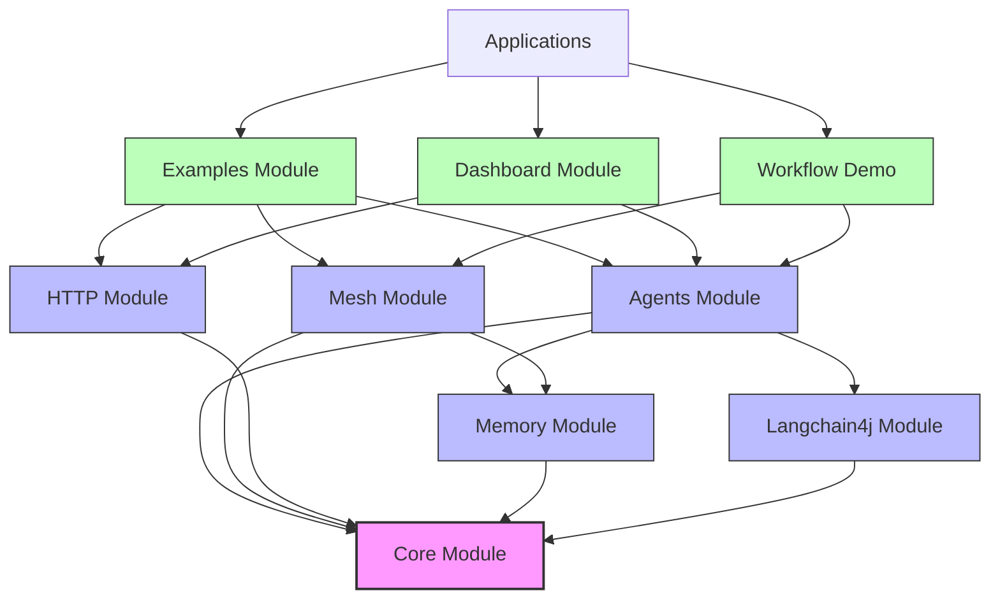
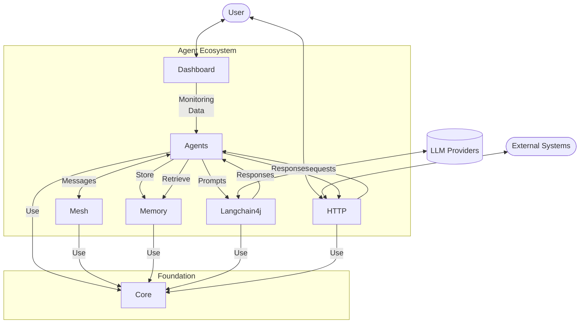
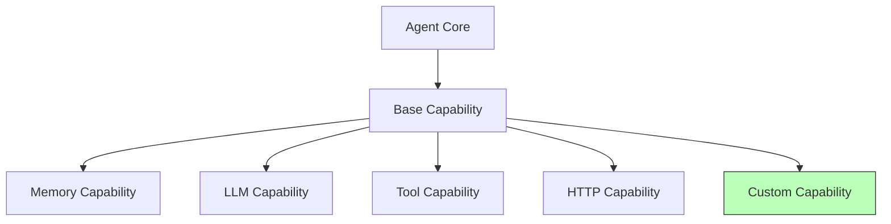
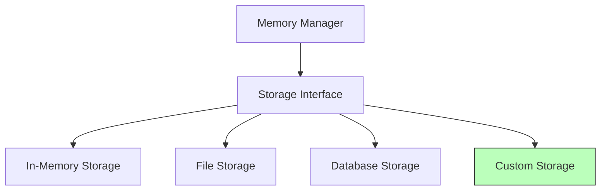
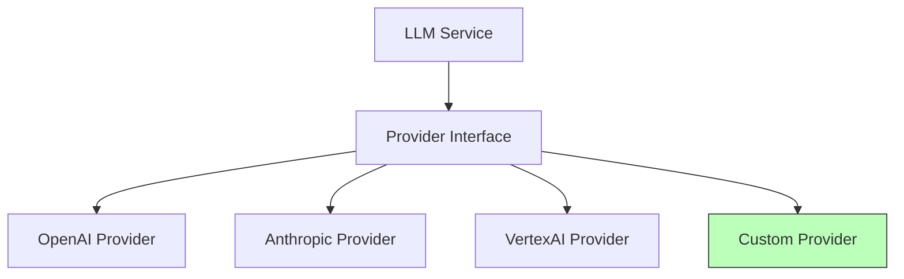
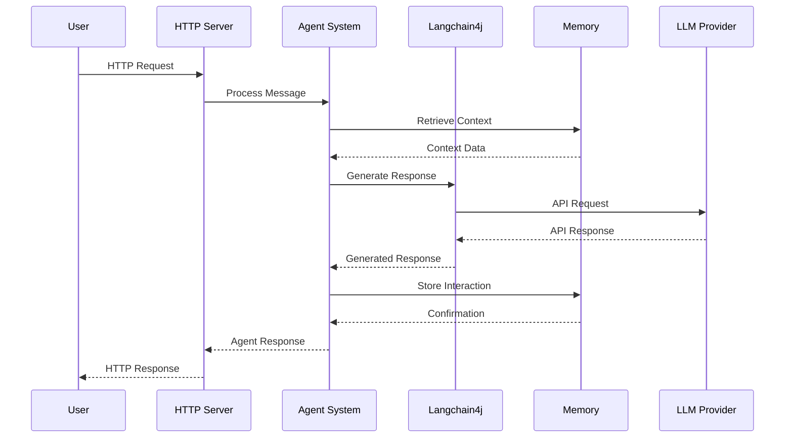

# ZIO Agentic AI Framework Component Relationships

**Version:** 1.0.0  
**Last Updated:** April 19, 2025  
**Author:** ZIO Agentic AI Framework Team  

## Table of Contents

1. [Overview](#overview)
2. [High-Level Architecture](#high-level-architecture)
3. [Module Dependencies](#module-dependencies)
4. [Data Flow](#data-flow)
5. [Communication Patterns](#communication-patterns)
6. [Extension Points](#extension-points)
7. [Runtime Interactions](#runtime-interactions)

## Overview

This document describes the relationships between components in the ZIO Agentic AI Framework, including dependencies, data flows, and communication patterns. Understanding these relationships is essential for both users and contributors to effectively work with the framework.

## High-Level Architecture

The ZIO Agentic AI Framework is organized into a layered architecture with clear separation of concerns:



**Legend:**
- Core components (pink)
- Supporting infrastructure (blue)
- Optional modules (green)

## Module Dependencies

The following table shows the direct dependencies between modules:

| Module | Depends On | Purpose |
|--------|------------|---------|
| Core | None | Foundational data structures and utilities |
| Memory | Core | Persistent and temporary storage capabilities |
| Langchain4j | Core | LLM integration and API wrappers |
| Agents | Core, Memory, Langchain4j | Agent capabilities and lifecycle |
| Mesh | Core, Memory | Distributed agent communication |
| HTTP | Core | HTTP server and client capabilities |
| Examples | Agents, Mesh, HTTP | Demonstration of framework features |
| Dashboard | Agents, HTTP | Web UI for agent monitoring |
| Workflow Demo | Agents, Mesh | Working implementation of workflow system |

## Data Flow

The following diagram illustrates the primary data flows between components:



## Communication Patterns

ZIO Agentic AI Framework components communicate using several patterns:

### 1. Direct Method Calls

For in-process communication, components use direct method calls wrapped in ZIO effects:

```scala
// Example: Agent using Memory
for {
  memory <- memoryService
  storedData <- memory.retrieve("key")
  result <- processData(storedData)
} yield result
```

### 2. Message Passing

For distributed communication, components use the Mesh module's message passing system:

```scala
// Example: Agent sending message to another agent
for {
  mesh <- meshService
  response <- mesh.sendMessage(destinationAgent, message)
} yield response
```

### 3. Event-Based Communication

For loose coupling, components can publish and subscribe to events:

```scala
// Example: Publishing an event
for {
  _ <- eventBus.publish(AgentStartedEvent(agentId))
} yield ()

// Example: Subscribing to events
val subscription = eventBus.subscribe(AgentEvents.Started).foreach { event =>
  logAgentStarted(event.agentId)
}
```

### 4. HTTP Communication

For external systems, components use the HTTP module:

```scala
// Example: HTTP endpoint receiving external request
val route = Routes.post("/agent/:id") { (req, params) =>
  for {
    agentId <- ZIO.succeed(params("id"))
    message <- req.body.asString
    response <- agentService.processMessage(agentId, message)
  } yield Response.json(response)
}
```

## Extension Points

ZIO Agentic AI Framework provides several extension points for customization:

### 1. Agent Capabilities

The capability system allows extending agent functionality:



### 2. Memory Storage Backends

The Memory module supports pluggable storage backends:



### 3. LLM Providers

The Langchain4j module supports multiple LLM providers:



## Runtime Interactions

The following sequence diagram illustrates a typical runtime interaction between components:



This sequence shows:

1. A user sends a request to the HTTP server
2. The HTTP server forwards the message to the appropriate agent
3. The agent retrieves context from memory
4. The agent uses Langchain4j to generate a response via an LLM provider
5. The agent stores the interaction in memory
6. The response is sent back through the HTTP server to the user

These interactions demonstrate the modular nature of the ROO framework, with clear boundaries between components and well-defined communication patterns.