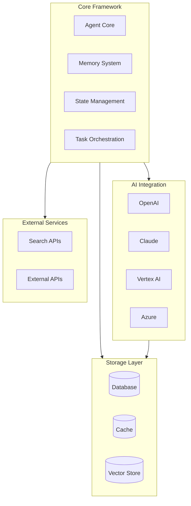
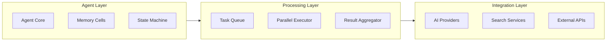
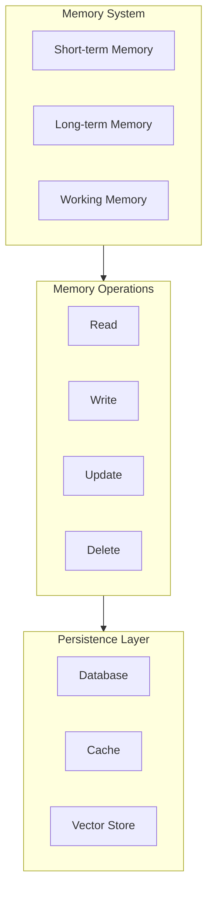

# Agentic AI Framework Architecture

## Overview

The Agentic AI Framework is a modern, type-safe, and composable framework for building sophisticated AI agents using Scala, ZIO, and functional programming principles. It provides a robust foundation for building resilient, parallel, and memory-aware AI systems.

## Core Principles

1. **Type Safety & Functional Programming**
   - Leverage Scala's type system for compile-time guarantees
   - Use category theory concepts (Monads, Applicatives, etc.)
   - Pure functional transformations

2. **Concurrency & Parallelism**
   - ZIO-based concurrency model
   - Parallel processing of multiple information streams
   - Non-blocking operations

3. **Resilience & Fault Tolerance**
   - Circuit breakers for external service calls
   - Retry mechanisms with exponential backoff
   - Graceful degradation

4. **Memory Management**
   - Cell-based memory architecture
   - Memory persistence and retrieval
   - Memory optimization strategies

## System Architecture



## Component Architecture



## Memory Architecture



## Development Roadmap

### Phase 1: Core Framework Enhancement
- [ ] Implement ZIO-based memory cell system
- [ ] Add parallel processing capabilities
- [ ] Implement state management with ZIO Ref
- [ ] Add circuit breaker patterns

### Phase 2: AI Integration
- [ ] OpenAI API integration
- [ ] Claude API integration
- [ ] Vertex AI integration
- [ ] Azure AI integration

### Phase 3: Search Integration
- [ ] Azure Search integration
- [ ] Vector search capabilities
- [ ] Hybrid search implementation

### Phase 4: Advanced Features
- [ ] Memory persistence
- [ ] Agent composition
- [ ] Task orchestration
- [ ] Monitoring and metrics

### Phase 5: Production Readiness
- [ ] Performance optimization
- [ ] Security hardening
- [ ] Documentation
- [ ] Testing suite

## Implementation Details

### Memory Cell System
```scala
trait MemoryCell[A] {
  def read: ZIO[Any, Throwable, A]
  def write(a: A): ZIO[Any, Throwable, Unit]
  def update(f: A => A): ZIO[Any, Throwable, Unit]
}
```

### Parallel Processing
```scala
trait ParallelProcessor[A, B] {
  def process(items: List[A]): ZIO[Any, Throwable, List[B]]
  def processWithTimeout(items: List[A], timeout: Duration): ZIO[Any, Throwable, List[B]]
}
```

### AI Provider Integration
```scala
trait AIProvider[A, B] {
  def generate(prompt: A): ZIO[Any, Throwable, B]
  def stream(prompt: A): ZStream[Any, Throwable, B]
}
```

## Best Practices

1. **Type Safety**
   - Use refined types for validation
   - Leverage type classes for abstraction
   - Implement lawful type class instances

2. **Error Handling**
   - Use ZIO's error handling capabilities
   - Implement proper error hierarchies
   - Use typed errors

3. **Testing**
   - Property-based testing
   - Integration testing
   - Performance testing

4. **Documentation**
   - API documentation
   - Architecture documentation
   - Usage examples

## Integration with Backstage

This framework is designed to integrate with Backstage for:
- API documentation
- Service catalog
- Developer portal
- Technical documentation

See the Backstage integration guide for detailed setup instructions. 