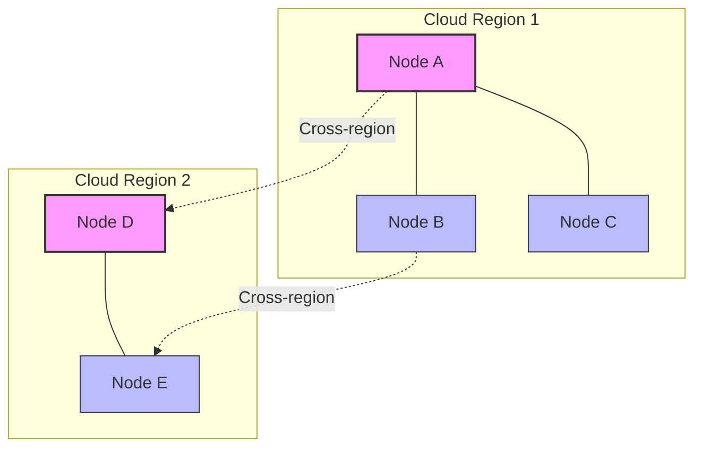

# ZIO Agentic AI Framework Deployment Guide

**Version:** 1.0.0  
**Last Updated:** April 19, 2025  
**Author:** ZIO Agentic AI Framework Team  

## Table of Contents

1. [Introduction](#introduction)
2. [Deployment Prerequisites](#deployment-prerequisites)
3. [Development Environment Deployment](#development-environment-deployment)
4. [Production Environment Deployment](#production-environment-deployment)
5. [Container-Based Deployment](#container-based-deployment)
6. [Cloud Deployment](#cloud-deployment)
7. [Mesh Node Deployment](#mesh-node-deployment)
8. [Configuration Management](#configuration-management)
9. [Scaling and Load Balancing](#scaling-and-load-balancing)
10. [Monitoring and Observability](#monitoring-and-observability)
11. [Backup and Recovery](#backup-and-recovery)
12. [Security Considerations](#security-considerations)
13. [Deployment Checklist](#deployment-checklist)
14. [Troubleshooting](#troubleshooting)

## Introduction

This guide provides comprehensive instructions for deploying ZIO Agentic AI Framework-based applications in various environments. Whether you're running a development instance on a local machine or deploying a production-grade mesh of agent systems in the cloud, this guide covers the necessary steps and best practices.

ZIO Agentic AI Framework applications can be deployed in multiple ways:
- As standalone applications
- Within containers (Docker)
- In orchestrated environments (Kubernetes)
- As distributed mesh systems

Each deployment model has specific considerations and configuration requirements that are detailed in this guide.

## Deployment Prerequisites

Before deploying a ZIO Agentic AI Framework application, ensure you have the following prerequisites:

### System Requirements

- **JVM**: Java 11 or newer
- **Memory**: Minimum 4GB, recommended 8GB+ for production
- **CPU**: Minimum 2 cores, recommended 4+ cores for production
- **Disk Space**: Minimum 1GB for the application, plus space for data storage

### Software Requirements

- **Java**: OpenJDK 11+ or Oracle JDK 11+
- **SBT**: Version 1.8.0+ (for building from source)
- **Docker**: Version 20+ (for container deployment)
- **Kubernetes**: Version 1.22+ (for orchestrated deployment)

### Network Requirements

- **Firewall Rules**: Open ports for HTTP (8080), Mesh communication (8081), and monitoring (9090)
- **Network Latency**: Low latency for mesh communication (<50ms recommended)
- **DNS**: Proper DNS resolution for distributed deployments

## Development Environment Deployment

For development and testing purposes, ZIO Agentic AI Framework applications can be run directly from SBT or as standalone JAR files.

### Running from SBT

```bash
# Run a specific module
sbt "module/run"

# Run with specific configuration
sbt -Dconfig.file=./dev-config.conf "module/run"

# Run with debugging enabled
sbt -jvm-debug 5005 "module/run"
```

### Running as a JAR

```bash
# Build a fat JAR
sbt assembly

# Run the JAR
java -jar target/scala-3.3.1/your-application-assembly-1.0.0.jar

# Run with custom configuration
java -Dconfig.file=./dev-config.conf -jar target/scala-3.3.1/your-application-assembly-1.0.0.jar
```

### Development Configuration

Create a `dev-config.conf` file for development settings:

```hocon
# Development configuration
include "application.conf"

# Override settings for development
http {
  port = 8080
  host = "localhost"
}

memory {
  backend = "in-memory"
}

logging {
  level = "DEBUG"
  format = "colored"
}
```

## Production Environment Deployment

For production deployments, ZIO Agentic AI Framework applications should be packaged and deployed with appropriate resource allocations and configuration.

### Building for Production

```bash
# Set production profile
export ZIO_AGENTIC_AI_ENV=production

# Build with production optimizations
sbt -Dmode=production clean assembly
```

### Running in Production

```bash
# Run with production configuration
java -Dconfig.file=/path/to/production.conf \
     -Xmx4g -Xms2g \
     -XX:+UseG1GC \
     -XX:+HeapDumpOnOutOfMemoryError \
     -jar your-application-assembly-1.0.0.jar
```

### Production Configuration

Create a `production.conf` file for production settings:

```hocon
# Production configuration
include "application.conf"

# Override settings for production
http {
  port = 8080
  host = "0.0.0.0"
  request-timeout = 30 seconds
  idle-timeout = 120 seconds
}

memory {
  backend = "database"
  database {
    url = "jdbc:postgresql://db-host:5432/zio-agentic-ai"
    username = "${DB_USER}"
    password = "${DB_PASSWORD}"
    connection-pool-size = 20
    max-lifetime = 30 minutes
  }
}

logging {
  level = "INFO"
  format = "json"
  output = "file"
  file {
    path = "/var/log/zio-agentic-ai/application.log"
    roll-size = 100 MB
    retention = 7 days
  }
}

mesh {
  binding {
    host = "0.0.0.0"
    port = 8081
  }
  discovery {
    mechanism = "dns"
    dns {
      service-name = "zio-agentic-ai-mesh"
      namespace = "production"
    }
  }
}
```

### Process Supervision

In production, use a process manager to ensure the application restarts on failure:

#### Systemd (Linux)

```ini
# /etc/systemd/system/zio-agentic-ai-application.service
[Unit]
Description=ZIO Agentic AI Framework Application
After=network.target

[Service]
User=zio-agentic-ai
WorkingDirectory=/opt/zio-agentic-ai
ExecStart=/usr/bin/java -Dconfig.file=/opt/zio-agentic-ai/production.conf -jar /opt/zio-agentic-ai/your-application-assembly-1.0.0.jar
Restart=always
RestartSec=5
Environment="ZIO_AGENTIC_AI_ENV=production"

[Install]
WantedBy=multi-user.target
```

Enable and start the service:

```bash
sudo systemctl enable zio-agentic-ai-application
sudo systemctl start zio-agentic-ai-application
```

## Container-Based Deployment

ZIO Agentic AI Framework applications can be containerized using Docker for easier deployment and scaling.

### Dockerfile

Create a `Dockerfile`:

```dockerfile
FROM eclipse-temurin:11-jre-alpine

# Set environment variables
ENV ZIO_AGENTIC_AI_ENV=production
ENV JVM_OPTS="-Xmx2g -Xms1g -XX:+UseG1GC"

# Create app directory
WORKDIR /app

# Copy the fat JAR
COPY target/scala-3.3.1/your-application-assembly-1.0.0.jar app.jar

# Copy configuration
COPY config/production.conf /app/config/application.conf

# Expose HTTP and mesh ports
EXPOSE 8080 8081 9090

# Create volume for logs
VOLUME ["/app/logs"]

# Run the application
ENTRYPOINT ["java", "-Dconfig.file=/app/config/application.conf", "-jar", "app.jar"]
```

### Building the Container

```bash
# Build the container
docker build -t roo-application:1.0.0 .

# Tag for registry
docker tag roo-application:1.0.0 registry.example.com/roo-application:1.0.0

# Push to registry
docker push registry.example.com/roo-application:1.0.0
```

### Running with Docker

```bash
# Run the container
docker run -d \
  --name roo-app \
  -p 8080:8080 \
  -p 8081:8081 \
  -p 9090:9090 \
  -v /path/to/logs:/app/logs \
  -e DB_USER=postgres \
  -e DB_PASSWORD=secret \
  registry.example.com/roo-application:1.0.0
```

### Docker Compose

For multi-container deployments, use Docker Compose:

```yaml
# docker-compose.yml
version: '3.8'

services:
  roo-app:
    image: registry.example.com/roo-application:1.0.0
    ports:
      - "8080:8080"
      - "8081:8081"
      - "9090:9090"
    volumes:
      - ./logs:/app/logs
    environment:
      - DB_USER=postgres
      - DB_PASSWORD=secret
      - ROO_ENV=production
    depends_on:
      - db
    networks:
      - roo-network
    restart: always
    healthcheck:
      test: ["CMD", "curl", "-f", "http://localhost:8080/health"]
      interval: 30s
      timeout: 10s
      retries: 3
      start_period: 40s

  db:
    image: postgres:14-alpine
    ports:
      - "5432:5432"
    volumes:
      - postgres-data:/var/lib/postgresql/data
    environment:
      - POSTGRES_USER=postgres
      - POSTGRES_PASSWORD=secret
      - POSTGRES_DB=roo
    networks:
      - roo-network
    restart: always

networks:
  roo-network:
    driver: bridge

volumes:
  postgres-data:
```

Run with Docker Compose:

```bash
docker-compose up -d
```

## Cloud Deployment

ROO applications can be deployed to various cloud providers for scalability and reliability.

### AWS Deployment

#### Using ECS (Elastic Container Service)

1. Create a task definition:

```json
{
  "family": "roo-application",
  "executionRoleArn": "arn:aws:iam::1234567890:role/ecsTaskExecutionRole",
  "networkMode": "awsvpc",
  "containerDefinitions": [
    {
      "name": "roo-app",
      "image": "1234567890.dkr.ecr.us-west-2.amazonaws.com/roo-application:1.0.0",
      "essential": true,
      "portMappings": [
        {
          "containerPort": 8080,
          "hostPort": 8080,
          "protocol": "tcp"
        },
        {
          "containerPort": 8081,
          "hostPort": 8081,
          "protocol": "tcp"
        }
      ],
      "environment": [
        {
          "name": "ROO_ENV",
          "value": "production"
        }
      ],
      "secrets": [
        {
          "name": "DB_USER",
          "valueFrom": "arn:aws:ssm:us-west-2:1234567890:parameter/roo/db_user"
        },
        {
          "name": "DB_PASSWORD",
          "valueFrom": "arn:aws:ssm:us-west-2:1234567890:parameter/roo/db_password"
        }
      ],
      "logConfiguration": {
        "logDriver": "awslogs",
        "options": {
          "awslogs-group": "/ecs/roo-application",
          "awslogs-region": "us-west-2",
          "awslogs-stream-prefix": "ecs"
        }
      }
    }
  ],
  "requiresCompatibilities": [
    "FARGATE"
  ],
  "cpu": "1024",
  "memory": "2048"
}
```

2. Create a service:

```bash
aws ecs create-service \
  --cluster roo-cluster \
  --service-name roo-service \
  --task-definition roo-application:1 \
  --desired-count 2 \
  --launch-type FARGATE \
  --network-configuration "awsvpcConfiguration={subnets=[subnet-12345678,subnet-87654321],securityGroups=[sg-12345678],assignPublicIp=ENABLED}" \
  --load-balancers "targetGroupArn=arn:aws:elasticloadbalancing:us-west-2:1234567890:targetgroup/roo-tg/1234567890,containerName=roo-app,containerPort=8080"
```

### Google Cloud Deployment

#### Using Google Cloud Run

1. Push the container to Google Container Registry:

```bash
docker tag roo-application:1.0.0 gcr.io/your-project/roo-application:1.0.0
docker push gcr.io/your-project/roo-application:1.0.0
```

2. Deploy to Cloud Run:

```bash
gcloud run deploy roo-application \
  --image gcr.io/your-project/roo-application:1.0.0 \
  --platform managed \
  --region us-central1 \
  --allow-unauthenticated \
  --memory 2Gi \
  --cpu 1 \
  --set-env-vars ROO_ENV=production \
  --set-secrets DB_USER=roo-db-user:latest,DB_PASSWORD=roo-db-password:latest
```

### Azure Deployment

#### Using Azure Container Instances

```bash
az container create \
  --resource-group roo-group \
  --name roo-application \
  --image registry.example.com/roo-application:1.0.0 \
  --dns-name-label roo-application \
  --ports 8080 8081 \
  --environment-variables ROO_ENV=production \
  --secure-environment-variables DB_USER=<db-user> DB_PASSWORD=<db-password> \
  --cpu 1 \
  --memory 2
```

## Mesh Node Deployment

ROO's mesh architecture allows for distributed deployment of agent nodes that can communicate with each other.

### Mesh Architecture



### Mesh Node Configuration

Each node in the mesh requires specific configuration:

```hocon
# Node configuration
mesh {
  node {
    id = "node-1"  # Unique node identifier
    role = "primary"  # Node role (primary/worker)
    region = "us-west"  # Logical region
  }
  
  binding {
    host = "0.0.0.0"
    port = 8081
  }
  
  discovery {
    mechanism = "k8s"  # kubernetes service discovery
    k8s {
      namespace = "roo-mesh"
      label-selector = "app=roo-node"
    }
  }
  
  # Alternative discovery mechanisms
  # discovery {
  #   mechanism = "multicast"
  #   multicast {
  #     group = "224.0.0.1"
  #     port = 8082
  #   }
  # }
  
  # OR
  
  # discovery {
  #   mechanism = "static"
  #   static {
  #     nodes = [
  #       {host = "node-1.example.com", port = 8081},
  #       {host = "node-2.example.com", port = 8081}
  #     ]
  #   }
  # }
  
  security {
    transport-encryption = true
    authentication = true
    shared-key = ${?MESH_SHARED_KEY}
  }
  
  connection {
    max-connections = 100
    idle-timeout = 30 seconds
    connect-timeout = 5 seconds
  }
}
```

### Kubernetes Deployment for Mesh Nodes

```yaml
# mesh-nodes.yaml
apiVersion: apps/v1
kind: StatefulSet
metadata:
  name: roo-mesh-node
  namespace: roo-mesh
spec:
  serviceName: roo-mesh
  replicas: 3
  selector:
    matchLabels:
      app: roo-node
  template:
    metadata:
      labels:
        app: roo-node
    spec:
      containers:
      - name: roo-node
        image: registry.example.com/roo-node:1.0.0
        ports:
        - containerPort: 8080
          name: http
        - containerPort: 8081
          name: mesh
        env:
        - name: ROO_ENV
          value: "production"
        - name: NODE_ID
          valueFrom:
            fieldRef:
              fieldPath: metadata.name
        - name: MESH_SHARED_KEY
          valueFrom:
            secretKeyRef:
              name: roo-mesh-secrets
              key: shared-key
        volumeMounts:
        - name: roo-node-data
          mountPath: /app/data
        resources:
          requests:
            memory: "1Gi"
            cpu: "500m"
          limits:
            memory: "2Gi"
            cpu: "1"
        livenessProbe:
          httpGet:
            path: /health
            port: 8080
          initialDelaySeconds: 60
          periodSeconds: 30
        readinessProbe:
          httpGet:
            path: /ready
            port: 8080
          initialDelaySeconds: 30
          periodSeconds: 10
  volumeClaimTemplates:
  - metadata:
      name: roo-node-data
    spec:
      accessModes: [ "ReadWriteOnce" ]
      resources:
        requests:
          storage: 10Gi

---
apiVersion: v1
kind: Service
metadata:
  name: roo-mesh
  namespace: roo-mesh
spec:
  selector:
    app: roo-node
  clusterIP: None
  ports:
  - port: 8081
    name: mesh

---
apiVersion: v1
kind: Service
metadata:
  name: roo-api
  namespace: roo-mesh
spec:
  selector:
    app: roo-node
  ports:
  - port: 80
    targetPort: 8080
    name: http
  type: LoadBalancer
```

## Configuration Management

Proper configuration management is critical for ROO applications, especially in production environments.

### Configuration Hierarchy

ROO uses a layered configuration approach:

1. Default configuration (built into the application)
2. External configuration file (application.conf)
3. Environment-specific configuration files (production.conf, staging.conf)
4. Environment variables (overrides for sensitive information)
5. JVM system properties (for runtime overrides)

### Sensitive Configuration

For sensitive configuration (passwords, API keys), use environment variables or secrets management:

```hocon
database {
  username = ${?DB_USER}  # Load from DB_USER environment variable
  password = ${?DB_PASSWORD}  # Load from DB_PASSWORD environment variable
}

llm {
  openai {
    api-key = ${?OPENAI_API_KEY}
  }
}
```

### Kubernetes Secrets

For Kubernetes deployments, use secrets:

```yaml
# roo-secrets.yaml
apiVersion: v1
kind: Secret
metadata:
  name: roo-secrets
  namespace: roo
type: Opaque
data:
  db-user: cG9zdGdyZXM=  # base64 encoded
  db-password: c2VjcmV0  # base64 encoded
  openai-api-key: c2stLi4u  # base64 encoded
```

Mount secrets as environment variables:

```yaml
env:
- name: DB_USER
  valueFrom:
    secretKeyRef:
      name: roo-secrets
      key: db-user
- name: DB_PASSWORD
  valueFrom:
    secretKeyRef:
      name: roo-secrets
      key: db-password
```

### Dynamic Configuration

For configuration that needs to change without restarting the application:

```hocon
# Enable dynamic configuration
dynamic-config {
  enabled = true
  refresh-interval = 60 seconds
  sources = [
    {
      type = "file"
      path = "/app/config/dynamic.conf"
    },
    {
      type = "etcd"
      endpoints = ["etcd-1:2379", "etcd-2:2379"]
      path-prefix = "/roo/config/"
    }
  ]
}
```

## Scaling and Load Balancing

ROO applications can be scaled horizontally to handle increased load.

### Stateless Components

HTTP servers and stateless processors can be scaled easily:

```yaml
# Kubernetes horizontal pod autoscaler
apiVersion: autoscaling/v2
kind: HorizontalPodAutoscaler
metadata:
  name: roo-api-hpa
  namespace: roo
spec:
  scaleTargetRef:
    apiVersion: apps/v1
    kind: Deployment
    name: roo-api
  minReplicas: 2
  maxReplicas: 10
  metrics:
  - type: Resource
    resource:
      name: cpu
      target:
        type: Utilization
        averageUtilization: 70
```

### Stateful Components

For stateful components (mesh nodes with local state):

```yaml
# Scale the StatefulSet
kubectl scale statefulset roo-mesh-node --replicas=5
```

### Load Balancing

#### Kubernetes Services

```yaml
apiVersion: v1
kind: Service
metadata:
  name: roo-api
  namespace: roo
spec:
  selector:
    app: roo-api
  ports:
  - port: 80
    targetPort: 8080
  type: LoadBalancer
```

#### NGINX Load Balancer

```nginx
# /etc/nginx/conf.d/roo.conf
upstream roo_backend {
    least_conn;
    server roo-node1:8080;
    server roo-node2:8080;
    server roo-node3:8080;
}

server {
    listen 80;
    server_name api.roo-example.com;

    location / {
        proxy_pass http://roo_backend;
        proxy_set_header Host $host;
        proxy_set_header X-Real-IP $remote_addr;
        proxy_set_header X-Forwarded-For $proxy_add_x_forwarded_for;
        proxy_set_header X-Forwarded-Proto $scheme;
    }
    
    location /health {
        proxy_pass http://roo_backend/health;
        access_log off;
    }
}
```

## Monitoring and Observability

Proper monitoring is essential for ROO applications in production.

### Metrics Exposure

ROO applications expose metrics on a dedicated endpoint:

```hocon
metrics {
  enabled = true
  endpoint = "/metrics"
  port = 9090
}
```

### Prometheus Integration

```yaml
# prometheus.yml
scrape_configs:
  - job_name: 'roo-nodes'
    scrape_interval: 15s
    kubernetes_sd_configs:
      - role: pod
        namespaces:
          names:
            - roo
    relabel_configs:
      - source_labels: [__meta_kubernetes_pod_label_app]
        regex: roo-node
        action: keep
      - source_labels: [__address__]
        action: replace
        regex: ([^:]+)(?::\d+)?
        replacement: $1:9090
        target_label: __address__
```

### Grafana Dashboards

Create Grafana dashboards for:
- System metrics (CPU, memory, disk usage)
- Application metrics (request rates, error rates, response times)
- Business metrics (agent interactions, message throughput)

### Logging

Configure structured logging:

```hocon
logging {
  level = "INFO"
  format = "json"
  
  # Fields to include in every log entry
  context-fields = [
    "trace-id",
    "span-id",
    "node-id",
    "component"
  ]
  
  # Log shipping configuration
  ship {
    enabled = true
    destination = "elasticsearch"
    elasticsearch {
      hosts = ["elasticsearch-host:9200"]
      index-pattern = "roo-logs-%{+YYYY.MM.dd}"
      username = ${?ES_USERNAME}
      password = ${?ES_PASSWORD}
    }
  }
}
```

### Distributed Tracing

Configure OpenTelemetry integration:

```hocon
telemetry {
  tracing {
    enabled = true
    exporter = "jaeger"
    jaeger {
      endpoint = "http://jaeger-collector:14268/api/traces"
    }
    
    # Sampling configuration
    sampling {
      type = "probabilistic"
      rate = 0.1  # Sample 10% of traces
    }
  }
}
```

## Backup and Recovery

Implement proper backup and recovery mechanisms for ROO applications.

### Database Backups

For PostgreSQL database:

```bash
# Daily backup script
pg_dump -h db-host -U postgres -d roo > /backups/roo-$(date +%Y%m%d).sql
```

Kubernetes CronJob for automated backups:

```yaml
apiVersion: batch/v1
kind: CronJob
metadata:
  name: roo-db-backup
  namespace: roo
spec:
  schedule: "0 2 * * *"  # 2:00 AM daily
  jobTemplate:
    spec:
      template:
        spec:
          containers:
          - name: backup
            image: postgres:14-alpine
            command:
            - /bin/sh
            - -c
            - |
              pg_dump -h ${DB_HOST} -U ${DB_USER} -d roo | gzip > /backups/roo-$(date +%Y%m%d).sql.gz
            env:
            - name: DB_HOST
              value: roo-db
            - name: DB_USER
              valueFrom:
                secretKeyRef:
                  name: roo-secrets
                  key: db-user
            - name: PGPASSWORD
              valueFrom:
                secretKeyRef:
                  name: roo-secrets
                  key: db-password
            volumeMounts:
            - name: backup-storage
              mountPath: /backups
          restartPolicy: OnFailure
          volumes:
          - name: backup-storage
            persistentVolumeClaim:
              claimName: backup-pvc
```

### Application State Backups

For application state:

```hocon
backup {
  enabled = true
  type = "snapshot"
  schedule = "0 0 * * *"  # Daily at midnight
  retention = 7  # Keep 7 backups
  
  storage {
    type = "s3"
    s3 {
      bucket = "roo-backups"
      prefix = "state/"
      region = "us-west-2"
    }
  }
}
```

### Recovery Procedures

Document recovery procedures:

1. Database restoration:
   ```bash
   # Restore from backup
   gunzip -c /backups/roo-20250419.sql.gz | psql -h db-host -U postgres -d roo
   ```

2. Application state restoration:
   ```bash
   # Start the application with restore flag
   java -Drestore=true -Drestore.snapshot=20250419 -jar application.jar
   ```

## Security Considerations

Implement security best practices for ROO deployments.

### Network Security

1. Use TLS for all HTTP endpoints:
   ```hocon
   http {
     ssl {
       enabled = true
       keystore {
         path = "/app/certs/keystore.jks"
         password = ${?KEYSTORE_PASSWORD}
       }
     }
   }
   ```

2. Implement network policies in Kubernetes:
   ```yaml
   apiVersion: networking.k8s.io/v1
   kind: NetworkPolicy
   metadata:
     name: roo-network-policy
     namespace: roo
   spec:
     podSelector:
       matchLabels:
         app: roo-node
     policyTypes:
     - Ingress
     - Egress
     ingress:
     - from:
       - podSelector:
           matchLabels:
             app: roo-node
       ports:
       - protocol: TCP
         port: 8081
     - from:
       - namespaceSelector:
           matchLabels:
             name: ingress
       ports:
       - protocol: TCP
         port: 8080
     egress:
     - to:
       - podSelector:
           matchLabels:
             app: roo-db
       ports:
       - protocol: TCP
         port: 5432
   ```

### Authentication and Authorization

1. Configure API authentication:
   ```hocon
   http {
     auth {
       enabled = true
       type = "jwt"
       jwt {
         issuer = "roo-auth"
         audience = "roo-api"
         secret = ${?JWT_SECRET}
       }
     }
   }
   ```

2. Define role-based access:
   ```hocon
   auth {
     roles {
       admin = ["*"]
       reader = ["GET:/api/*"]
       writer = ["GET:/api/*", "POST:/api/*", "PUT:/api/*"]
     }
   }
   ```

### Encryption

1. Enable encryption for mesh communication:
   ```hocon
   mesh {
     security {
       transport-encryption = true
       encryption-key = ${?MESH_ENCRYPTION_KEY}
     }
   }
   ```

2. Configure sensitive data encryption:
   ```hocon
   data {
     encryption {
       enabled = true
       key-provider = "vault"
       vault {
         url = "https://vault.example.com"
         token = ${?VAULT_TOKEN}
         key-path = "secret/data/roo/encryption-key"
       }
     }
   }
   ```

## Deployment Checklist

Use this checklist before and after deployment to ensure a successful rollout:

### Pre-Deployment Checklist

- [ ] Application compiled with proper settings
- [ ] Configuration files created and validated
- [ ] Database schema migrations prepared
- [ ] Secrets and environment variables set
- [ ] Network ports and firewall rules configured
- [ ] Load balancer and DNS settings updated
- [ ] Monitoring and alerting configured
- [ ] Backup procedures tested
- [ ] Rollback plan prepared

### Post-Deployment Checklist

- [ ] Verify application startup logs
- [ ] Confirm application health endpoints respond
- [ ] Test critical functionality
- [ ] Verify metrics are being collected
- [ ] Check log shipping is working
- [ ] Validate backup process
- [ ] Test scaling operations
- [ ] Verify security configurations
- [ ] Update documentation with deployment details

## Troubleshooting

Common deployment issues and their solutions:

### Application Won't Start

1. **JVM Memory Issues**:
   - Check for OutOfMemoryError in logs
   - Increase heap size: `-Xmx4g`
   - Enable GC logging: `-Xlog:gc*:file=gc.log`

2. **Configuration Problems**:
   - Verify config file path is correct
   - Check for syntax errors in configuration
   - Ensure environment variables are set
   - Try with `-Dconfig.trace=loads` to debug config loading

3. **Port Binding Issues**:
   - Check if ports are already in use: `netstat -tulpn | grep 8080`
   - Verify permissions for binding to low ports (<1024)
   - Check network policies or security groups

### Mesh Communication Issues

1. **Discovery Problems**:
   - Check discovery configuration
   - Verify network connectivity between nodes
   - Ensure multicast is enabled (if using multicast discovery)
   - Try static configuration temporarily

2. **Authentication Failures**:
   - Verify shared keys match across nodes
   - Check time synchronization between nodes
   - Ensure certificates are valid (if using TLS)

3. **Network Issues**:
   - Verify firewall rules allow mesh ports
   - Check for network latency issues: `ping` and `traceroute`
   - Validate that DNS resolves correctly

### Performance Issues

1. **High CPU Usage**:
   - Check for inefficient code or infinite loops
   - Profile the application: `-Dcom.sun.management.jmxremote`
   - Verify appropriate JVM GC settings

2. **Memory Leaks**:
   - Enable heap dumps: `-XX:+HeapDumpOnOutOfMemoryError`
   - Analyze with tools like VisualVM or MAT
   - Check for resource leaks (connections, file handles)

3. **Slow Response Times**:
   - Check database query performance
   - Verify network latency between components
   - Examine thread pool configurations
   - Look for blocking operations in non-blocking code

### Database Connectivity

1. **Connection Failures**:
   - Verify database credentials
   - Check network connectivity to database host
   - Ensure database service is running
   - Validate connection pool settings

2. **Connection Pool Exhaustion**:
   - Increase pool size
   - Check for connection leaks
   - Add connection timeout handling
   - Implement retry logic

For more detailed troubleshooting, refer to the [Comprehensive Troubleshooting Guide](../troubleshooting/TroubleshootingGuide.md).