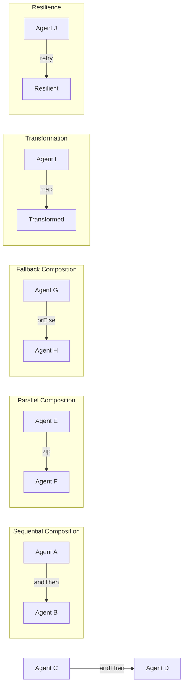
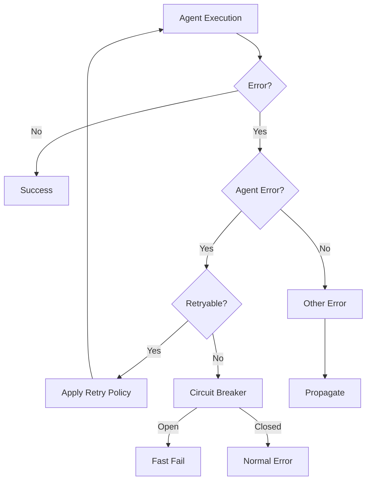
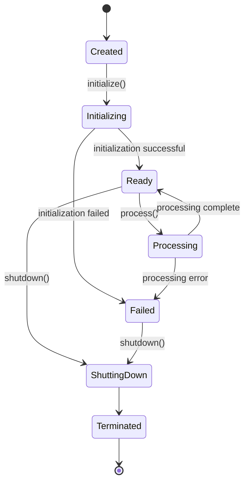

# Agent API Design Document

**Version:** 1.0.0  
**Last Updated:** April 19, 2025  
**Author:** ZIO Agentic AI Framework Team

## Table of Contents

1. [Introduction and Design Philosophy](#introduction-and-design-philosophy)
2. [Core Agent Trait](#core-agent-trait)
3. [Compositional Operations](#compositional-operations)
4. [Capability System Integration](#capability-system-integration)
5. [Error Handling Model](#error-handling-model)
6. [Lifecycle Management](#lifecycle-management)
7. [ZIO Integration](#zio-integration)
8. [Workflow System Integration](#workflow-system-integration)
9. [Extension Points](#extension-points)
10. [Implementation Examples](#implementation-examples)
11. [Testing Strategies](#testing-strategies)
12. [Migration Guide](#migration-guide)

## Introduction and Design Philosophy

The Agent API for ZIO Agentic AI Framework Version 2 represents a foundational evolution in our approach to building intelligent, autonomous agents. Building on the concepts introduced in Version 1, this new API emphasizes compositional design, type safety, functional purity, and deep integration with ZIO's effect system.

### Core Design Principles

1. **Compositional Design**: Agents should be easily composable, allowing complex workflows to be built from simpler components while maintaining type safety throughout the composition chain.

2. **Type Safety**: The Agent API leverages Scala's expressive type system to ensure that composition and interactions between agents are verified at compile time.

3. **Referential Transparency**: All operations follow pure functional principles, making agent behavior predictable, testable, and reasoning-friendly.

4. **Error Recovery and Resilience**: First-class error handling enables robust agent implementations that can recover from failures in a principled way.

5. **Resource Safety**: The lifecycle of agents and their resources is managed through ZIO's resource-safe patterns.

6. **Testability**: The design facilitates comprehensive testing strategies, including unit tests, property-based tests, and integration tests.

### Evolution from V1 to V2

Version 2 of the Agent API introduces several key improvements over the original design:

| Aspect | Version 1 | Version 2 |
|--------|-----------|-----------|
| Type Parameters | Limited (Agent[I, O]) | Comprehensive (Agent[-R, +E, -I, +O]) |
| ZIO Integration | Basic | Deep integration with ZIO 2.x features |
| Composition | Method-based | Functional operators with monadic behavior |
| Error Handling | Ad-hoc | Structured with specialized hierarchy |
| Capabilities | Concrete traits | Type class based with lawful behavior |
| Resource Management | Manual | ZIO Scope-based automatic resource handling |

## Core Agent Trait

The core `Agent` trait forms the foundation of the Agent API. It is defined with flexible type parameters to represent the environment, error, input, and output types:

```scala
/**
 * Represents an agent that requires an environment of type R, 
 * may fail with an error of type E, 
 * accepts inputs of type I, and 
 * produces outputs of type O.
 */
trait Agent[-R, +E, -I, +O] { self =>
  
  /**
   * The unique identifier for this agent.
   */
  def id: AgentId
  
  /**
   * Metadata associated with this agent.
   */
  def metadata: AgentMetadata
  
  /**
   * Process an input value to produce an output.
   * This is the core operation of the agent.
   */
  def process(input: I): ZIO[R, E, O]
  
  /**
   * Initialize the agent, allocating any necessary resources.
   */
  def initialize: ZIO[R, E, Unit]
  
  /**
   * Shutdown the agent, releasing any resources.
   * This should always succeed, even if there are errors during shutdown.
   */
  def shutdown: ZIO[R, Nothing, Unit]
  
  /**
   * Retrieve a capability by its ID.
   */
  def getCapability[C <: Capability](id: CapabilityId): Option[C]
}
```

### Type Parameters Explained

- **R**: The environment type the agent requires (contravariant). This follows ZIO's approach to environment types.
- **E**: The error type the agent may produce (covariant). This represents failures during processing.
- **I**: The input type the agent accepts (contravariant). The agent can process any subtype of I.
- **O**: The output type the agent produces (covariant). The agent guarantees to produce a value of type O.

The contravariance of `R` and `I` combined with the covariance of `E` and `O` enables proper typing for functional composition, following the standard variance patterns for function types.

### AgentId and AgentMetadata

```scala
/**
 * A strongly typed identifier for agents.
 */
final case class AgentId(value: String) extends AnyVal

/**
 * Metadata associated with an agent.
 */
final case class AgentMetadata(
  name: String,
  description: String,
  version: String,
  tags: Set[String] = Set.empty,
  properties: Map[String, String] = Map.empty
)
```

### Design Rationale

The `Agent` trait is designed with the following considerations:

1. **ZIO Alignment**: The use of ZIO effects for operations ensures seamless integration with the ZIO ecosystem.

2. **Type Parameter Structure**: The type parameters follow the pattern used in ZIO to enable efficient composition and type inference.

3. **Minimal Core Interface**: The trait defines the minimal operations required for all agents, allowing extensions to add more specialized functionality.

4. **Resource Management**: The initialize/shutdown methods provide clear lifecycle management for agent resources.

5. **Capability Access**: The `getCapability` method provides access to agent capabilities while maintaining type safety.

## Compositional Operations

The power of the Agent API comes from its compositional operations, which enable building complex agent workflows from simpler components. These operations are defined as extension methods on the Agent trait:

```scala
implicit class AgentOps[-R, +E, -I, +O](self: Agent[R, E, I, O]) {

  /**
   * Sequential composition - creates a new agent that pipes the output of this agent
   * to the input of the second agent.
   */
  def andThen[R1 <: R, E1 >: E, O2](that: Agent[R1, E1, O, O2]): Agent[R1, E1, I, O2] =
    new Agent[R1, E1, I, O2] {
      val id: AgentId = AgentId(s"${self.id.value}_andThen_${that.id.value}")
      
      val metadata: AgentMetadata = AgentMetadata(
        name = s"${self.metadata.name} > ${that.metadata.name}",
        description = s"Sequential composition of ${self.metadata.name} and ${that.metadata.name}",
        version = s"${self.metadata.version}+${that.metadata.version}",
        tags = self.metadata.tags ++ that.metadata.tags,
        properties = self.metadata.properties ++ that.metadata.properties
      )
      
      def process(input: I): ZIO[R1, E1, O2] =
        for {
          intermediate <- self.process(input)
          result <- that.process(intermediate)
        } yield result
      
      def initialize: ZIO[R1, E1, Unit] =
        for {
          _ <- self.initialize
          _ <- that.initialize
        } yield ()
      
      def shutdown: ZIO[R1, Nothing, Unit] =
        for {
          _ <- ZIO.attempt(self.shutdown).orDie
          _ <- ZIO.attempt(that.shutdown).orDie
        } yield ()
      
      def getCapability[C <: Capability](id: CapabilityId): Option[C] =
        self.getCapability[C](id).orElse(that.getCapability[C](id))
    }

  /**
   * Parallel composition - creates a new agent that processes the input with both agents
   * in parallel and returns both results as a tuple.
   */
  def zip[R1 <: R, E1 >: E, I1 <: I, O2](
    that: Agent[R1, E1, I1, O2]
  ): Agent[R1, E1, I1, (O, O2)] =
    new Agent[R1, E1, I1, (O, O2)] {
      val id: AgentId = AgentId(s"${self.id.value}_zip_${that.id.value}")
      
      val metadata: AgentMetadata = AgentMetadata(
        name = s"${self.metadata.name} & ${that.metadata.name}",
        description = s"Parallel composition of ${self.metadata.name} and ${that.metadata.name}",
        version = s"${self.metadata.version}+${that.metadata.version}",
        tags = self.metadata.tags ++ that.metadata.tags,
        properties = self.metadata.properties ++ that.metadata.properties
      )
      
      def process(input: I1): ZIO[R1, E1, (O, O2)] =
        self.process(input).zipPar(that.process(input))
      
      def initialize: ZIO[R1, E1, Unit] =
        self.initialize.zipPar(that.initialize).unit
      
      def shutdown: ZIO[R1, Nothing, Unit] =
        ZIO.attempt(self.shutdown).zipPar(ZIO.attempt(that.shutdown)).unit.orDie
      
      def getCapability[C <: Capability](id: CapabilityId): Option[C] =
        self.getCapability[C](id).orElse(that.getCapability[C](id))
    }

  /**
   * Creates a new agent that applies a function to the output of this agent.
   */
  def map[O2](f: O => O2): Agent[R, E, I, O2] =
    new Agent[R, E, I, O2] {
      val id: AgentId = AgentId(s"${self.id.value}_map")
      
      val metadata: AgentMetadata = self.metadata.copy(
        name = s"${self.metadata.name} (mapped)",
        description = s"Output transformation of ${self.metadata.name}"
      )
      
      def process(input: I): ZIO[R, E, O2] =
        self.process(input).map(f)
      
      def initialize: ZIO[R, E, Unit] = self.initialize
      
      def shutdown: ZIO[R, Nothing, Unit] = self.shutdown
      
      def getCapability[C <: Capability](id: CapabilityId): Option[C] =
        self.getCapability[C](id)
    }

  /**
   * Creates a new agent that will use the provided agent if this one fails.
   */
  def orElse[R1 <: R, E1, I1 <: I, O1 >: O](
    that: Agent[R1, E1, I1, O1]
  ): Agent[R1, E1, I1, O1] =
    new Agent[R1, E1, I1, O1] {
      val id: AgentId = AgentId(s"${self.id.value}_orElse_${that.id.value}")
      
      val metadata: AgentMetadata = AgentMetadata(
        name = s"${self.metadata.name} fallback ${that.metadata.name}",
        description = s"Fallback composition of ${self.metadata.name} and ${that.metadata.name}",
        version = s"${self.metadata.version}+${that.metadata.version}",
        tags = self.metadata.tags ++ that.metadata.tags,
        properties = self.metadata.properties ++ that.metadata.properties
      )
      
      def process(input: I1): ZIO[R1, E1, O1] =
        self.process(input).catchAll(_ => that.process(input))
      
      def initialize: ZIO[R1, E1, Unit] =
        self.initialize.catchAll(_ => that.initialize)
      
      def shutdown: ZIO[R1, Nothing, Unit] =
        ZIO.attempt(self.shutdown).zipPar(ZIO.attempt(that.shutdown)).unit.orDie
      
      def getCapability[C <: Capability](id: CapabilityId): Option[C] =
        self.getCapability[C](id).orElse(that.getCapability[C](id))
    }
    
  /**
   * Creates a new agent that will retry this agent according to the provided policy.
   */
  def retry[R1 <: R, B](policy: Schedule[R1, E, B]): Agent[R1, E, I, O] =
    new Agent[R1, E, I, O] {
      val id: AgentId = AgentId(s"${self.id.value}_retry")
      
      val metadata: AgentMetadata = self.metadata.copy(
        name = s"${self.metadata.name} (with retry)",
        description = s"Retry-enabled version of ${self.metadata.name}"
      )
      
      def process(input: I): ZIO[R1, E, O] =
        self.process(input).retry(policy)
      
      def initialize: ZIO[R1, E, Unit] =
        self.initialize.retry(policy)
      
      def shutdown: ZIO[R1, Nothing, Unit] =
        self.shutdown
      
      def getCapability[C <: Capability](id: CapabilityId): Option[C] =
        self.getCapability[C](id)
    }
}
```

### Composition Patterns



The composition operations follow functional programming patterns:

1. **Sequential Composition (andThen)**: Pipe the output of one agent to the input of another, similar to function composition.

2. **Parallel Composition (zip)**: Process the same input with two agents in parallel and combine their results.

3. **Transformation (map)**: Apply a function to the output of an agent.

4. **Error Recovery (orElse)**: Provide a fallback agent in case of failure.

5. **Resilience (retry)**: Add retry capability to an agent using ZIO's retry scheduling.

### Additional Combinators

For more advanced composition patterns, we provide:

```scala
object AgentCombinators {
  /**
   * Create an agent that executes multiple agents in parallel and combines
   * their results using the provided function.
   */
  def zipWith[R, E, I, O, O1, O2](
    agent1: Agent[R, E, I, O1],
    agent2: Agent[R, E, I, O2]
  )(f: (O1, O2) => O): Agent[R, E, I, O] =
    new Agent[R, E, I, O] {
      val id: AgentId = AgentId(s"${agent1.id.value}_zipWith_${agent2.id.value}")
      
      val metadata: AgentMetadata = AgentMetadata(
        name = s"${agent1.metadata.name} combined with ${agent2.metadata.name}",
        description = s"Parallel composition with result combination",
        version = s"${agent1.metadata.version}+${agent2.metadata.version}",
        tags = agent1.metadata.tags ++ agent2.metadata.tags,
        properties = agent1.metadata.properties ++ agent2.metadata.properties
      )
      
      def process(input: I): ZIO[R, E, O] =
        agent1.process(input).zipPar(agent2.process(input)).map {
          case (result1, result2) => f(result1, result2)
        }
      
      def initialize: ZIO[R, E, Unit] =
        agent1.initialize.zipPar(agent2.initialize).unit
      
      def shutdown: ZIO[R, Nothing, Unit] =
        ZIO.attempt(agent1.shutdown).zipPar(ZIO.attempt(agent2.shutdown)).unit.orDie
      
      def getCapability[C <: Capability](id: CapabilityId): Option[C] =
        agent1.getCapability[C](id).orElse(agent2.getCapability[C](id))
    }
    
  /**
   * Create an agent that routes the input to one of two agents based on a predicate.
   */
  def cond[R, E, I, O](
    predicate: I => Boolean,
    ifTrue: Agent[R, E, I, O],
    ifFalse: Agent[R, E, I, O]
  ): Agent[R, E, I, O] =
    new Agent[R, E, I, O] {
      val id: AgentId = AgentId("conditional_agent")
      
      val metadata: AgentMetadata = AgentMetadata(
        name = "Conditional Agent",
        description = "Routes to one of two agents based on input",
        version = s"${ifTrue.metadata.version}+${ifFalse.metadata.version}",
        tags = ifTrue.metadata.tags ++ ifFalse.metadata.tags,
        properties = ifTrue.metadata.properties ++ ifFalse.metadata.properties
      )
      
      def process(input: I): ZIO[R, E, O] =
        if (predicate(input)) ifTrue.process(input)
        else ifFalse.process(input)
      
      def initialize: ZIO[R, E, Unit] =
        ifTrue.initialize.zipPar(ifFalse.initialize).unit
      
      def shutdown: ZIO[R, Nothing, Unit] =
        ZIO.attempt(ifTrue.shutdown).zipPar(ZIO.attempt(ifFalse.shutdown)).unit.orDie
      
      def getCapability[C <: Capability](id: CapabilityId): Option[C] =
        ifTrue.getCapability[C](id).orElse(ifFalse.getCapability[C](id))
    }
    
  /**
   * Create an agent that processes inputs in a pipeline, with each stage
   * transforming the output of the previous stage.
   */
  def pipeline[R, E, A](
    stages: Agent[R, E, A, A]*
  ): Agent[R, E, A, A] = {
    require(stages.nonEmpty, "Pipeline must have at least one stage")
    
    stages.reduce((a, b) => a.andThen(b))
  }
}
```

### Design Rationale

The compositional operations are designed with the following principles:

1. **Type-Safety**: All composition maintains proper type relationships, ensuring that only compatible agents can be composed.

2. **Functional Approach**: The operations follow established functional programming patterns, making them intuitive for developers familiar with FP concepts.

3. **Performance**: Operations like `zipPar` perform parallel execution where appropriate, optimizing resource utilization.

4. **Resource Management**: All composed agents properly manage the resources of their constituent parts.

5. **Metadata Propagation**: The metadata of composed agents meaningfully combines the metadata of the original agents.

## Capability System Integration

The Agent API integrates deeply with the capability system, allowing agents to expose and utilize diverse functionality through a type-class based approach.

### Capability Trait

```scala
/**
 * Base trait for all agent capabilities.
 */
trait Capability {
  /**
   * The unique identifier for this capability.
   */
  def id: CapabilityId
  
  /**
   * Human-readable description of this capability.
   */
  def description: String
}

/**
 * Strongly typed identifier for capabilities.
 */
final case class CapabilityId(value: String) extends AnyVal
```

### Type Class Pattern for Capabilities

The capability system uses type classes to define behaviors that agents can implement:

```scala
/**
 * Type class for agents that have memory capabilities.
 */
trait HasMemory[-R, +E, -I, +O] { self: Agent[R, E, I, O] =>
  /**
   * Store a value in the agent's memory.
   */
  def remember[A](key: String, value: A): ZIO[R, E, Unit]
  
  /**
   * Retrieve a value from the agent's memory.
   */
  def recall[A](key: String): ZIO[R, E, Option[A]]
  
  /**
   * Forget a value from the agent's memory.
   */
  def forget(key: String): ZIO[R, E, Unit]
}

/**
 * Type class for agents that have LLM integration capabilities.
 */
trait HasLLM[-R, +E, -I, +O] { self: Agent[R, E, I, O] =>
  /**
   * Generate text using the underlying LLM.
   */
  def generate(prompt: String): ZIO[R, E, String]
  
  /**
   * Have a chat conversation with the LLM.
   */
  def chat(messages: List[ChatMessage]): ZIO[R, E, String]
}

/**
 * Type class for agents that can use tools.
 */
trait HasTools[-R, +E, -I, +O] { self: Agent[R, E, I, O] =>
  /**
   * List all tools available to this agent.
   */
  def listTools: ZIO[R, E, List[Tool]]
  
  /**
   * Execute a tool with the provided arguments.
   */
  def executeTool(name: String, args: Map[String, String]): ZIO[R, E, ToolResult]
}
```

### Capability Registration and Discovery

For agents to register and discover capabilities:

```scala
trait CapabilityRegistry {
  /**
   * Register a capability with the registry.
   */
  def registerCapability(capability: Capability): UIO[Unit]
  
  /**
   * Retrieve a capability by ID.
   */
  def getCapability[C <: Capability](id: CapabilityId): UIO[Option[C]]
  
  /**
   * Find capabilities by tag.
   */
  def findCapabilities(tag: String): UIO[List[Capability]]
}

object CapabilityRegistry {
  /**
   * Create a new capability registry.
   */
  def make: ULayer[CapabilityRegistry] = ???
}
```

### Capability Inheritance

The capability system supports hierarchical inheritance:

```scala
/**
 * Base capability for all NLP-related capabilities.
 */
trait NLPCapability extends Capability {
  override val id: CapabilityId = CapabilityId("nlp")
  override val description: String = "Natural language processing capabilities"
}

/**
 * Text summarization capability.
 */
trait SummarizationCapability extends NLPCapability {
  override val id: CapabilityId = CapabilityId("nlp.summarization")
  override val description: String = "Ability to summarize text"
  
  /**
   * Summarize the provided text.
   */
  def summarize(text: String, maxLength: Option[Int] = None): Task[String]
}

/**
 * Text translation capability.
 */
trait TranslationCapability extends NLPCapability {
  override val id: CapabilityId = CapabilityId("nlp.translation")
  override val description: String = "Ability to translate text between languages"
  
  /**
   * Translate text between languages.
   */
  def translate(text: String, sourceLanguage: String, targetLanguage: String): Task[String]
}
```

### Capability Verification

Type-level verification of capabilities:

```scala
object CapabilityVerification {
  /**
   * Verify that an agent has a required capability.
   */
  def hasCapability[C <: Capability](agent: Agent[_, _, _, _], id: CapabilityId): Boolean =
    agent.getCapability[C](id).isDefined
    
  /**
   * Verify that an agent has all required capabilities.
   */
  def hasAllCapabilities[C <: Capability](agent: Agent[_, _, _, _], ids: Set[CapabilityId]): Boolean =
    ids.forall(id => hasCapability[C](agent, id))
    
  /**
   * Get an agent's capability, failing if not available.
   */
  def getCapabilityOrFail[C <: Capability](agent: Agent[_, _, _, _], id: CapabilityId): Task[C] =
    ZIO.fromOption(agent.getCapability[C](id))
      .orElseFail(new IllegalStateException(s"Agent ${agent.id} does not have capability $id"))
}
```

### Design Rationale

The capability system is designed with the following principles:

1. **Type Safety**: The use of type classes ensures that capabilities are properly typed and verified.

2. **Extensibility**: New capabilities can be easily added to the system through trait inheritance.

3. **Runtime Verification**: Both compile-time and runtime verification are supported to ensure agents have required capabilities.

4. **Hierarchical Organization**: Capabilities form a logical hierarchy, enabling rich taxonomies of agent abilities.

5. **Separation of Concerns**: Capabilities separate the "what" (interface) from the "how" (implementation), enabling different implementations of the same capability.

## Error Handling Model

Error handling is a critical aspect of robust agent systems. The Agent API provides a structured approach to errors through specialized error types and recovery mechanisms.

### Agent Error Hierarchy

```scala
/**
 * Base trait for all agent-related errors.
 */
sealed trait AgentError extends Throwable {
  /**
   * Human-readable error message.
   */
  def message: String
  
  /**
   * Whether this error is considered retryable.
   */
  def isRetryable: Boolean
}

/**
 * Error indicating an agent initialization failure.
 */
final case class AgentInitializationError(
  agentId: AgentId,
  message: String,
  cause: Option[Throwable] = None,
  isRetryable: Boolean = true
) extends AgentError

/**
 * Error indicating a failure during agent processing.
 */
final case class AgentProcessingError(
  agentId: AgentId,
  message: String,
  cause: Option[Throwable] = None,
  isRetryable: Boolean = true
) extends AgentError

/**
 * Error indicating a failure related to capabilities.
 */
final case class CapabilityError(
  capabilityId: CapabilityId,
  message: String,
  cause: Option[Throwable] = None,
  isRetryable: Boolean = false
) extends AgentError

/**
 * Error indicating a resource acquisition or release failure.
 */
final case class ResourceError(
  resourceId: String,
  message: String,
  cause: Option[Throwable] = None,
  isRetryable: Boolean = true
) extends AgentError

/**
 * Error indicating a timeout during agent operation.
 */
final case class TimeoutError(
  agentId: AgentId,
  operationName: String,
  duration: Duration,
  isRetryable: Boolean = true
) extends AgentError
```

### Error Recovery Mechanisms

The Agent API leverages ZIO's error handling mechanisms for robust recovery:

```scala
/**
 * Extension methods for agent error handling.
 */
implicit class AgentErrorOps[-R, +E, -I, +O](self: Agent[R, E, I, O]) {
  /**
   * Create a new agent that will capture AgentErrors and execute
   * recovery logic.
   */
  def catchAgentError[R1 <: R, E1, O1 >: O](
    recover: AgentError => ZIO[R1, E1, O1]
  ): Agent[R1, E1, I, O1] =
    new Agent[R1, E1, I, O1] {
      val id: AgentId = AgentId(s"${self.id.value}_catchAgentError")
      
      val metadata: AgentMetadata = self.metadata.copy(
        name = s"${self.metadata.name} (with error recovery)",
        description = s"Error-handling wrapper for ${self.metadata.name}"
      )
      
      def process(input: I): ZIO[R1, E1, O1] =
        self.process(input).catchSome {
          case e: AgentError => recover(e)
        }
      
      def initialize: ZIO[R1, E1, Unit] =
        self.initialize.catchSome {
          case e: AgentError => recover(e).unit
        }
      
      def shutdown: ZIO[R1, Nothing, Unit] =
        self.shutdown
      
      def getCapability[C <: Capability](id: CapabilityId): Option[C] =
        self.getCapability[C](id)
    }
    
  /**
   * Create a new agent that will timeout operations after the specified duration.
   */
  def timeout[R1 <: R with Clock](duration: Duration): Agent[R1, E with TimeoutError, I, O] =
    new Agent[R1, E with TimeoutError, I, O] {
      val id: AgentId = AgentId(s"${self.id.value}_timeout")
      
      val metadata: AgentMetadata = self.metadata.copy(
        name = s"${self.metadata.name} (with timeout)",
        description = s"Timeout-enabled version of ${self.metadata.name}"
      )
      
      def process(input: I): ZIO[R1, E with TimeoutError, O] =
        self.process(input).timeoutFail(
          TimeoutError(self.id, "process", duration)
        )(duration)
      
      def initialize: ZIO[R1, E with TimeoutError, Unit] =
        self.initialize.timeoutFail(
          TimeoutError(self.id, "initialize", duration)
        )(duration)
      
      def shutdown: ZIO[R1, Nothing, Unit] =
        self.shutdown.timeout(duration).orDie
      
      def getCapability[C <: Capability](id: CapabilityId): Option[C] =
        self.getCapability[C](id)
    }
    
  /**
   * Create a new agent with a circuit breaker that will fail fast
   * after successive failures.
   */
  def withCircuitBreaker[R1 <: R](
    maxFailures: Int,
    resetTimeout: Duration,
    maxResetTimeout: Duration
  ): Agent[R1, E, I, O] = {
    type State = {
      var failures: Int
      var lastFailure: Long
      var open: Boolean
    }
    
    val initial = new {
      var failures = 0
      var lastFailure = 0L
      var open = false
    }
    
    val stateRef = new AtomicReference[State](initial)
    
    new Agent[R1, E, I, O] {
      val id: AgentId = AgentId(s"${self.id.value}_circuitBreaker")
      
      val metadata: AgentMetadata = self.metadata.copy(
        name = s"${self.metadata.name} (with circuit breaker)",
        description = s"Circuit breaker-protected version of ${self.metadata.name}"
      )
      
      def process(input: I): ZIO[R1, E, O] =
        ZIO.succeed {
          val state = stateRef.get()
          if (state.open) {
            val now = System.currentTimeMillis()
            val elapsed = now - state.lastFailure
            if (elapsed > resetTimeout.toMillis) {
              val newState = new {
                var failures = state.failures
                var lastFailure = state.lastFailure
                var open = false
              }
              stateRef.compareAndSet(state, newState)
              false
            } else true
          } else false
        }.flatMap {
          case true =>
            ZIO.fail(
              AgentProcessingError(
                self.id,
                "Circuit breaker is open",
                None,
                isRetryable = false
              ).asInstanceOf[E]
            )
          case false =>
            self.process(input).catchAll { error =>
              ZIO.succeed {
                val state = stateRef.get()
                val newState = new {
                  var failures = state.failures + 1
                  var lastFailure = System.currentTimeMillis()
                  var open = state.failures + 1 >= maxFailures
                }
                stateRef.compareAndSet(state, newState)
              } *> ZIO.fail(error)
            }
        }
      
      def initialize: ZIO[R1, E, Unit] =
        self.initialize
      
      def shutdown: ZIO[R1, Nothing, Unit] =
        self.shutdown
      
      def getCapability[C <: Capability](id: CapabilityId): Option[C] =
        self.getCapability[C](id)
    }
  }
}
```

### Error Handling Flow



### Design Rationale

The error handling model is designed with the following principles:

1. **Structured Errors**: A well-defined hierarchy of error types enables precise error handling.

2. **Retryability Classification**: Errors are classified as retryable or non-retryable to inform recovery strategies.

3. **Root Cause Analysis**: Errors carry underlying causes to facilitate debugging and logging.

4. **ZIO Integration**: Error handling leverages ZIO's powerful error handling capabilities.

5. **Circuit Breaking**: The circuit breaker pattern prevents cascading failures in agent systems.

## Lifecycle Management

Proper lifecycle management ensures that agents reliably acquire and release resources.

### Lifecycle States



### Managed Agent Pattern

The Agent API provides a resource-safe pattern for creating and using agents:

```scala
/**
 * Creates a managed agent that is properly initialized before use
 * and shut down after use.
 */
def managedAgent[R, E, I, O](
  agent: Agent[R, E, I, O]
): ZManaged[R, E, Agent[R, E, I, O]] =
  ZManaged.make(
    agent.initialize.as(agent)
  )(_.shutdown.orDie)

/**
 * A more convenient version using ZIO's Scope system.
 */
def scoped[R, E, I, O](
  agent: Agent[R, E, I, O]
): ZIO[Scope & R, E, Agent[R, E, I, O]] =
  ZIO.acquireRelease(
    agent.initialize.as(agent)
  )(_.shutdown.orDie)
```

### Agent Factory Pattern

The factory pattern provides a consistent way to create and configure agents:

```scala
trait AgentFactory[R, E, I, O] {
  /**
   * Create a new agent instance with the specified configuration.
   */
  def create(config: AgentConfig): ZIO[R, E, Agent[R, E, I, O]]
  
  /**
   * Create a managed agent instance.
   */
  def managed(config: AgentConfig): ZManaged[R, E, Agent[R, E, I, O]] =
    ZManaged.make(
      create(config)
    )(_.shutdown.orDie)
    
  /**
   * Create a scoped agent instance.
   */
  def scoped(config: AgentConfig): ZIO[Scope & R, E, Agent[R, E, I, O]] =
    ZIO.acquireRelease(
      create(config)
    )(_.shutdown.orDie)
}
```

### State Management

For agents that need to maintain state across operations:

```scala
/**
 * A stateful agent that maintains internal state between processing calls.
 */
trait StatefulAgent[-R, +E, -I, +O, S] extends Agent[R, E, I, O] {
  /**
   * Get the current state of the agent.
   */
  def getState: ZIO[R, E, S]
  
  /**
   * Update the state using a function.
   */
  def updateState(f: S => S): ZIO[R, E, Unit]
  
  /**
   * Set the state to a new value.
   */
  def setState(s: S): ZIO[R, E, Unit]
  
  /**
   * Process input with the current state and return a new state along with the output.
   */
  def processWithState(input: I): ZIO[R, E, (S, O)]
  
  /**
   * Implementation of the standard process method using processWithState.
   */
  override def process(input: I): ZIO[R, E, O] =
    processWithState(input).map(_._2)
}
```

### Design Rationale

The lifecycle management approach is designed with the following principles:

1. **Resource Safety**: The use of ZIO's resource management ensures proper cleanup of agent resources.

2. **Consistent Lifecycle**: A clear and consistent lifecycle model simplifies reasoning about agent behavior.

3. **State Isolation**: Stateful agents encapsulate and manage their state in a controlled manner.

4. **Configuration Flexibility**: The factory pattern enables flexible agent configuration.

5. **ZIO Integration**: Integration with ZIO's Scope system provides powerful and composable resource management.

## ZIO Integration

The Agent API integrates deeply with ZIO to leverage its powerful effect system.

### ZLayer Integration

Agents can be provided as services through ZIO's layer system:

```scala
object AgentLayers {
  /**
   * Create a layer that provides an agent service.
   */
  def live[R, E, I, O](
    agent: Agent[R, E, I, O]
  ): ZLayer[R, E, Agent[R, E, I, O]] =
    ZLayer.scoped(
      ZIO.acquireRelease(
        agent.initialize.as(agent)
      )(_.shutdown.orDie)
    )
    
  /**
   * Create a layer from an agent factory and configuration.
   */
  def fromFactory[R, E, I, O](
    factory: AgentFactory[R, E, I, O],
    config: AgentConfig
  ): ZLayer[R, E, Agent[R, E, I, O]] =
    ZLayer.scoped(
      factory.scoped(config)
    )
}
```

### ZStream Integration

Integration with ZIO Streams for processing data flows:

```scala
implicit class AgentStreamOps[-R, +E, -I, +O](agent: Agent[R, E, I, O]) {
  /**
   * Process a stream of inputs through this agent.
   */
  def processStream(input: ZStream[R, E, I]): ZStream[R, E, O] =
    input.mapZIO(agent.process)
    
  /**
   * Process a stream of inputs through this agent with batching.
   */
  def processBatched(
    input: ZStream[R, E, I],
    batchSize: Int
  ): ZStream[R, E, Chunk[O]] =
    input.chunks
      .map(_.take(batchSize))
      .mapZIO(chunk => ZIO.foreachPar(chunk)(agent.process))
      .map(Chunk.fromIterable)
}
```

### ZIO Schedule Integration

Integration with ZIO's scheduling system:

```scala
/**
 * Create an agent that runs another agent according to a schedule.
 */
def scheduled[R, E, I, O, B](
  agent: Agent[R, E, I, O],
  schedule: Schedule[R, I, B]
): Agent[R, E, I, O] =
  new Agent[R, E, I, O] {
    val id: AgentId = AgentId(s"${agent.id.value}_scheduled")
    
    val metadata: AgentMetadata = agent.metadata.copy(
      name = s"${agent.metadata.name} (scheduled)",
      description = s"Scheduled version of ${agent.metadata.name}"
    )
    
    def process(input: I): ZIO[R, E, O] =
      schedule.run(input).flatMap(_ => agent.process(input))
    
    def initialize: ZIO[R, E, Unit] =
      agent.initialize
    
    def shutdown: ZIO[R, Nothing, Unit] =
      agent.shutdown
    
    def getCapability[C <: Capability](id: CapabilityId): Option[C] =
      agent.getCapability[C](id)
  }
```

### ZIO Clock Integration

Integration with ZIO's Clock for time-based operations:

```scala
/**
 * Create an agent that measures the execution time of another agent.
 */
def timed[R <: Clock, E, I, O](
  agent: Agent[R, E, I, O]
): Agent[R, E, I, (Duration, O)] =
  new Agent[R, E, I, (Duration, O)] {
    val id: AgentId = AgentId(s"${agent.id.value}_timed")
    
    val metadata: AgentMetadata = agent.metadata.copy(
      name = s"${agent.metadata.name} (timed)",
      description = s"Timing wrapper for ${agent.metadata.name}"
    )
    
    def process(input: I): ZIO[R, E, (Duration, O)] =
      agent.process(input).timed
    
    def initialize: ZIO[R, E, Unit] =
      agent.initialize
    
    def shutdown: ZIO[R, Nothing, Unit] =
      agent.shutdown
    
    def getCapability[C <: Capability](id: CapabilityId): Option[C] =
      agent.getCapability[C](id)
  }
```

### Design Rationale

The ZIO integration is designed with the following principles:

1. **Seamless Integration**: The Agent API integrates naturally with ZIO's core abstractions.

2. **Functional Composition**: The integration enables composing agents with ZIO's powerful combinators.

3. **Resource Management**: ZIO's resource management capabilities are leveraged for agent lifecycle.

4. **Concurrency Control**: ZIO's concurrency primitives are used for parallel agent execution.

5. **Streaming Support**: Integration with ZStream enables processing data flows through agents.

## Workflow System Integration

The Agent API integrates with the Workflow System to enable building complex agent workflows.

### Agent to Workflow Node Conversion

```scala
/**
 * Convert an agent to a workflow node.
 */
def agentToWorkflowNode[R, E, I, O](
  agent: Agent[R, E, I, O],
  nodeId: String,
  position: NodePosition
): WorkflowNode =
  WorkflowNode(
    id = nodeId,
    nodeType = agent.getClass.getSimpleName,
    label = agent.metadata.name,
    configuration = agent.metadata.properties,
    position = position
  )

/**
 * Create an agent from a workflow node configuration.
 */
def workflowNodeToAgent[R, E, I, O](
  node: WorkflowNode,
  registry: AgentRegistry
): ZIO[R, E, Agent[R, E, I, O]] =
  registry.getAgent(node.nodeType, node.configuration)
```

### Workflow Construction Using Agents

```scala
/**
 * Build a workflow from a collection of agents and connections.
 */
def buildWorkflow[R, E, I, O](
  agentMap: Map[String, Agent[R, E, _, _]],
  connections: List[NodeConnection]
): ZIO[R, E, Workflow] = {
  val nodes = agentMap.map { case (id, agent) =>
    agentToWorkflowNode(
      agent,
      id,
      NodePosition(0, 0) // Position would be determined by a layout algorithm
    )
  }.toList
  
  ZIO.succeed(
    Workflow(
      id = UUID.randomUUID().toString,
      name = "Generated Workflow",
      description = "Workflow generated from agents",
      nodes = nodes,
      connections = connections
    )
  )
}
```

### Dynamic Workflow Construction

```scala
/**
 * Dynamically discover and compose agents to fulfill a specific capability.
 */
def discoverAndComposeWorkflow[R, E, I, O](
  registry: AgentRegistry,
  requiredCapability: CapabilityId,
  input: Class[I],
  output: Class[O]
): ZIO[R, E, Workflow] = {
  for {
    agents <- registry.findAgentsByCapability(requiredCapability)
    compatibleAgents <- ZIO.filter(agents) { agent =>
      ZIO.succeed(
        agent.metadata.properties.get("inputType").contains(input.getName) &&
        agent.metadata.properties.get("outputType").contains(output.getName)
      )
    }
    workflow <- buildWorkflow(
      compatibleAgents.map(a => a.id.value -> a).toMap,
      List() // Connections would need to be determined based on agent input/output compatibility
    )
  } yield workflow
}
```

### Workflow Execution Engine

```scala
/**
 * Engine for executing agent-based workflows.
 */
trait WorkflowExecutionEngine {
  /**
   * Execute a workflow with the provided input.
   */
  def execute[I, O](workflow: Workflow, input: I): Task[O]
  
  /**
   * Execute a single workflow node.
   */
  def executeNode[I, O](node: WorkflowNode, input: I): Task[O]
  
  /**
   * Monitor the execution of a workflow.
   */
  def monitorExecution(executionId: String): Stream[Throwable, WorkflowStatus]
}

/**
 * Implementation of workflow execution using agents.
 */
final class AgentWorkflowExecutionEngine(
  registry: AgentRegistry
) extends WorkflowExecutionEngine {
  override def execute[I, O](workflow: Workflow, input: I): Task[O] = {
    // Implementation details omitted for brevity
    ???
  }
  
  override def executeNode[I, O](node: WorkflowNode, input: I): Task[O] = {
    for {
      agent <- registry.getAgent[Any, Throwable, I, O](node.nodeType, node.configuration)
      result <- agent.process(input)
    } yield result
  }
  
  override def monitorExecution(executionId: String): Stream[Throwable, WorkflowStatus] = {
    // Implementation details omitted for brevity
    ???
  }
}
```

### Design Rationale

The workflow system integration is designed with the following principles:

1. **Bidirectional Mapping**: Agents can be converted to workflow nodes and vice versa.

2. **Dynamic Discovery**: The system can dynamically discover agents based on capabilities.

3. **Flexible Composition**: Agents can be composed into workflows with various connection patterns.

4. **Execution Monitoring**: Workflow execution can be monitored and observed.

5. **Declarative Definition**: Workflows can be defined declaratively and then executed with the appropriate agents.

## Extension Points

The Agent API provides several extension points for customization and enhancement.

### Custom Capability Development

Developers can extend the system with custom capabilities:

```scala
/**
 * Define a custom capability for database operations.
 */
trait DatabaseCapability extends Capability {
  override val id: CapabilityId = CapabilityId("database")
  override val description: String = "Database interaction capability"
  
  /**
   * Execute a query on the database.
   */
  def query(sql: String): Task[QueryResult]
  
  /**
   * Execute an update on the database.
   */
  def update(sql: String): Task[Int]
  
  /**
   * Execute a transaction.
   */
  def transaction[A](operations: DatabaseCapability => Task[A]): Task[A]
}

/**
 * Implementation of the database capability.
 */
final class PostgresDatabaseCapability(
  connectionPool: ConnectionPool
) extends DatabaseCapability {
  override def query(sql: String): Task[QueryResult] =
    ZIO.attemptBlocking {
      // Implementation details omitted for brevity
      ???
    }
  
  override def update(sql: String): Task[Int] =
    ZIO.attemptBlocking {
      // Implementation details omitted for brevity
      ???
    }
  
  override def transaction[A](operations: DatabaseCapability => Task[A]): Task[A] =
    ZIO.attemptBlocking {
      // Implementation details omitted for brevity
      ???
    }
}
```

### Agent Transformer Pattern

```scala
/**
 * Trait for transforming agents.
 */
trait AgentTransformer[-R, +E, -I, +O, R1, E1, I1, O1] {
  /**
   * Transform an agent into a new agent with different type parameters.
   */
  def transform(agent: Agent[R, E, I, O]): Agent[R1, E1, I1, O1]
}

/**
 * Create a logging transformer for agents.
 */
def loggingTransformer[R, E, I, O](
  logLevel: LogLevel = LogLevel.Info
): AgentTransformer[R, E, I, O, R with Logging, E, I, O] =
  new AgentTransformer[R, E, I, O, R with Logging, E, I, O] {
    override def transform(agent: Agent[R, E, I, O]): Agent[R with Logging, E, I, O] =
      new Agent[R with Logging, E, I, O] {
        val id: AgentId = AgentId(s"${agent.id.value}_logged")
        
        val metadata: AgentMetadata = agent.metadata.copy(
          name = s"${agent.metadata.name} (logged)",
          description = s"Logging wrapper for ${agent.metadata.name}"
        )
        
        def process(input: I): ZIO[R with Logging, E, O] =
          for {
            _ <- ZIO.log(s"Agent ${agent.id} processing input: $input").as(logLevel)
            startTime <- Clock.currentTime(TimeUnit.MILLISECONDS)
            result <- agent.process(input)
            endTime <- Clock.currentTime(TimeUnit.MILLISECONDS)
            _ <- ZIO.log(
              s"Agent ${agent.id} completed processing in ${endTime - startTime}ms with result: $result"
            ).as(logLevel)
          } yield result
        
        def initialize: ZIO[R with Logging, E, Unit] =
          ZIO.log(s"Initializing agent ${agent.id}").as(logLevel) *>
            agent.initialize <*
            ZIO.log(s"Agent ${agent.id} initialized").as(logLevel)
        
        def shutdown: ZIO[R with Logging, Nothing, Unit] =
          ZIO.log(s"Shutting down agent ${agent.id}").as(logLevel) *>
            agent.shutdown <*
            ZIO.log(s"Agent ${agent.id} shut down").as(logLevel)
        
        def getCapability[C <: Capability](id: CapabilityId): Option[C] =
          agent.getCapability[C](id)
      }
  }
```

### Middleware and Interceptors

```scala
/**
 * Trait for agent middleware that can intercept and modify agent behavior.
 */
trait AgentMiddleware[-R, +E, -I, +O] {
  /**
   * Apply the middleware to an agent.
   */
  def apply(agent: Agent[R, E, I, O]): Agent[R, E, I, O]
}

/**
 * Create a metrics middleware for agents.
 */
def metricsMiddleware[R, E, I, O](
  metricsRegistry: MetricsRegistry
): AgentMiddleware[R, E, I, O] =
  new AgentMiddleware[R, E, I, O] {
    override def apply(agent: Agent[R, E, I, O]): Agent[R, E, I, O] =
      new Agent[R, E, I, O] {
        val id: AgentId = agent.id
        val metadata: AgentMetadata = agent.metadata
        
        def process(input: I): ZIO[R, E, O] = {
          val timer = metricsRegistry.timer(s"agent.${agent.id.value}.process")
          timer.time(agent.process(input))
            .tap(_ => metricsRegistry.counter(s"agent.${agent.id.value}.process.success").increment())
            .tapError(_ => metricsRegistry.counter(s"agent.${agent.id.value}.process.failure").increment())
        }
        
        def initialize: ZIO[R, E, Unit] = {
          val timer = metricsRegistry.timer(s"agent.${agent.id.value}.initialize")
          timer.time(agent.initialize)
            .tap(_ => metricsRegistry.counter(s"agent.${agent.id.value}.initialize.success").increment())
            .tapError(_ => metricsRegistry.counter(s"agent.${agent.id.value}.initialize.failure").increment())
        }
        
        def shutdown: ZIO[R, Nothing, Unit] = {
          val timer = metricsRegistry.timer(s"agent.${agent.id.value}.shutdown")
          timer.time(agent.shutdown)
            .tap(_ => metricsRegistry.counter(s"agent.${agent.id.value}.shutdown.success").increment())
        }
        
        def getCapability[C <: Capability](id: CapabilityId): Option[C] =
          agent.getCapability[C](id)
      }
  }
```

### Design Rationale

The extension points are designed with the following principles:

1. **Open for Extension**: The system is designed to be easily extended with new capabilities and behaviors.

2. **Composition**: Extensions can be composed to create more complex behaviors.

3. **Separation of Concerns**: Different aspects of agent behavior are separated into distinct extension points.

4. **Type Safety**: Extensions are type-safe, ensuring compile-time verification of compatibility.

5. **Non-Invasive**: Extensions can be applied without modifying the original agent implementations.

## Implementation Examples

This section provides complete examples of implementing and using agents with the new API.

### Basic Agent Implementation

```scala
/**
 * A simple text transformer agent that applies a transformation to input text.
 */
class TextTransformerAgent(
  val transform: String => String,
  val id: AgentId,
  val metadata: AgentMetadata
) extends Agent[Any, Nothing, String, String] {
  
  override def process(input: String): UIO[String] =
    ZIO.succeed(transform(input))
    
  override def initialize: UIO[Unit] =
    ZIO.unit
    
  override def shutdown: UIO[Unit] =
    ZIO.unit
    
  override def getCapability[C <: Capability](id: CapabilityId): Option[C] =
    None
}

/**
 * Factory for text transformer agents.
 */
object TextTransformerAgent {
  /**
   * Create a text transformer agent with the specified transformation.
   */
  def make(
    name: String,
    description: String,
    transform: String => String
  ): UIO[TextTransformerAgent] =
    ZIO.succeed(
      new TextTransformerAgent(
        transform = transform,
        id = AgentId(s"text-transformer-${UUID.randomUUID()}"),
        metadata = AgentMetadata(
          name = name,
          description = description,
          version = "1.0.0",
          tags = Set("text", "transformer"),
          properties = Map(
            "inputType" -> "String",
            "outputType" -> "String"
          )
        )
      )
    )
    
  /**
   * Create an uppercase text transformer agent.
   */
  def uppercase: UIO[TextTransformerAgent] =
    make(
      name = "Uppercase Transformer",
      description = "Transforms text to uppercase",
      transform = _.toUpperCase
    )
    
  /**
   * Create a lowercase text transformer agent.
   */
  def lowercase: UIO[TextTransformerAgent] =
    make(
      name = "Lowercase Transformer",
      description = "Transforms text to lowercase",
      transform = _.toLowerCase
    )
}
```

### Agent Composition Examples

```scala
/**
 * Example of sequential agent composition.
 */
def sequentialCompositionExample: ZIO[Any, Nothing, String] = {
  for {
    uppercaseAgent <- TextTransformerAgent.uppercase
    lowercaseAgent <- TextTransformerAgent.lowercase
    
    // Sequential composition
    pipeline = uppercaseAgent.andThen(lowercaseAgent)
    
    // Process input through the pipeline
    result <- pipeline.process("Hello World")
  } yield result
  // Result: "hello world"
}

/**
 * Example of parallel agent composition.
 */
def parallelCompositionExample: ZIO[Any, Nothing, (String, String)] = {
  for {
    uppercaseAgent <- TextTransformerAgent.uppercase
    lowercaseAgent <- TextTransformerAgent.lowercase
    
    // Parallel composition
    parallelAgent = uppercaseAgent.zip(lowercaseAgent)
    
    // Process input through both agents
    result <- parallelAgent.process("Hello World")
  } yield result
  // Result: ("HELLO WORLD", "hello world")
}

/**
 * Example of conditional agent execution.
 */
def conditionalAgentExample: ZIO[Any, Nothing, String] = {
  for {
    uppercaseAgent <- TextTransformerAgent.uppercase
    lowercaseAgent <- TextTransformerAgent.lowercase
    
    // Conditional agent based on input
    conditionalAgent = AgentCombinators.cond[Any, Nothing, String, String](
      predicate = _.length > 10,
      ifTrue = uppercaseAgent,
      ifFalse = lowercaseAgent
    )
    
    // Process short input (uses lowercase)
    shortResult <- conditionalAgent.process("Hello")
    
    // Process long input (uses uppercase)
    longResult <- conditionalAgent.process("Hello World, how are you today?")
  } yield s"Short: $shortResult, Long: $longResult"
  // Result: "Short: hello, Long: HELLO WORLD, HOW ARE YOU TODAY?"
}
```

### Error Handling Examples

```scala
/**
 * An agent that might fail during processing.
 */
class FailingAgent(
  val failureRate: Double,
  val id: AgentId,
  val metadata: AgentMetadata
) extends Agent[Any, AgentError, String, String] {
  
  private val random = new scala.util.Random()
  
  override def process(input: String): ZIO[Any, AgentError, String] =
    if (random.nextDouble() < failureRate) {
      ZIO.fail(
        AgentProcessingError(
          agentId = id,
          message = "Random failure during processing",
          isRetryable = true
        )
      )
    } else {
      ZIO.succeed(s"Processed: $input")
    }
    
  override def initialize: ZIO[Any, AgentError, Unit] =
    ZIO.unit
    
  override def shutdown: ZIO[Any, Nothing, Unit] =
    ZIO.unit
    
  override def getCapability[C <: Capability](id: CapabilityId): Option[C] =
    None
}

/**
 * Factory for failing agents.
 */
object FailingAgent {
  /**
   * Create a failing agent with the specified failure rate.
   */
  def make(failureRate: Double): UIO[FailingAgent] =
    ZIO.succeed(
      new FailingAgent(
        failureRate = failureRate,
        id = AgentId(s"failing-agent-${UUID.randomUUID()}"),
        metadata = AgentMetadata(
          name = "Failing Agent",
          description = s"An agent that fails with probability $failureRate",
          version = "1.0.0",
          tags = Set("test", "error-handling"),
          properties = Map(
            "failureRate" -> failureRate.toString,
            "inputType" -> "String",
            "outputType" -> "String"
          )
        )
      )
    )
}

/**
 * Example of error handling with retry.
 */
def retryExample: ZIO[Any, Nothing, String] = {
  for {
    failingAgent <- FailingAgent.make(0.7) // 70% chance of failure
    
    // Apply retry policy
    retrySchedule = Schedule.exponential(100.millis) && Schedule.recurs(5)
    resilientAgent = failingAgent.retry(retrySchedule)
    
    // Process with retry
    result <- resilientAgent.process("Test input").catchAll { error =>
      ZIO.succeed(s"Even with retry, still failed: ${error.message}")
    }
  } yield result
}

/**
 * Example of error handling with circuit breaker.
 */
def circuitBreakerExample: ZIO[Any, Nothing, List[String]] = {
  for {
    failingAgent <- FailingAgent.make(0.7) // 70% chance of failure
    
    // Apply circuit breaker
    cbAgent = failingAgent.withCircuitBreaker(
      maxFailures = 3,
      resetTimeout = 5.seconds,
      maxResetTimeout = 1.minute
    )
    
    // Process multiple inputs
    results <- ZIO.foreach(1 to 10) { i =>
      cbAgent.process(s"Input $i").catchAll { error =>
        ZIO.succeed(s"Failed with: ${error.message}")
      }
    }
  } yield results
}
```

### Capability Usage Examples

```scala
/**
 * Example implementation of the memory capability.
 */
class InMemoryMemoryCapability extends Capability with HasMemory[Any, Nothing, Any, Any] {
  private val storage = new ConcurrentHashMap[String, Any]()
  
  override val id: CapabilityId = CapabilityId("memory")
  
  override val description: String = "In-memory storage capability"
  
  override def remember[A](key: String, value: A): UIO[Unit] =
    ZIO.succeed(storage.put(key, value)).unit
  
  override def recall[A](key: String): UIO[Option[A]] =
    ZIO.succeed(Option(storage.get(key)).map(_.asInstanceOf[A]))
  
  override def forget(key: String): UIO[Unit] =
    ZIO.succeed(storage.remove(key)).unit
}

/**
 * Example implementation of the LLM capability.
 */
class MockLLMCapability extends Capability with HasLLM[Any, Nothing, Any, Any] {
  override val id: CapabilityId = CapabilityId("llm")
  
  override val description: String = "Mock LLM capability for testing"
  
  override def generate(prompt: String): UIO[String] =
    ZIO.succeed(s"Generated text for prompt: $prompt")
  
  override def chat(messages: List[ChatMessage]): UIO[String] =
    ZIO.succeed(s"Response to chat with ${messages.length} messages")
}

/**
 * Example of an agent with capabilities.
 */
class CapableAgent(
  val id: AgentId,
  val metadata: AgentMetadata,
  initialCapabilities: Map[CapabilityId, Capability] = Map.empty
) extends Agent[Any, Nothing, String, String] {
  private val capabilities = new ConcurrentHashMap[CapabilityId, Capability]()
  
  // Initialize capabilities
  initialCapabilities.foreach { case (id, capability) =>
    capabilities.put(id, capability)
  }
  
  override def process(input: String): UIO[String] = {
    val memoryOpt = getCapability[HasMemory[Any, Nothing, Any, Any]](CapabilityId("memory"))
    val llmOpt = getCapability[HasLLM[Any, Nothing, Any, Any]](CapabilityId("llm"))
    
    (memoryOpt, llmOpt) match {
      case (Some(memory), Some(llm)) =>
        for {
          // Check if we've seen this input before
          savedResponse <- memory.recall[String](input)
          response <- savedResponse match {
            case Some(saved) => ZIO.succeed(s"From memory: $saved")
            case None =>
              for {
                // Generate new response
                generated <- llm.generate(input)
                // Save for future use
                _ <- memory.remember(input, generated)
              } yield s"Newly generated: $generated"
          }
        } yield response
        
      case (Some(memory), None) =>
        for {
          savedResponse <- memory.recall[String](input)
          response = savedResponse.getOrElse(s"No LLM available to process: $input")
        } yield s"Memory only: $response"
        
      case (None, Some(llm)) =>
        for {
          generated <- llm.generate(input)
        } yield s"LLM only (not saved): $generated"
        
      case (None, None) =>
        ZIO.succeed(s"No capabilities available to process: $input")
    }
  }
  
  override def initialize: UIO[Unit] =
    ZIO.unit
    
  override def shutdown: UIO[Unit] =
    ZIO.unit
    
  override def getCapability[C <: Capability](id: CapabilityId): Option[C] =
    Option(capabilities.get(id)).map(_.asInstanceOf[C])
    
  /**
   * Add a capability to this agent.
   */
  def addCapability(capability: Capability): UIO[Unit] =
    ZIO.succeed(capabilities.put(capability.id, capability)).unit
}

/**
 * Example of using an agent with capabilities.
 */
def capabilityExample: ZIO[Any, Nothing, String] = {
  for {
    // Create capabilities
    memoryCapability = new InMemoryMemoryCapability()
    llmCapability = new MockLLMCapability()
    
    // Create agent with no initial capabilities
    agent <- ZIO.succeed(
      new CapableAgent(
        id = AgentId("capable-agent"),
        metadata = AgentMetadata(
          name = "Capable Agent",
          description = "Agent with dynamic capabilities",
          version = "1.0.0"
        )
      )
    )
    
    // Process without capabilities
    result1 <- agent.process("Hello")
    
    // Add memory capability
    _ <- agent.addCapability(memoryCapability)
    
    // Process with memory capability
    result2 <- agent.process("Hello")
    
    // Add LLM capability
    _ <- agent.addCapability(llmCapability)
    
    // Process with both capabilities
    result3 <- agent.process("Hello")
    
    // Process new input with both capabilities
    result4 <- agent.process("New input")
    
    // Process same input again (should come from memory)
    result5 <- agent.process("New input")
  } yield s"""
    |Without capabilities: $result1
    |With memory only: $result2
    |With memory and LLM: $result3
    |New input with both: $result4
    |Repeated input: $result5
    """.stripMargin
}
```

## Testing Strategies

The Agent API is designed with testability in mind. This section outlines strategies for effectively testing agents.

### Unit Testing Agents

```scala
class TextTransformerAgentSpec extends ZIOSpec[Any] {
  def spec = suite("TextTransformerAgent")(
    test("uppercase agent should convert text to uppercase") {
      for {
        agent <- TextTransformerAgent.uppercase
        result <- agent.process("hello world")
      } yield assertTrue(result == "HELLO WORLD")
    },
    
    test("lowercase agent should convert text to lowercase") {
      for {
        agent <- TextTransformerAgent.lowercase
        result <- agent.process("HELLO WORLD")
      } yield assertTrue(result == "hello world")
    },
    
    test("andThen composition works correctly") {
      for {
        uppercaseAgent <- TextTransformerAgent.uppercase
        lowercaseAgent <- TextTransformerAgent.lowercase
        pipeline = uppercaseAgent.andThen(lowercaseAgent)
        result <- pipeline.process("Hello World")
      } yield assertTrue(result == "hello world")
    }
  )
}
```

### Mocking Capabilities

```scala
class MockMemoryCapability extends Capability with HasMemory[Any, Nothing, Any, Any] {
  private val storage = scala.collection.mutable.Map.empty[String, Any]
  private val rememberedKeys = scala.collection.mutable.Set.empty[String]
  private val forgottenKeys = scala.collection.mutable.Set.empty[String]
  
  override val id: CapabilityId = CapabilityId("memory")
  
  override val description: String = "Mock memory capability for testing"
  
  override def remember[A](key: String, value: A): UIO[Unit] =
    ZIO.succeed {
      storage(key) = value
      rememberedKeys += key
    }
  
  override def recall[A](key: String): UIO[Option[A]] =
    ZIO.succeed(storage.get(key).map(_.asInstanceOf[A]))
  
  override def forget(key: String): UIO[Unit] =
    ZIO.succeed {
      storage.remove(key)
      forgottenKeys += key
    }
    
  // Test helpers
  def wasRemembered(key: String): Boolean = rememberedKeys.contains(key)
  def wasForgotten(key: String): Boolean = forgottenKeys.contains(key)
  def contents: Map[String, Any] = storage.toMap
}

class CapableAgentSpec extends ZIOSpec[Any] {
  def spec = suite("CapableAgent")(
    test("agent with memory capability should store and retrieve values") {
      for {
        mockMemory = new MockMemoryCapability()
        agent <- ZIO.succeed(
          new CapableAgent(
            id = AgentId("test-agent"),
            metadata = AgentMetadata(
              name = "Test Agent",
              description = "Agent for testing",
              version = "1.0.0"
            ),
            initialCapabilities = Map(mockMemory.id -> mockMemory)
          )
        )
        _ <- agent.process("Hello")
        _ <- agent.process("Hello again")
      } yield assertTrue(
        mockMemory.wasRemembered("Hello") &&
        mockMemory.wasRemembered("Hello again")
      )
    }
  )
}
```

### Property-Based Testing

```scala
class AgentPBTSpec extends ZIOSpec[Any] {
  def spec = suite("Agent Property-Based Tests")(
    test("map preserves output transformation") {
      check(Gen.alphaNumericString, Gen.function(Gen.alphaNumericString)) { (input, f) =>
        for {
          agent <- TextTransformerAgent.uppercase
          mappedAgent = agent.map(f)
          result1 <- agent.process(input)
          result2 <- mappedAgent.process(input)
        } yield assertTrue(result2 == f(result1))
      }
    },
    
    test("andThen composition is associative") {
      val agentGen = Gen.oneOf(
        TextTransformerAgent.uppercase,
        TextTransformerAgent.lowercase,
        TextTransformerAgent.make(
          name = "Reverse",
          description = "Reverses text",
          transform = _.reverse
        )
      )
      
      check(Gen.alphaNumericString, agentGen, agentGen, agentGen) { (input, agentA, agentB, agentC) =>
        for {
          a <- agentA
          b <- agentB
          c <- agentC
          
          // (a andThen b) andThen c
          result1 <- a.andThen(b).andThen(c).process(input)
          
          // a andThen (b andThen c)
          result2 <- a.andThen(b.andThen(c)).process(input)
        } yield assertTrue(result1 == result2)
      }
    }
  )
}
```

### Integration Testing

```scala
class AgentIntegrationSpec extends ZIOSpec[Logging] {
  def spec = suite("Agent Integration Tests")(
    test("end-to-end workflow") {
      for {
        // Create agents
        uppercaseAgent <- TextTransformerAgent.uppercase
        lowercaseAgent <- TextTransformerAgent.lowercase
        reverseAgent <- TextTransformerAgent.make(
          name = "Reverse",
          description = "Reverses text",
          transform = _.reverse
        )
        
        // Add logging
        loggedUppercase = loggingTransformer().transform(uppercaseAgent)
        loggedLowercase = loggingTransformer().transform(lowercaseAgent)
        loggedReverse = loggingTransformer().transform(reverseAgent)
        
        // Create workflow
        workflow = loggedUppercase
          .andThen(loggedReverse)
          .andThen(loggedLowercase)
        
        // Execute workflow
        result <- workflow.process("Hello World")
      } yield assertTrue(result == "dlrow olleh")
    }
  )
}
```

### Design Rationale

The testing strategies are designed with the following principles:

1. **Unit Testability**: Agents are designed to be easily tested in isolation.

2. **Mocking**: Capabilities can be mocked to test agent behavior without external dependencies.

3. **Property Testing**: The functional nature of agents enables property-based testing of their behaviors.

4. **Integration Testing**: Composed agents can be tested together to verify end-to-end workflows.

5. **Observability**: The agent API provides hooks for logging and monitoring during tests.

## Migration Guide

This section outlines the steps for migrating from Version 1 to Version 2 of the Agent API.

### Key Differences

| Component | Version 1 | Version 2 | Migration Action |
|-----------|-----------|-----------|------------------|
| Agent Trait | `trait Agent[I, O]` | `trait Agent[-R, +E, -I, +O]` | Add type parameters for environment and error |
| Process Method | `def process(input: I): Task[O]` | `def process(input: I): ZIO[R, E, O]` | Update return type |
| Lifecycle | Manual resource management | ZIO Scope-based lifecycle | Use `ZManaged` or `Scope` for resource safety |
| Capabilities | Object-based | Type class-based | Implement capability type classes |
| Composition | Limited | Comprehensive | Use new compositional operators |
| Error Handling | Ad-hoc | Structured | Use specialized error types |

### Step-by-Step Migration

1. **Update Agent Trait Implementation**

   **Before:**
   ```scala
   class MyAgent extends Agent[String, String] {
     def process(input: String): Task[String] =
       ZIO.succeed(input.toUpperCase)
   }
   ```

   **After:**
   ```scala
   class MyAgent extends Agent[Any, Nothing, String, String] {
     val id: AgentId = AgentId("my-agent")
     
     val metadata: AgentMetadata = AgentMetadata(
       name = "My Agent",
       description = "Example agent",
       version = "1.0.0"
     )
     
     def process(input: String): UIO[String] =
       ZIO.succeed(input.toUpperCase)
       
     def initialize: UIO[Unit] =
       ZIO.unit
       
     def shutdown: UIO[Unit] =
       ZIO.unit
       
     def getCapability[C <: Capability](id: CapabilityId): Option[C] =
       None
   }
   ```

2. **Update Capability Usage**

   **Before:**
   ```scala
   class MyCapableAgent extends Agent[String, String] with MemoryCapability {
     def process(input: String): Task[String] =
       for {
         previous <- recall(input)
         result <- ZIO.succeed(previous.getOrElse("") + input)
         _ <- remember(input, result)
       } yield result
       
     def remember(key: String, value: String): Task[Unit] = ???
     def recall(key: String): Task[Option[String]] = ???
   }
   ```

   **After:**
   ```scala
   class MyCapableAgent(
     memoryCapability: HasMemory[Any, Nothing, Any, Any]
   ) extends Agent[Any, Nothing, String, String] {
     val id: AgentId = AgentId("my-capable-agent")
     
     val metadata: AgentMetadata = AgentMetadata(
       name = "My Capable Agent",
       description = "Agent with memory capability",
       version = "1.0.0"
     )
     
     def process(input: String): UIO[String] =
       for {
         previous <- memoryCapability.recall[String](input)
         result = previous.getOrElse("") + input
         _ <- memoryCapability.remember(input, result)
       } yield result
       
     def initialize: UIO[Unit] =
       ZIO.unit
       
     def shutdown: UIO[Unit] =
       ZIO.unit
       
     def getCapability[C <: Capability](id: CapabilityId): Option[C] =
       if (id == memoryCapability.id) Some(memoryCapability.asInstanceOf[C])
       else None
   }
   ```

3. **Update Agent Composition**

   **Before:**
   ```scala
   val result = for {
     a <- agentA.process(input)
     b <- agentB.process(a)
   } yield b
   ```

   **After:**
   ```scala
   val pipeline = agentA.andThen(agentB)
   val result = pipeline.process(input)
   ```

4. **Update Error Handling**

   **Before:**
   ```scala
   val result = agent.process(input).catchAll { error =>
     ZIO.succeed(s"Error: ${error.getMessage}")
   }
   ```

   **After:**
   ```scala
   val result = agent.process(input).catchSome {
     case error: AgentProcessingError =>
       ZIO.succeed(s"Processing error: ${error.message}")
   }
   ```

5. **Update Resource Management**

   **Before:**
   ```scala
   val program = for {
     agent <- createAgent
     _ <- agent.init()
     result <- agent.process(input)
     _ <- agent.shutdown()
   } yield result
   ```

   **After:**
   ```scala
   val program = ZIO.scoped {
     for {
       agent <- scoped(createAgent)
       result <- agent.process(input)
     } yield result
   }
   ```

### Adapting Existing Agents

For gradual migration, you can create adapters for existing agents:

```scala
/**
 * Adapt a V1 agent to the V2 API.
 */
def adaptV1Agent[I, O](v1Agent: v1.Agent[I, O]): Agent[Any, Throwable, I, O] =
  new Agent[Any, Throwable, I, O] {
    val id: AgentId = AgentId(s"v1-adapter-${UUID.randomUUID()}")
    
    val metadata: AgentMetadata = AgentMetadata(
      name = "V1 Adapted Agent",
      description = "Agent adapted from V1 API",
      version = "1.0.0"
    )
    
    def process(input: I): Task[O] =
      v1Agent.process(input)
      
    def initialize: Task[Unit] =
      ZIO.succeed(v1Agent.init())
      
    def shutdown: UIO[Unit] =
      ZIO.succeed(v1Agent.shutdown()).orDie
      
    def getCapability[C <: Capability](id: CapabilityId): Option[C] =
      None
  }
```

### Design Rationale

The migration guide is designed with the following principles:

1. **Incremental Adoption**: Adapters enable gradual migration without rewriting all agents at once.

2. **Clear Mapping**: Each V1 concept has a well-defined mapping to V2.

3. **Feature Improvement**: The migration path highlights how V2 improves on V1's limitations.

4. **Step-by-Step Guide**: Clear examples show the process of updating each component.

5. **Compatibility**: Where possible, V2 maintains conceptual compatibility with V1.