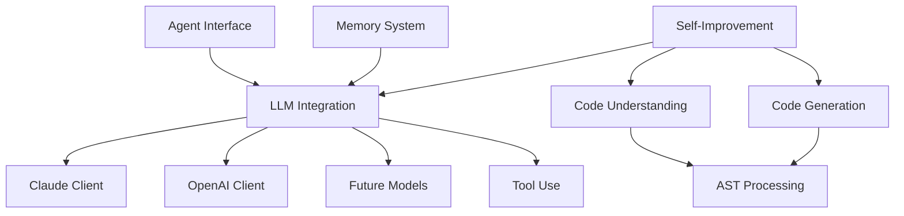
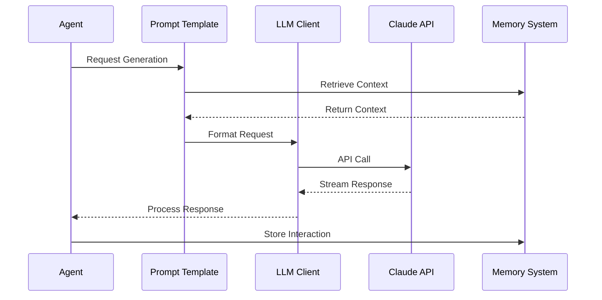
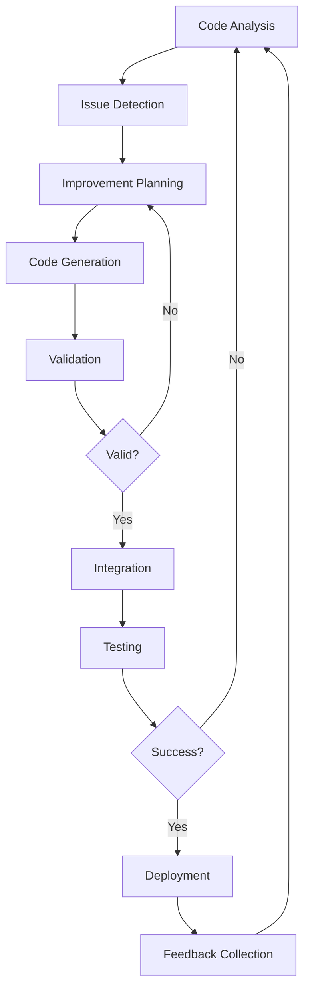

# LLM Integration Implementation Plan

This document outlines our detailed plan for implementing the LLM integration component of the Agentic AI Framework, which is a critical foundation for our self-evolving system capabilities.

## Current Status

We have completed the initial implementation of Claude 3.7 integration via Google Cloud Vertex AI, including:

- Basic configuration and client implementation
- Mock demonstration implementation
- Documentation and testing guide

## Phase 1: Complete Claude Integration (2 Weeks)

### Week 1: Core Implementation

#### Day 1-2: Fix Dependency Issues
- [ ] Resolve ZIO dependency conflicts
- [ ] Ensure Google Cloud Vertex AI dependencies are correctly configured
- [ ] Test basic compilation of the entire project

#### Day 3-4: Implement Real API Calls
- [ ] Replace mock implementation with actual API calls to Vertex AI
- [ ] Implement proper error handling and retry mechanisms
- [ ] Add logging for debugging and monitoring

#### Day 5: Streaming Implementation
- [ ] Implement streaming responses from Claude
- [ ] Create proper backpressure handling
- [ ] Optimize for low-latency responses

### Week 2: Testing and Refinement

#### Day 1-2: Unit Tests
- [ ] Create comprehensive unit tests for all components
- [ ] Implement test mocks for external API calls
- [ ] Ensure 90%+ code coverage

#### Day 3: Integration Tests
- [ ] Create integration tests with actual API calls
- [ ] Test error scenarios and edge cases
- [ ] Benchmark performance and resource usage

#### Day 4-5: Documentation and Examples
- [ ] Complete API documentation with examples
- [ ] Create tutorial for using Claude with different use cases
- [ ] Add diagrams illustrating the architecture

## Phase 2: Multi-Model Support (3 Weeks)

### Week 1: Abstract LLM Interface

#### Day 1-2: Design LLM Type Classes
- [ ] Create generic LLM interface with ZIO and category theory principles
- [ ] Design prompt template system with composable operators
- [ ] Implement type-safe response handlers

#### Day 3-5: Refactor Claude Implementation
- [ ] Adapt Claude client to use the new interface
- [ ] Ensure backward compatibility
- [ ] Add additional Claude-specific optimizations

### Week 2: Add OpenAI Integration

#### Day 1-3: Implement OpenAI Client
- [ ] Create OpenAI configuration
- [ ] Implement OpenAI client using the abstract interface
- [ ] Add specialized features for GPT-4 and beyond

#### Day 4-5: Model Switching and Fallback
- [ ] Implement dynamic model selection based on requirements
- [ ] Create fallback mechanisms for reliability
- [ ] Add cost optimization strategies

### Week 3: Testing and Advanced Features

#### Day 1-2: Benchmarking Framework
- [ ] Create system for comparing model performance
- [ ] Implement metrics collection and reporting
- [ ] Build automated evaluation pipeline

#### Day 3-5: Advanced Prompting
- [ ] Implement chain-of-thought prompting
- [ ] Add structured output parsing
- [ ] Create tool-use capabilities for LLMs

## Phase 3: Self-Evolution Foundations (4 Weeks)

### Week 1: Code Understanding

#### Day 1-3: Code Parsing and Representation
- [ ] Implement Scala parser integration
- [ ] Create abstract syntax tree (AST) representation
- [ ] Build semantic understanding capabilities

#### Day 4-5: Code Analysis
- [ ] Create code quality analyzers
- [ ] Implement dependency graph generation
- [ ] Build type inference and checking

### Week 2: Code Generation

#### Day 1-3: Template-Based Generation
- [ ] Implement code generation templates
- [ ] Create validation mechanisms for generated code
- [ ] Build testing framework for generated code

#### Day 4-5: LLM-Based Generation
- [ ] Design prompts for code generation
- [ ] Implement iterative refinement process
- [ ] Create specialized fine-tuning datasets

### Week 3-4: Self-Improvement Loop

#### Week 3, Day 1-3: Evaluation Mechanism
- [ ] Create metrics for code quality assessment
- [ ] Implement automated test generation
- [ ] Build performance benchmarking system

#### Week 3, Day 4-5: Feedback Integration
- [ ] Design feedback collection system
- [ ] Implement learning from execution results
- [ ] Create reinforcement learning framework

#### Week 4, Day 1-5: End-to-End Pipeline
- [ ] Integrate all components into self-improvement pipeline
- [ ] Implement safety constraints and validation gates
- [ ] Create monitoring and oversight dashboard
- [ ] Test with simple self-modification tasks

## Technical Architecture

### Core Components

### LLM Request Flow

### Self-Improvement Loop

## Key Innovations

1. **Category Theory-Based Composition**: Using functors and monads to compose LLM operations in a type-safe manner
2. **Algebraic Effects for LLM Interactions**: Implementing algebraic effects to handle LLM calls with proper error handling
3. **Self-Modifying Code Safeguards**: Creating formal verification techniques to ensure safety of self-modifications
4. **Meta-Learning Optimization**: Developing systems that learn how to better use LLMs over time
5. **Multi-Model Orchestration**: Building intelligent routing between different LLMs based on task requirements

## Success Metrics

1. **Performance**:
   - Response time under 2 seconds for standard queries
   - Throughput of 100+ requests per minute per instance
   - 99.9% availability

2. **Quality**:
   - 95%+ accuracy on benchmark tasks
   - 90%+ user satisfaction rating
   - 80%+ success rate on novel tasks

3. **Self-Improvement**:
   - Demonstrable improvements in generated code quality over time
   - Successful self-optimization of at least 5 system components
   - Reduction in human intervention for maintenance by 50%

## Next Steps

1. Complete the current Claude 3.7 implementation with real API calls
2. Create comprehensive testing suite
3. Begin designing the abstract LLM interface with category theory principles
4. Start implementing code understanding components
5. Research advanced prompt engineering techniques for code generation

## Resource Requirements

1. **Google Cloud**:
   - Vertex AI access with appropriate quotas
   - Storage for model artifacts and datasets
   - Compute for testing and benchmarking

2. **Development Resources**:
   - 2-3 Scala developers with ZIO expertise
   - 1-2 ML engineers with LLM experience
   - Infrastructure for CI/CD and testing

3. **Research**:
   - Access to academic papers and research
   - Collaboration with academic partners
   - Experimentation budget for novel approaches

## Risks and Mitigations

| Risk | Impact | Likelihood | Mitigation |
|------|--------|------------|------------|
| API changes from LLM providers | High | Medium | Abstract interfaces, versioning, adapters |
| Performance bottlenecks | Medium | High | Early benchmarking, caching, optimization |
| Security vulnerabilities | High | Medium | Rigorous review, sandboxing, testing |
| Self-modification issues | Critical | Medium | Formal verification, human oversight, rollback |
| Cost overruns | Medium | High | Usage monitoring, cost optimization, budget alerts |

This plan will be continuously updated as we progress through implementation and gain new insights.