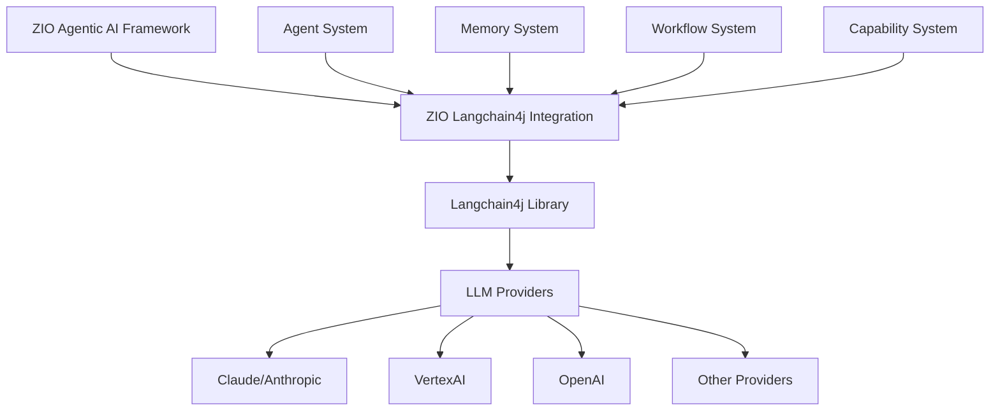

# Langchain4j Integration Design

**Version:** 1.0.0  
**Date:** April 20, 2025  
**Author:** ZIO Agentic AI Framework Team

## Table of Contents

1. [Introduction](#introduction)
2. [Design Principles](#design-principles)
3. [Architectural Overview](#architectural-overview)
4. [Core Components](#core-components)
   - [ZIO Wrappers](#zio-wrappers)
   - [Chat Models](#chat-models)
   - [Embedding Models](#embedding-models)
   - [Memory Integration](#memory-integration)
   - [Tool Support](#tool-support)
5. [Integration with Agent System](#integration-with-agent-system)
   - [Agent Implementation](#agent-implementation)
   - [Capability System Integration](#capability-system-integration)
   - [Compositional Patterns](#compositional-patterns)
6. [Prompt Engineering System](#prompt-engineering-system)
   - [Template Design](#template-design)
   - [Compositional Templates](#compositional-templates)
7. [ZIO-Native Features](#zio-native-features)
   - [Resource Management](#resource-management)
   - [Streaming Support](#streaming-support)
   - [Error Handling](#error-handling)
   - [Observability](#observability)
8. [Testing Strategy](#testing-strategy)
   - [Mock Implementations](#mock-implementations)
   - [Testing Patterns](#testing-patterns)
   - [LLM Test Harness](#llm-test-harness)
9. [Extension Points](#extension-points)
   - [Custom Model Integration](#custom-model-integration)
   - [Memory Extensions](#memory-extensions)
10. [Code Examples](#code-examples)
    - [Basic Usage](#basic-usage)
    - [Agent Integration](#agent-integration)
    - [Testing Examples](#testing-examples)
11. [Comparison with Alternatives](#comparison-with-alternatives)
    - [Direct API Integration](#direct-api-integration)
    - [Other Langchain4j Integrations](#other-langchain4j-integrations)
12. [Implementation Roadmap](#implementation-roadmap)
    - [Current Status](#current-status)
    - [Future Development](#future-development)

## Introduction

This document outlines the technical design for integrating Langchain4j with the ZIO Agentic AI Framework. Langchain4j is a Java library that provides a structured approach to building applications with Large Language Models (LLMs). By integrating Langchain4j, we leverage its mature implementation of LLM interactions while focusing our development efforts on the agentic aspects of our framework.

### Key Objectives

1. Provide seamless integration between Langchain4j and our ZIO-based framework
2. Enable type-safe interactions with LLM providers
3. Integrate with our agent system for composable AI workflows
4. Ensure resource-safe and performant operations
5. Maintain testability and observability
6. Support extensibility for future AI models and capabilities

The integration will allow developers to build sophisticated agentic systems with minimal boilerplate while maintaining the functional programming principles and type safety that are central to our framework.

## Design Principles

The design of the Langchain4j integration is guided by several core principles:

1. **Type Safety**: Utilize Scala's type system to ensure compile-time validation of LLM interactions
2. **Functional Purity**: Maintain referential transparency across all operations
3. **Composability**: Enable compositional design of both individual components and full agent systems
4. **ZIO-Native**: Leverage ZIO's effect system for resource management, concurrency, and error handling
5. **Extensibility**: Design for extension with clear extension points for new models and capabilities
6. **Testability**: Enable comprehensive testing with mocks and deterministic fixtures

These principles align with the overall framework architecture while addressing the specific needs of LLM integration through Langchain4j.

## Architectural Overview

The integration follows a layered architecture that wraps Langchain4j components with ZIO-native interfaces:



This layered approach provides several benefits:

1. Clear separation of concerns between framework and LLM integration
2. Thin adaptation layer that minimizes overhead
3. Ability to leverage Langchain4j features while maintaining ZIO semantics
4. Future-proofing against changes in either Langchain4j or LLM provider APIs

## Core Components

### ZIO Wrappers

The foundation of the integration is a set of ZIO wrappers for Langchain4j components. These wrappers translate Langchain4j's Java-based API into ZIO effects, providing:

- Type-safe interfaces for Langchain4j components
- Automatic resource management through ZIO effects
- Error handling through ZIO's error channel
- Integration with ZIO's concurrency model

The primary wrapper for Langchain4j's chat models is defined as:

```scala
trait ZIOChatLanguageModel {
  def generate(request: ChatLanguageModel.Request): ZIO[Any, Throwable, ChatLanguageModel.Response]
  def generateStream(request: ChatLanguageModel.Request): ZStream[Any, Throwable, String]
}
```

Implementation example:

```scala
case class ZIOChatLanguageModelLive(model: ChatLanguageModel) extends ZIOChatLanguageModel {
  override def generate(request: ChatLanguageModel.Request): ZIO[Any, Throwable, ChatLanguageModel.Response] =
    ZIO.attemptBlocking(model.generate(request))
  
  override def generateStream(request: ChatLanguageModel.Request): ZStream[Any, Throwable, String] =
    // Implementation for streaming response
    ZStream.fromZIO(generate(request)).flatMap { response =>
      ZStream.fromIterable(response.content.text.split(" ").map(_ + " "))
    }
}
```

### Chat Models

The integration provides a unified interface for all chat-based LLM providers through ZIO wrappers and factory methods:

```scala
object ZIOChatModelFactory {
  // Claude/Anthropic models
  def makeClaudeModel(
    apiKey: String, 
    modelName: String = "claude-3-opus-20240229"
  ): ZIO[Any, Throwable, ZIOChatLanguageModel] = ???
  
  // VertexAI models
  def makeVertexAIModel(
    projectId: String, 
    location: String, 
    modelName: String
  ): ZIO[Any, Throwable, ZIOChatLanguageModel] = ???
  
  // OpenAI models
  def makeOpenAIModel(
    apiKey: String, 
    modelName: String = "gpt-4"
  ): ZIO[Any, Throwable, ZIOChatLanguageModel] = ???
}
```

Each factory method handles the specific configuration required for that provider, while returning a common `ZIOChatLanguageModel` interface. This enables seamless switching between providers while maintaining a consistent API.

### Embedding Models

Similar to chat models, the integration provides ZIO wrappers for Langchain4j's embedding models:

```scala
trait ZIOEmbeddingModel {
  def embed(text: String): ZIO[Any, Throwable, Embedding]
  def embedAll(texts: List[String]): ZIO[Any, Throwable, List[Embedding]]
}
```

Implementation example:

```scala
case class ZIOEmbeddingModelLive(model: EmbeddingModel) extends ZIOEmbeddingModel {
  override def embed(text: String): ZIO[Any, Throwable, Embedding] =
    ZIO.attemptBlocking(model.embed(text))
  
  override def embedAll(texts: List[String]): ZIO[Any, Throwable, List[Embedding]] =
    ZIO.attemptBlocking {
      val embeddings = model.embedAll(texts.asJava)
      embeddings.asScala.toList
    }
}
```

Factory methods are provided for different embedding model providers:

```scala
object ZIOEmbeddingModelFactory {
  def makeVertexAIEmbeddingModel(
    projectId: String,
    location: String,
    modelName: String = "textembedding-gecko"
  ): ZIO[Any, Throwable, ZIOEmbeddingModel] = ???
  
  def makeOpenAIEmbeddingModel(
    apiKey: String,
    modelName: String = "text-embedding-3-small"
  ): ZIO[Any, Throwable, ZIOEmbeddingModel] = ???
}
```

### Memory Integration

The integration provides ZIO wrappers for Langchain4j's memory components, enabling stateful conversations and context management:

```scala
trait ZIOChatMemory {
  def addUserMessage(message: String): ZIO[Any, Throwable, Unit]
  def addAssistantMessage(message: String): ZIO[Any, Throwable, Unit]
  def messages: ZIO[Any, Throwable, List[ChatMessage]]
  def clear(): ZIO[Any, Throwable, Unit]
}
```

Implementation example:

```scala
case class ZIOChatMemoryLive(memory: ChatMemory) extends ZIOChatMemory {
  override def addUserMessage(message: String): ZIO[Any, Throwable, Unit] =
    ZIO.attemptBlocking(memory.add(UserMessage.from(message)))
  
  override def addAssistantMessage(message: String): ZIO[Any, Throwable, Unit] =
    ZIO.attemptBlocking(memory.add(AiMessage.from(message)))
  
  override def messages: ZIO[Any, Throwable, List[ChatMessage]] =
    ZIO.attemptBlocking(memory.messages().asScala.toList)
  
  override def clear(): ZIO[Any, Throwable, Unit] =
    ZIO.attemptBlocking(memory.clear())
}
```

Factory methods for different memory types:

```scala
object ZIOChatMemoryFactory {
  def createMessageWindow(maxMessages: Int): UIO[ZIOChatMemory] =
    ZIO.succeed(ZIOChatMemoryLive(MessageWindowChatMemory.withMaxMessages(maxMessages)))
  
  def createBufferMemory(): UIO[ZIOChatMemory] =
    ZIO.succeed(ZIOChatMemoryLive(ChatMemoryImpl.builder().build()))
}
```

### Tool Support

The integration provides ZIO wrappers for Langchain4j's tool system, enabling function calling with LLMs:

```scala
trait ZIOTool {
  def name: String
  def description: String
  def execute(arguments: Map[String, String]): ZIO[Any, Throwable, String]
}
```

Implementation example:

```scala
case class ZIOToolLive(tool: Tool) extends ZIOTool {
  override def name: String = tool.name()
  override def description: String = tool.description()
  override def execute(arguments: Map[String, String]): ZIO[Any, Throwable, String] =
    ZIO.attemptBlocking {
      val javaMap = arguments.asJava
      tool.invoke(javaMap)
    }
}
```

Tool registry for managing multiple tools:

```scala
case class ZIOToolRegistry(tools: List[ZIOTool]) {
  def register(tool: ZIOTool): ZIOToolRegistry =
    copy(tools = tool :: tools)
  
  def findTool(name: String): Option[ZIOTool] =
    tools.find(_.name == name)
    
  def asLangchainTools: List[Tool] =
    tools.map {
      case live: ZIOToolLive => live.tool
      case other => 
        // Create adapter for other ZIOTool implementations
        ???
    }
}
```

## Integration with Agent System

### Agent Implementation

The integration provides an implementation of our Agent trait using Langchain4j models:

```scala
case class LangchainAgent[-R, +E, -I, +O](
  id: AgentId,
  metadata: AgentMetadata,
  chatModel: ZIOChatLanguageModel,
  memory: ZIOChatMemory,
  tools: ZIOToolRegistry = ZIOToolRegistry(Nil),
  messageMapper: I => ZIO[R, E, String],
  responseMapper: String => ZIO[R, E, O]
) extends Agent[R, E, I, O] {
  
  override def process(input: I): ZIO[R, E, O] = {
    for {
      // Map input to message
      message <- messageMapper(input)
      
      // Add to memory
      _ <- memory.addUserMessage(message).mapError(e => ???)
      
      // Get all messages
      messages <- memory.messages.mapError(e => ???)
      
      // Create request
      request = createRequest(messages, tools)
      
      // Get response
      response <- chatModel.generate(request).mapError(e => ???)
      
      // Add to memory
      _ <- memory.addAssistantMessage(response.content.text).mapError(e => ???)
      
      // Map to output
      output <- responseMapper(response.content.text)
    } yield output
  }
  
  private def createRequest(
    messages: List[ChatMessage], 
    tools: ZIOToolRegistry
  ): ChatLanguageModel.Request = {
    // Implementation details for creating the request
    ???
  }
  
  override def initialize: ZIO[R, E, Unit] = ZIO.unit
  
  override def shutdown: ZIO[R, Nothing, Unit] = ZIO.unit
  
  override def getCapability[C <: Capability](id: CapabilityId): Option[C] = None
}
```

Factory methods for creating agents:

```scala
object LangchainAgent {
  def make[R, E, I, O](
    modelType: ModelType,
    config: ModelConfig,
    name: String = "agent",
    maxHistory: Int = 10,
    messageMapper: I => ZIO[R, E, String],
    responseMapper: String => ZIO[R, E, O]
  ): ZIO[R, E, Agent[R, E, I, O]] = {
    for {
      chatModel <- createModel(modelType, config).mapError(e => ???)
      memory <- ZIOChatMemoryFactory.createMessageWindow(maxHistory)
      agentId = AgentId(s"langchain-agent-${name}-${UUID.randomUUID()}")
      metadata = AgentMetadata(
        name = name,
        description = s"Langchain4j-based agent using ${modelType}",
        version = "1.0.0"
      )
    } yield LangchainAgent(
      id = agentId,
      metadata = metadata,
      chatModel = chatModel,
      memory = memory,
      messageMapper = messageMapper,
      responseMapper = responseMapper
    )
  }
  
  private def createModel(
    modelType: ModelType, 
    config: ModelConfig
  ): ZIO[Any, Throwable, ZIOChatLanguageModel] = {
    modelType match {
      case ModelType.Claude => 
        ZIOChatModelFactory.makeClaudeModel(
          config.apiKey.get, 
          config.modelName.getOrElse("claude-3-opus-20240229")
        )
      case ModelType.VertexAI => 
        ZIOChatModelFactory.makeVertexAIModel(
          config.projectId.get, 
          config.location.getOrElse("us-central1"), 
          config.modelName.getOrElse("gemini-1.5-pro")
        )
      case ModelType.OpenAI => 
        ZIOChatModelFactory.makeOpenAIModel(
          config.apiKey.get, 
          config.modelName.getOrElse("gpt-4")
        )
    }
  }
}
```

### Capability System Integration

Langchain4j agents can be enhanced with capabilities from our capability system:

```scala
trait LLMCapability extends Capability {
  def model: ZIOChatLanguageModel
  def generateResponse(input: String): ZIO[Any, Throwable, String]
}

case class LangchainLLMCapability(
  model: ZIOChatLanguageModel,
  memory: ZIOChatMemory
) extends LLMCapability {
  def generateResponse(input: String): ZIO[Any, Throwable, String] = {
    for {
      _ <- memory.addUserMessage(input)
      messages <- memory.messages
      request = createRequest(messages)
      response <- model.generate(request)
      _ <- memory.addAssistantMessage(response.content.text)
    } yield response.content.text
  }
  
  private def createRequest(messages: List[ChatMessage]): ChatLanguageModel.Request = {
    // Implementation details
    ???
  }
}
```

The capability can be added to agents:

```scala
def enhanceWithLLM(
  agent: Agent[R, E, I, O], 
  model: ZIOChatLanguageModel,
  memorySize: Int = 10
): ZIO[Any, Throwable, Agent[R, E, I, O]] = {
  for {
    memory <- ZIOChatMemoryFactory.createMessageWindow(memorySize)
    capability = LangchainLLMCapability(model, memory)
    enhanced = agent.withCapability(CapabilityId("llm"), capability)
  } yield enhanced
}
```

### Compositional Patterns

Langchain4j agents can be composed using our agent composition operators:

```scala
// Sequential composition of two Langchain agents
def sequential[R, E, I, M, O](
  first: LangchainAgent[R, E, I, M],
  second: LangchainAgent[R, E, M, O]
): Agent[R, E, I, O] = {
  first.andThen(second)
}

// Parallel composition of two Langchain agents
def parallel[R, E, I, O1, O2](
  first: LangchainAgent[R, E, I, O1],
  second: LangchainAgent[R, E, I, O2]
): Agent[R, E, I, (O1, O2)] = {
  first.zip(second)
}

// Creating a fallback chain of Langchain agents
def withFallback[R, E1, E2, I, O](
  primary: LangchainAgent[R, E1, I, O],
  fallback: LangchainAgent[R, E2, I, O]
): Agent[R, E2, I, O] = {
  primary.orElse(fallback)
}
```

## Prompt Engineering System

### Template Design

The integration includes a template system for structured prompt engineering:

```scala
trait PromptTemplate {
  def render(variables: Map[String, String]): String
  def tokenCount(variables: Map[String, String]): ZIO[Any, Throwable, Int]
}
```

Implementation example:

```scala
case class StringPromptTemplate(template: String) extends PromptTemplate {
  private val pattern = """\{\{([^}]+)\}\}""".r
  
  override def render(variables: Map[String, String]): String = {
    pattern.replaceAllIn(template, m => {
      val key = m.group(1).trim
      variables.getOrElse(key, s"{{$key}}")
    })
  }
  
  override def tokenCount(variables: Map[String, String]): ZIO[Any, Throwable, Int] = {
    // Use tokenizer to count tokens in rendered template
    val rendered = render(variables)
    ZIO.succeed(estimateTokenCount(rendered))
  }
  
  private def estimateTokenCount(text: String): Int = {
    // Simple estimation: ~4 characters per token
    text.length / 4
  }
}
```

### Compositional Templates

Templates can be composed for complex prompt structures:

```scala
object PromptTemplate {
  def fromString(template: String): PromptTemplate =
    StringPromptTemplate(template)
    
  def combine(templates: List[PromptTemplate], separator: String = "\n\n"): PromptTemplate =
    new PromptTemplate {
      override def render(variables: Map[String, String]): String =
        templates.map(_.render(variables)).mkString(separator)
        
      override def tokenCount(variables: Map[String, String]): ZIO[Any, Throwable, Int] =
        ZIO.foreach(templates)(_.tokenCount(variables)).map(_.sum + (templates.size - 1) * separator.length / 4)
    }
}
```

## ZIO-Native Features

### Resource Management

The integration leverages ZIO's resource management for safe handling of LLM connections:

```scala
def createManagedModel(
  modelType: ModelType,
  config: ModelConfig
): ZIO[Scope, Throwable, ZIOChatLanguageModel] = {
  ZIO.acquireRelease(
    LangchainAgent.createModel(modelType, config)
  )(model => 
    // Close any resources when done
    ZIO.attempt(model.asInstanceOf[AutoCloseable].close()).orDie
  )
}

// Using the managed model
ZIO.scoped {
  for {
    model <- createManagedModel(ModelType.Claude, config)
    result <- model.generate(request)
  } yield result
}
```

### Streaming Support

The integration provides streaming support through ZIO Stream:

```scala
trait ZIOStreamingChatModel {
  def generateStream(
    request: ChatLanguageModel.Request
  ): ZStream[Any, Throwable, String]
}

// Usage example
val streamingResponse: ZStream[Any, Throwable, String] = for {
  model <- ZStream.fromZIO(ZIOChatModelFactory.makeClaudeModel(apiKey))
  request = ChatLanguageModel.Request.from(userMessage)
  chunk <- model.generateStream(request)
} yield chunk
```

### Error Handling

The integration provides typed error handling:

```scala
sealed trait LangchainError extends Throwable
case class ModelError(cause: Throwable) extends LangchainError
case class RateLimitError(retryAfter: Option[Duration]) extends LangchainError
case class AuthenticationError(message: String) extends LangchainError
case class ContextLengthError(message: String) extends LangchainError

// Error handling example
model.generate(request)
  .catchSome {
    case e: RateLimitError => 
      // Wait and retry
      ZIO.sleep(e.retryAfter.getOrElse(1.second)) *> model.generate(request)
    case e: ContextLengthError =>
      // Reduce context and retry
      for {
        shortenedRequest <- shortenContext(request)
        result <- model.generate(shortenedRequest)
      } yield result
  }
```

### Observability

The integration provides observability through ZIO metrics and logging:

```scala
trait ObservableChatModel extends ZIOChatLanguageModel {
  override def generate(
    request: ChatLanguageModel.Request
  ): ZIO[Any, Throwable, ChatLanguageModel.Response] = {
    for {
      // Record start time
      start <- ZIO.clockWith(_.instant)
      
      // Log request
      _ <- ZIO.logDebug(s"LLM Request: ${request.messages.size} messages")
      
      // Execute request with timeout
      response <- super.generate(request)
        .timeout(30.seconds)
        .tap(_ => ZIO.logDebug(s"LLM Response received"))
        .tapError(e => ZIO.logWarning(s"LLM Error: ${e.getMessage}"))
      
      // Record end time and duration
      end <- ZIO.clockWith(_.instant)
      duration = Duration.fromMillis(ChronoUnit.MILLIS.between(start, end))
      
      // Update metrics
      _ <- ZIO.attempt {
        Metrics.llmRequestCounter.increment()
        Metrics.llmLatencyHistogram.update(duration.toMillis)
        Metrics.llmTokensCounter.increment(estimateTokenCount(response.content.text))
      }
    } yield response
  }
}
```

## Testing Strategy

### Mock Implementations

The integration provides mock implementations for testing:

```scala
class MockChatModel(responses: Map[String, String]) extends ZIOChatLanguageModel {
  override def generate(
    request: ChatLanguageModel.Request
  ): ZIO[Any, Throwable, ChatLanguageModel.Response] = {
    ZIO.succeed {
      val lastUserMessage = request.messages.asScala.last.text
      val responseText = responses.getOrElse(lastUserMessage, "I don't know how to respond to that.")
      ChatLanguageModel.Response.from(AiMessage.from(responseText))
    }
  }
  
  override def generateStream(
    request: ChatLanguageModel.Request
  ): ZStream[Any, Throwable, String] = {
    ZStream.fromZIO(generate(request))
      .flatMap { response =>
        val words = response.content.text.split(" ")
        ZStream.fromIterable(words.map(_ + " "))
      }
  }
}
```

### Testing Patterns

The integration provides testing patterns for different scenarios:

```scala
// Unit testing a Langchain agent
test("agent should respond appropriately to input") {
  val responses = Map(
    "Hello" -> "Hi there!",
    "What's the weather?" -> "I don't have real-time weather data."
  )
  
  val mockModel = new MockChatModel(responses)
  val memory = ZIOChatMemoryLive(MessageWindowChatMemory.withMaxMessages(10))
  
  val agent = LangchainAgent(
    id = AgentId("test-agent"),
    metadata = AgentMetadata("Test Agent", "For testing", "1.0.0"),
    chatModel = mockModel,
    memory = memory,
    messageMapper = (s: String) => ZIO.succeed(s),
    responseMapper = (s: String) => ZIO.succeed(s)
  )
  
  for {
    response1 <- agent.process("Hello")
    response2 <- agent.process("What's the weather?")
  } yield {
    assertTrue(response1 == "Hi there!")
    assertTrue(response2 == "I don't have real-time weather data.")
  }
}
```

### LLM Test Harness

The integration provides a test harness for LLM interactions:

```scala
case class LLMTestCase(
  input: String,
  expectedOutput: String,
  description: String = ""
)

def testChatModel(
  model: ZIOChatLanguageModel,
  testCases: List[LLMTestCase]
): ZIO[Any, Throwable, TestResult] = {
  ZIO.foreach(testCases) { testCase =>
    for {
      request = ChatLanguageModel.Request.from(UserMessage.from(testCase.input))
      response <- model.generate(request)
      actual = response.content.text
    } yield {
      val passed = actual.contains(testCase.expectedOutput)
      if (!passed) {
        println(s"Test case failed: ${testCase.description}")
        println(s"Expected to contain: ${testCase.expectedOutput}")
        println(s"Actual: $actual")
      }
      assertTrue(passed)
    }
  }.map(TestResult.all(_))
}
```

## Extension Points

### Custom Model Integration

The integration provides extension points for custom models:

```scala
trait CustomModelProvider {
  def id: String
  def createChatModel(config: Map[String, String]): ZIO[Any, Throwable, ZIOChatLanguageModel]
  def createEmbeddingModel(config: Map[String, String]): ZIO[Any, Throwable, ZIOEmbeddingModel]
}

object ModelRegistry {
  private val providers = new ConcurrentHashMap[String, CustomModelProvider]()
  
  def registerProvider(provider: CustomModelProvider): UIO[Unit] =
    ZIO.succeed(providers.put(provider.id, provider))
    
  def createChatModel(
    providerId: String, 
    config: Map[String, String]
  ): ZIO[Any, Throwable, ZIOChatLanguageModel] = {
    ZIO.fromOption(Option(providers.get(providerId)))
      .orElseFail(new IllegalArgumentException(s"Provider not found: $providerId"))
      .flatMap(_.createChatModel(config))
  }
}
```

### Memory Extensions

The integration provides extension points for custom memory implementations:

```scala
trait CustomMemoryProvider {
  def id: String
  def createMemory(config: Map[String, String]): ZIO[Any, Throwable, ZIOChatMemory]
}

object MemoryRegistry {
  private val providers = new ConcurrentHashMap[String, CustomMemoryProvider]()
  
  def registerProvider(provider: CustomMemoryProvider): UIO[Unit] =
    ZIO.succeed(providers.put(provider.id, provider))
    
  def createMemory(
    providerId: String, 
    config: Map[String, String]
  ): ZIO[Any, Throwable, ZIOChatMemory] = {
    ZIO.fromOption(Option(providers.get(providerId)))
      .orElseFail(new IllegalArgumentException(s"Provider not found: $providerId"))
      .flatMap(_.createMemory(config))
  }
}
```

## Code Examples

### Basic Usage

```scala
import com.agenticai.langchain4j.*
import dev.langchain4j.data.message.UserMessage
import zio.*

object BasicExample extends ZIOAppDefault {
  val program = for {
    // Create a Claude model
    model <- ZIOChatModelFactory.makeClaudeModel(
      apiKey = sys.env("ANTHROPIC_API_KEY"),
      modelName = "claude-3-opus-20240229"
    )
    
    // Create a request
    request = ChatLanguageModel.Request.from(
      UserMessage.from("Explain quantum computing in simple terms")
    )
    
    // Get a response
    response <- model.generate(request)
    
    // Print the response
    _ <- Console.printLine(response.content.text)
  } yield ()
  
  def run = program
}
```

### Agent Integration

```scala
import com.agenticai.agents.*
import com.agenticai.langchain4j.*
import zio.*

object AgentExample extends ZIOAppDefault {
  // Config for the model
  val config = ModelConfig(
    apiKey = Some(sys.env("ANTHROPIC_API_KEY")),
    modelName = Some("claude-3-opus-20240229")
  )
  
  // Create a string processing agent
  val program = for {
    // Create a Langchain agent
    agent <- LangchainAgent.make[Any, Throwable, String, String](
      modelType = ModelType.Claude,
      config = config,
      name = "text-processor",
      messageMapper = s => ZIO.succeed(s),
      responseMapper = s => ZIO.succeed(s)
    )
    
    // Process input
    response <- agent.process("Summarize the key points of functional programming")
    
    // Print the response
    _ <- Console.printLine(response)
  } yield ()
  
  def run = program
}
```

### Testing Examples

```scala
import com.agenticai.langchain4j.*
import com.agenticai.langchain4j.testing.*
import zio.test.*
import zio.*

object LangchainTest extends ZIOSpecDefault {
  def spec = suite("Langchain4j Integration Tests")(
    test("mock model should return expected responses") {
      val responses = Map(
        "Hello" -> "Hi there!",
        "What's the weather?" -> "I don't have real-time weather data."
      )
      
      val mockModel = new MockChatModel(responses)
      
      for {
        response1 <- mockModel.generate(createRequest("Hello"))
        response2 <- mockModel.generate(createRequest("What's the weather?"))
      } yield {
        assertTrue(response1.content.text == "Hi there!") &&
        assertTrue(response2.content.text == "I don't have real-time weather data.")
      }
    },
    
    test("model should handle streaming") {
      val responses = Map(
        "Tell me a joke" -> "Why did the chicken cross the road? To get to the other side!"
      )
      
      val mockModel = new MockChatModel(responses)
      
      for {
        chunks <- mockModel.generateStream(createRequest("Tell me a joke"))
          .runCollect
          .map(_.mkString)
      } yield {
        assertTrue(chunks == "Why did the chicken cross the road? To get to the other side!")
      }
    }
  )
  
  private def createRequest(text: String) = {
    ChatLanguageModel.Request.from(UserMessage.from(text))
  }
}
```

## Comparison with Alternatives

### Direct API Integration

**Advantages of Langchain4j over direct API integration:**

1. **Breadth of Models**: Langchain4j supports multiple LLM providers through a unified interface
2. **Feature Completeness**: Includes built-in support for chat models, embeddings, and tools
3. **Maintenance**: Reduces burden of maintaining provider-specific code
4. **Future-Proofing**: Langchain4j team handles API changes in providers

**Disadvantages compared to direct API integration:**

1. **Overhead**: Adds a thin layer between our code and the LLM providers
2. **Feature Lag**: May not immediately support new provider features
3. **Customization**: Less control over low-level interactions

### Other Langchain4j Integrations

**Advantages over other Langchain4j integrations:**

1. **ZIO Integration**: Deep integration with ZIO for effect management, resource safety, and concurrency
2. **Type Safety**: Leverages Scala's type system for compile-time guarantees
3. **Agent System**: Integrates with our agent composition system for complex workflows
4. **Observability**: Built-in metrics and logging for LLM operations
5. **Testing**: Comprehensive testing infrastructure with mocks and test harnesses

## Implementation Roadmap

### Current Status

As of April 2025, the implementation status is:

- ✅ **Implemented**: ZIO wrappers for Langchain4j chat models
- ✅ **Implemented**: Factory methods for Claude and Vertex AI models
- ✅ **Implemented**: Basic memory adapters
- ✅ **Implemented**: Streaming support for chat models
- ✅ **Implemented**: Enhanced memory capabilities with filtering and metadata support
- ✅ **Implemented**: Embedding model integration with multiple provider support
- ✅ **Implemented**: Vector store integration with in-memory implementation
- 🚧 **In Progress**: Tool support integration
- 🚧 **In Progress**: Advanced Langchain4j features
- 🔮 **Planned**: RAG (Retrieval Augmented Generation) capabilities
- 🔮 **Planned**: Agent types from Langchain4j

### Future Development

Planned enhancements:

1. **Advanced Vector Store Integration**: Implement additional vector store backends (Redis, Postgres, etc.)
2. **RAG System**: Build a retrieval-augmented generation system on Langchain4j
3. **Agent Framework**: Integrate more deeply with Langchain4j's agent framework
4. **Prompt Management**: Develop a comprehensive prompt management system
5. **Testing Infrastructure**: Expand testing capabilities for LLM applications
6. **Observability**: Enhance metrics and tracing for LLM operations