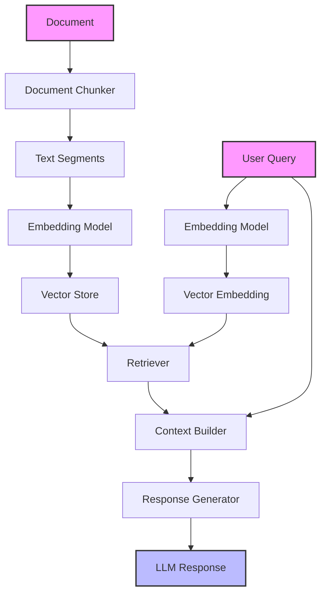
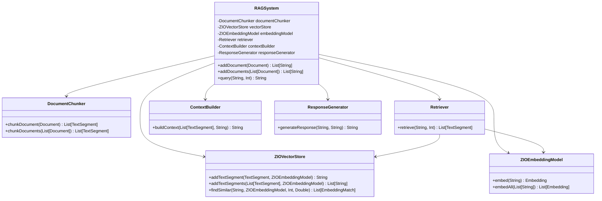

# RAG System Design

## Introduction

This document describes the design of the Retrieval-Augmented Generation (RAG) system for our ZIO Agentic AI Framework. The RAG system provides a way to enhance LLM responses with relevant context from a knowledge base, improving the quality, accuracy, and groundedness of generated content.

## 1. Architectural Overview

The RAG system follows a modular, composable architecture with well-defined interfaces between components. This design prioritizes flexibility, extensibility, and type safety, while maintaining ZIO's functional programming principles.

### High-Level Architecture



### Data Flow

1. **Ingest Pipeline**:
   - Documents are processed through the document chunker to create text segments
   - Text segments are embedded using the embedding model
   - Embeddings and their source segments are stored in the vector store

2. **Query Pipeline**:
   - User query is embedded using the same embedding model
   - Retriever uses the query embedding to find similar segments in the vector store
   - Context builder combines the retrieved segments into a prompt context
   - Response generator uses the context and query to generate a final response

### Component Relationships



## 2. Core Components

### Document Processing Pipeline

The document processing pipeline is responsible for processing input documents into chunks that can be embedded and stored in the vector store. It consists of:

1. **Document Chunker**: Breaks documents into manageable segments for effective retrieval
   - `DocumentChunker` trait defines the interface for chunking documents
   - `DefaultDocumentChunker` provides a configurable implementation with chunk size and overlap parameters
   - Additional chunking strategies (e.g., semantic chunking) can be added as alternative implementations

2. **Embedding Pipeline**: Generates vector embeddings for chunks
   - Leverages existing `ZIOEmbeddingModel` for embedding generation
   - Works with various embedding models through the unified interface
   - Can be extended with batching and caching optimizations

3. **Vector Storage**: Stores embeddings and their source segments
   - Uses `ZIOVectorStore` for storing and retrieving embeddings
   - Supports different implementations (in-memory, persistent)
   - Provides efficient similarity search capabilities

### Chunking and Embedding Strategies

#### Chunking Strategies
- **Fixed-Size Chunking**: Simple approach with configurable size and overlap
- **Semantic Chunking**: Break based on semantic units (paragraphs, sections)
- **Recursive Chunking**: Hierarchical approach for preserving document structure

#### Embedding Strategies
- **Document-Level Embedding**: One embedding per document (less granular, faster)
- **Chunk-Level Embedding**: One embedding per chunk (more granular, more accurate)
- **Hierarchical Embedding**: Multiple levels of embeddings (flexible retrieval)

### Retrieval Mechanisms

The retrieval component is responsible for finding the most relevant segments based on the user query. It:

1. Embeds the user query using the same embedding model as the documents
2. Searches the vector store for similar vectors
3. Returns the text segments associated with the most similar vectors

Configurable parameters include:
- Maximum number of results to retrieve
- Minimum similarity score threshold
- Optional filters (metadata, source, etc.)

### Context Integration

The context builder component is responsible for integrating the retrieved segments into a coherent context that can be used by the LLM. Features include:

1. **Context Formatting**: Formats retrieved segments into a prompt template
2. **Context Management**: Ensures context stays within token limits
3. **Query Integration**: Integrates the original query with retrieved context

### Response Generation

The response generation component uses the LLM to generate a final response based on the context and query. It:

1. Receives the formatted context and original query
2. Sends a request to the LLM through the ZIOChatLanguageModel
3. Returns the generated response

## 3. API Design

### User-Facing API

The RAG system provides a simple, intuitive API for end users:

```scala
// Create a RAG system with builder pattern
val ragSystem = RAGSystem.builder
  .withVectorStore(vectorStore)
  .withEmbeddingModel(embeddingModel)
  .withDefaultDocumentChunker()
  .withDefaultRetriever()
  .withDefaultContextBuilder()
  .withDefaultResponseGenerator(chatModel)
  .build

// Add documents to the knowledge base
val documentIds = ragSystem.addDocument(document)

// Query the system
val response = ragSystem.query("What is the capital of France?")
```

### Configuration Options

The RAG system is highly configurable through the builder pattern:

```scala
val ragSystem = RAGSystem.builder
  .withVectorStore(vectorStore)
  .withEmbeddingModel(embeddingModel)
  .withDocumentChunker(DocumentChunker(1000, 200))
  .withRetriever(DefaultRetriever(vectorStore, embeddingModel, 0.8))
  .withContextBuilder(DefaultContextBuilder(4000, "Context: {context}\nQuestion: {query}"))
  .withResponseGenerator(DefaultResponseGenerator(chatModel))
  .build
```

### Customization Points

The RAG system provides multiple customization points:

1. **Document Chunker**: Control how documents are split into segments
2. **Retriever**: Control how segments are retrieved based on queries
3. **Context Builder**: Control how context is built from segments
4. **Response Generator**: Control how responses are generated from context and queries

## 4. Integration Points

### Vector Store Integration

The RAG system integrates with vector stores through the `ZIOVectorStore` trait, which provides methods for:

- Adding text segments with their embeddings
- Searching for similar embeddings
- Managing the vector store (clearing, updating, etc.)

The built-in `InMemoryZIOVectorStore` provides a reference implementation, while additional implementations can be added for different vector databases.

### Embedding Model Integration

The RAG system integrates with embedding models through the `ZIOEmbeddingModel` trait, which provides methods for:

- Embedding single text strings
- Embedding batches of text strings

This allows the RAG system to work with any embedding model that implements this interface, including models from different providers.

### Agent System Integration

The RAG system can be integrated with the agent system in several ways:

1. **Tool Integration**: Expose the RAG system as a tool that agents can use
2. **Memory Integration**: Use the RAG system to enhance agent memory
3. **Reasoning Integration**: Use the RAG system for agent reasoning steps

## 5. Performance Considerations

### Caching Strategies

To improve performance, the RAG system can implement several caching strategies:

1. **Embedding Cache**: Cache embeddings for frequently used queries
2. **Retrieval Cache**: Cache retrieval results for the same or similar queries
3. **Response Cache**: Cache final responses for identical queries

### Batch Processing Optimizations

For processing large document collections, batch processing optimizations include:

1. **Batch Embedding**: Process multiple chunks in a single embedding request
2. **Parallel Processing**: Process multiple documents or chunks in parallel
3. **Incremental Processing**: Process documents incrementally as they are added

### Memory Usage Optimizations

To optimize memory usage, strategies include:

1. **Stream Processing**: Process documents as streams rather than loading them all in memory
2. **Lazy Loading**: Load segments from storage only when needed
3. **Dimension Reduction**: Use techniques like PCA to reduce embedding dimensions

## 6. Extension Points

### Document Type Support

The RAG system can be extended to support additional document types:

1. **Text Documents**: Plain text, PDF, Word, etc.
2. **Web Content**: HTML, JSON, XML, etc.
3. **Structured Data**: CSV, databases, APIs, etc.

This can be achieved through document processors that convert various formats to the standard Document type.

### Custom Retrievers

Custom retrievers can be implemented for specific use cases:

1. **Hybrid Retrievers**: Combine vector search with keyword search
2. **Filtered Retrievers**: Apply metadata filters to retrieval results
3. **Reranking Retrievers**: Apply additional ranking models to initial results

### Context Customization

Context building can be customized in several ways:

1. **Template Customization**: Use different templates for different types of queries
2. **Segment Ordering**: Order segments by relevance, chronology, etc.
3. **Segment Summarization**: Summarize segments to fit more content

## 7. Testing Strategy

### Unit Testing

Unit tests for the RAG system focus on testing individual components:

1. **DocumentChunker Tests**: Verify that documents are correctly chunked
2. **Retriever Tests**: Verify that similar segments are retrieved correctly
3. **ContextBuilder Tests**: Verify that context is built correctly
4. **ResponseGenerator Tests**: Verify that responses are generated correctly

### Integration Testing

Integration tests verify that the components work together:

1. **End-to-End Tests**: Add documents and query the RAG system
2. **Vector Store Integration**: Test with different vector store implementations
3. **Embedding Model Integration**: Test with different embedding models

### Performance Testing

Performance tests measure the system's performance under different conditions:

1. **Scalability Tests**: Measure performance with increasing document collections
2. **Latency Tests**: Measure query response time
3. **Throughput Tests**: Measure number of queries per second

## 8. Implementation Roadmap

### Phase 1: Core RAG System

1. **Document Chunking**: Implement basic document chunking
2. **Vector Storage**: Implement in-memory vector store integration
3. **Retrieval**: Implement simple similarity-based retrieval
4. **Context Building**: Implement basic context building
5. **Response Generation**: Implement LLM response generation

### Phase 2: Optimizations and Extensions

1. **Advanced Chunking**: Implement semantic chunking
2. **Batch Processing**: Implement batch processing optimizations
3. **Caching**: Implement caching strategies
4. **Document Types**: Support additional document types
5. **Custom Retrievers**: Implement hybrid and filtering retrievers

### Phase 3: Performance and Integration

1. **Persistent Storage**: Implement integration with persistent vector stores
2. **Agent Integration**: Integrate with agent system
3. **Performance Tuning**: Optimize performance for large document collections
4. **UI Integration**: Develop UI for managing RAG systems
5. **Documentation and Examples**: Create comprehensive documentation and examples

## Conclusion

The RAG system design provides a flexible, extensible framework for enhancing LLMs with external knowledge. The modular architecture allows for easy customization and extension, while the ZIO-native implementation ensures functional purity and composability.