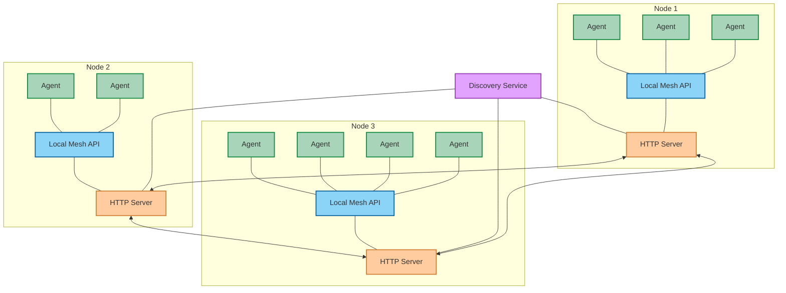
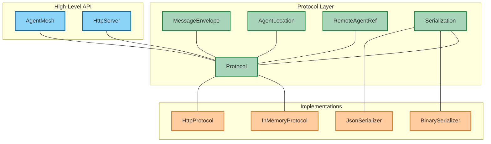
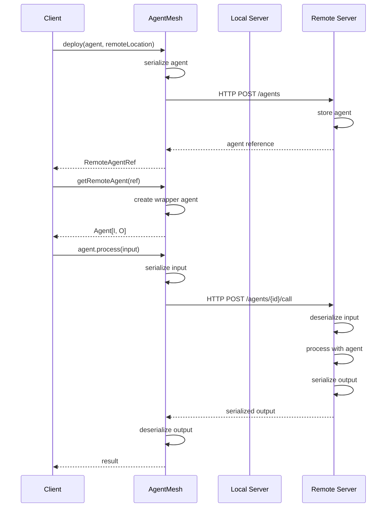
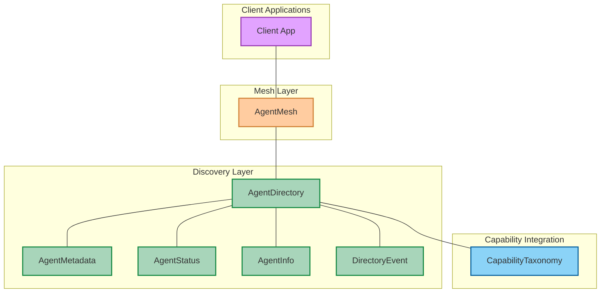
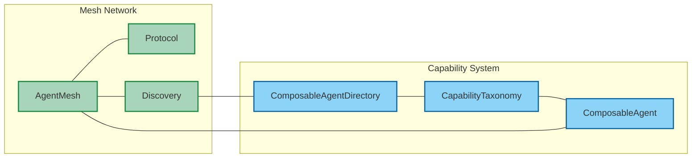
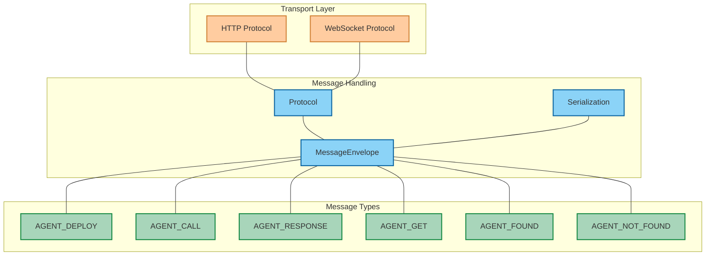
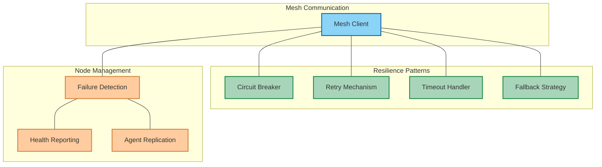
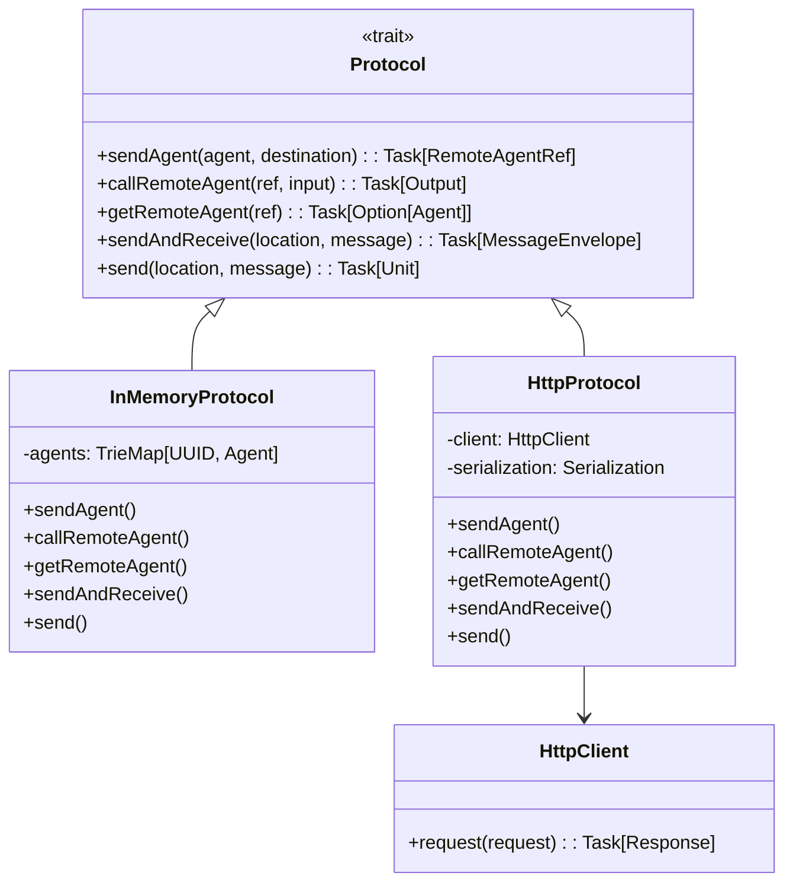
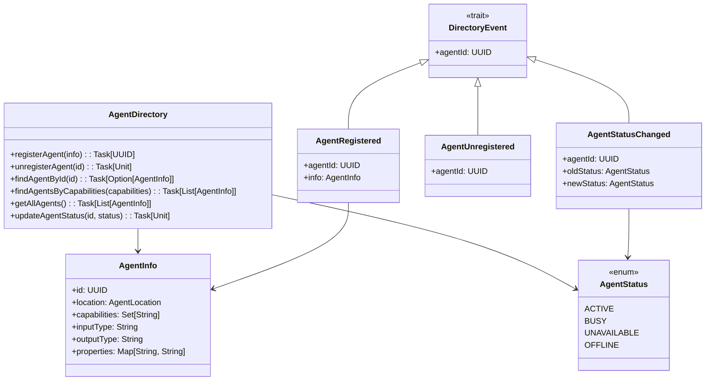
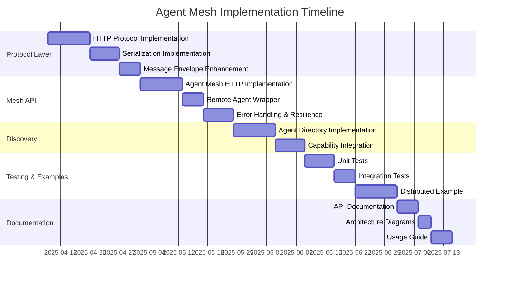

# Agent Mesh Network: Architecture Diagrams

## Overview

This document provides comprehensive architectural diagrams for the Distributed Agent Mesh Network system, illustrating the key components, interactions, and workflows.

## High-Level Mesh Architecture

## Protocol Layer Architecture

## Agent Deployment and Communication

## Agent Discovery System

## Integration with Capability System

## Message Flow Architecture

## Fault Tolerance Architecture

## Implementing HTTP Protocol

## Agent Discovery Implementation

## Implementation Plan Timeline

These diagrams provide a comprehensive visualization of the Agent Mesh architecture, from high-level design to detailed implementation classes and timelines. They should serve as valuable guides for implementation and documentation of the distributed agent mesh system.