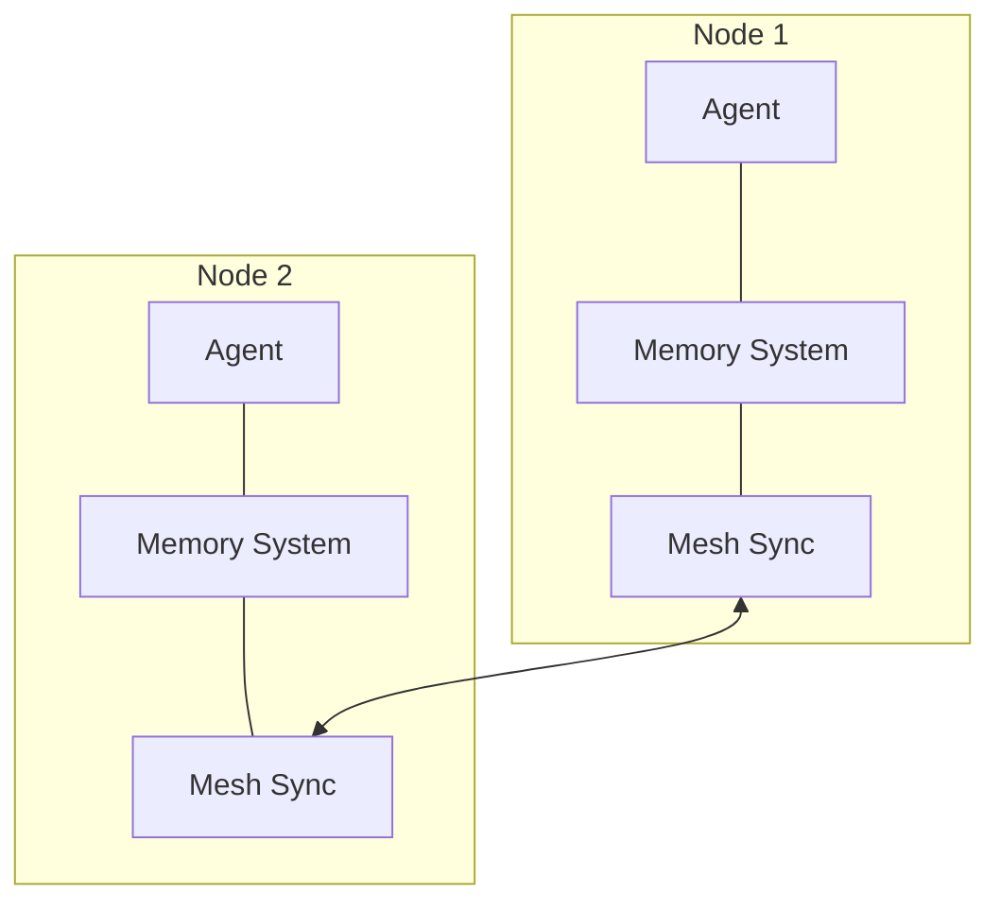
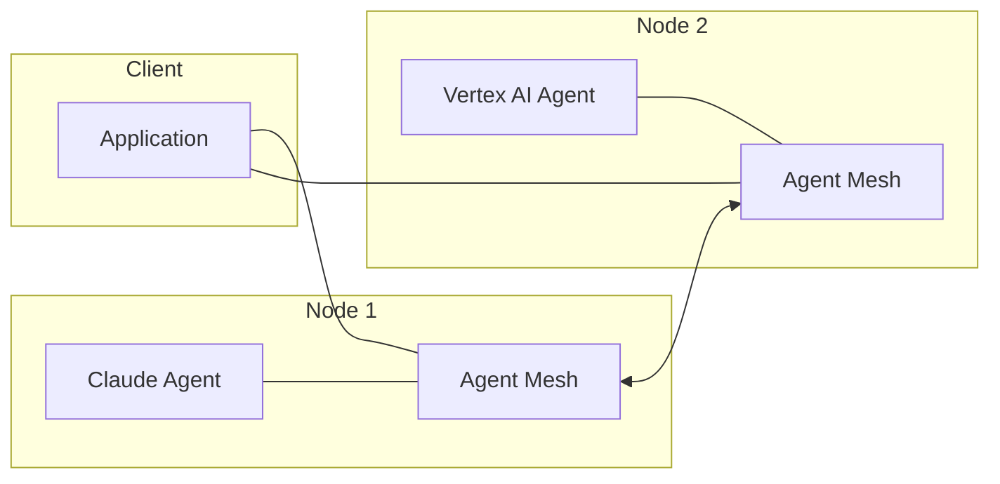
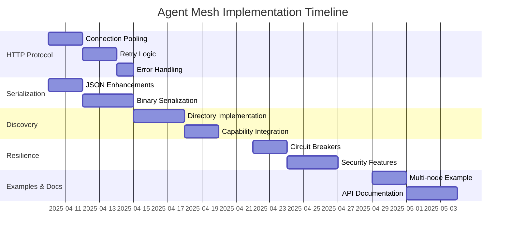

# Agent Mesh Network: Implementation Plan

## Current Status Overview

The Agentic AI Framework's distributed mesh network provides a foundation for deploying, discovering, and communicating with agents across different machines and processes. This document outlines the implementation plan for completing and enhancing the mesh network functionality.

## Current Implementation Status

| Component | Status | Notes |
|-----------|--------|-------|
| Core Interfaces | ✅ Complete | Basic traits and interfaces defined |
| Protocol Trait | ✅ Complete | Core communication interface established |
| Protocol Messages | ✅ Complete | MessageEnvelope, AgentLocation defined |
| In-Memory Protocol | ✅ Complete | Local testing implementation available |
| HTTP Server | ✅ Partial | Basic routes defined, needs enhancements |
| HTTP Protocol | ✅ Partial | Initial implementation created |
| Serialization | ✅ Partial | JSON serialization implemented |
| Agent Discovery | ⚠️ Started | Directory interfaces defined, implementation needed |
| Integration with Capabilities | ❌ Not Started | Need to connect with capability-based agents |
| Testing Infrastructure | ❌ Not Started | Need comprehensive test suite |
| Examples | ⚠️ Partial | Basic example created, needs enhancement |

## Implementation Plan

### Phase 1: Complete HTTP Protocol Implementation (Week 1)

**Objectives:** Finalize the HTTP protocol implementation to enable robust communication between mesh nodes.

#### Tasks:

1. **HTTP Client Enhancements:**
   - Add connection pooling for performance
   - Implement retry logic for failed requests
   - Add proper error handling and recovery mechanisms

2. **Serialization Enhancements:**
   - Complete JsonSerialization for complex object types
   - Add binary serialization for performance-critical paths
   - Implement serialization registry for type handling

3. **Protocol Extensions:**
   - Add protocol versioning for future compatibility
   - Implement compression for large message payloads
   - Add protocol negotiation between nodes

4. **Testing HTTP Implementation:**
   - Create unit tests for HTTP protocol components
   - Implement integration tests for node-to-node communication
   - Add performance tests for throughput and latency measurements

**Expected Outcome:** A robust HTTP protocol implementation that can reliably transport agents and messages between nodes with proper error handling and recovery.

### Phase 2: Agent Discovery and Capability Integration (Week 2)

**Objectives:** Implement agent discovery across the mesh and integrate with the capability-based agent system.

#### Tasks:

1. **Complete Agent Directory Implementation:**
   - Implement `AgentDirectory` service with in-memory storage
   - Add persistence for agent registry
   - Implement agent status updates and heartbeats

2. **Discovery Protocol:**
   - Add discovery messages to Protocol
   - Implement discovery API in AgentMesh
   - Create directory synchronization between nodes

3. **Capability Integration:**
   - Connect mesh discovery with CapabilityTaxonomy
   - Implement capability-based agent lookup across the mesh
   - Enable remote capability discovery and querying

4. **Agent Metadata:**
   - Enhance AgentInfo with capability metadata
   - Add versioning for agent capabilities
   - Implement capability validation during registration

**Expected Outcome:** A comprehensive agent discovery system that allows finding agents by capabilities across multiple nodes in the mesh.

### Phase 3: Resilience and Security (Week 3)

**Objectives:** Enhance the mesh network with fault tolerance, security features, and monitoring.

#### Tasks:

1. **Fault Tolerance:**
   - Implement circuit breakers for remote calls
   - Add automatic retry with exponential backoff
   - Create failover mechanisms for agent redundancy

2. **Security Features:**
   - Add authentication for mesh nodes
   - Implement authorization for agent access
   - Add encryption for agent communication

3. **Monitoring and Metrics:**
   - Add event publishing for mesh activities
   - Implement performance metrics collection
   - Create dashboard for mesh visualization

4. **Health Checking:**
   - Implement node health checks
   - Add agent health monitoring
   - Create automatic recovery mechanisms

**Expected Outcome:** A resilient and secure mesh network that can handle node failures, secure communication, and provide visibility into the system's health.

### Phase 4: Advanced Features and Examples (Week 4)

**Objectives:** Implement advanced features and create comprehensive examples demonstrating mesh functionality.

#### Tasks:

1. **Agent Migration:**
   - Implement agent state transfer between nodes
   - Add agent rebalancing for load distribution
   - Create agent versioning and upgrade mechanisms

2. **Memory Integration:**
   - Connect distributed agents with shared memory systems
   - Implement memory synchronization across nodes
   - Add memory caching for performance

3. **Enhanced Examples:**
   - Create multi-node deployment example
   - Implement capability-based workflow example
   - Add fault tolerance demonstration

4. **Documentation:**
   - Complete API documentation
   - Add deployment guides
   - Create troubleshooting documentation

**Expected Outcome:** A feature-complete mesh network with advanced capabilities and comprehensive examples that demonstrate real-world use cases.

## Integration with Existing Framework

### Memory System Integration

The mesh network will integrate with the existing memory system to provide distributed memory capabilities:



### LLM Integration

LLM-based agents will be deployable to the mesh network, enabling distributed AI processing:



## Testing Strategy

1. **Unit Testing:**
   - Test each component in isolation
   - Mock dependencies for controlled testing
   - Verify behavior against specifications

2. **Integration Testing:**
   - Test communication between components
   - Verify end-to-end workflows
   - Test with different node configurations

3. **Performance Testing:**
   - Measure throughput and latency
   - Test with varying load patterns
   - Identify bottlenecks and optimize

4. **Resilience Testing:**
   - Simulate node failures
   - Test recovery mechanisms
   - Verify system behavior under stress

## Key Components Detailed Specifications

### HTTP Protocol

The HTTP protocol implementation provides:

- Agent deployment via HTTP POST
- Remote agent calling with serialized inputs/outputs
- Message passing between nodes
- Error handling and retry mechanisms

Example flow for remote agent call:

```scala
// Client code
val remoteAgent = mesh.getRemoteAgent(agentRef)
val result = remoteAgent.process("input data")

// Translates to:
// 1. Serialize "input data"
// 2. HTTP POST to /agents/{id}/call with serialized data
// 3. Remote node executes agent with deserialized input
// 4. Serialize result and return
// 5. Deserialize result and return to client
```

### Agent Directory

The agent directory provides:

- Registration of agents with capabilities
- Discovery of agents by ID or capabilities
- Status tracking for agents
- Events for agent lifecycle

Example of capability-based discovery:

```scala
// Find agents with specific capabilities
val textProcessors = directory.findAgentsByCapabilities(
  Set("text-processing", "translation")
)

// Find the best agent for a task
val bestTranslator = textProcessors
  .filter(_.capabilities.contains("translation"))
  .sortBy(_.metadata.get("accuracy").map(_.toDouble).getOrElse(0.0))
  .headOption
```

## Implementation Timeline



## Next Steps

1. Complete the HTTP protocol implementation with retry logic and connection pooling
2. Enhance the serialization system to handle complex types
3. Implement the agent directory with capability integration
4. Create comprehensive tests for all components
5. Enhance the example to demonstrate distributed capabilities

This implementation plan provides a roadmap for completing the Agent Mesh Network, enabling powerful distributed agent capabilities in the Agentic AI Framework.