# Circuit Pattern Diagrams

This document provides visual representations of the circuit patterns implemented in our framework, inspired by Factorio's circuit networks.

## Memory Cell

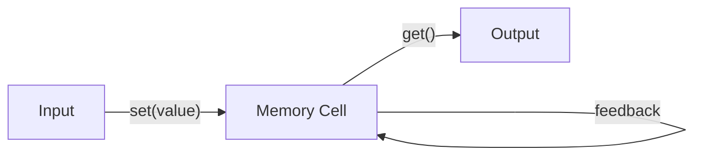

The Memory Cell maintains state between operations, similar to how Factorio's memory cells hold signals across multiple ticks.

## Transform (Arithmetic Combinator)

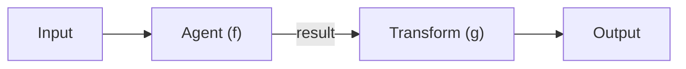

Transforms the output of an agent, analogous to an Arithmetic Combinator that takes signals and outputs a modified version.

## Filter (Decider Combinator)

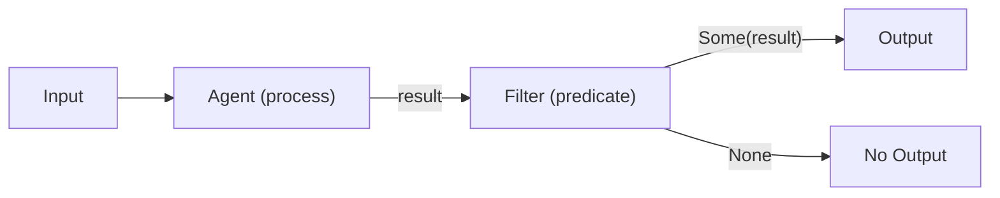

Conditionally passes output based on a predicate, similar to a Decider Combinator that only lets signals through if they meet a condition.

## Pipeline

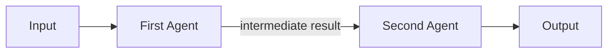

Connects agents in sequence, like a production line where the output of one stage becomes the input to the next.

## Parallel Processing

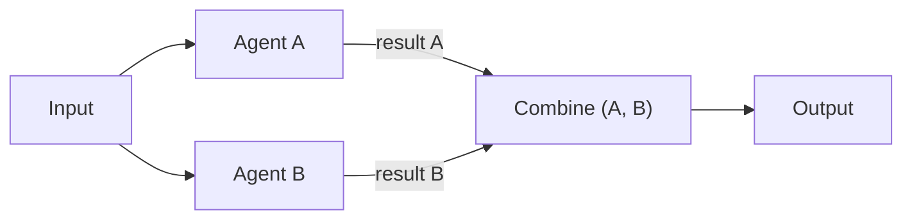

Processes input through multiple paths simultaneously and combines the results, similar to splitting a belt in Factorio and recombining the processed items.

## Shift Register

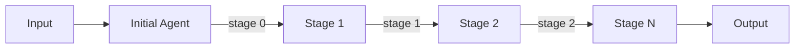

Applies a sequence of transformations to data, similar to Factorio's shift register that pushes signals through a sequence of memory cells.

## Clock

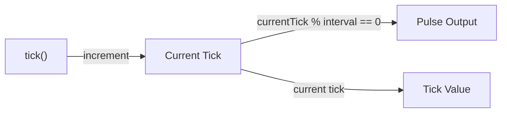

Generates regular pulses, like Factorio's clock circuits that drive timing operations.

## Feedback Loop

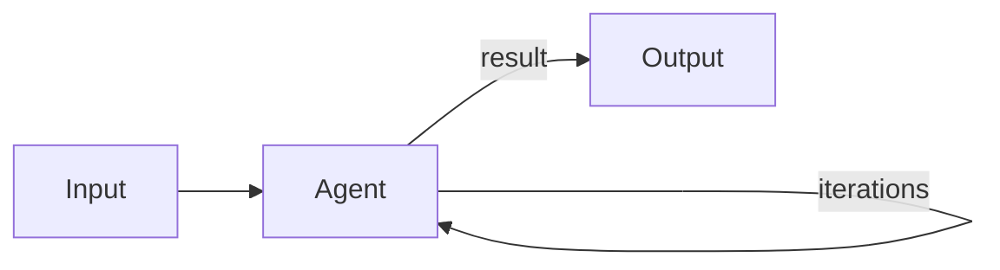

Applies an operation repeatedly to its own output, like a recursive circuit in Factorio.

## Ring Buffer

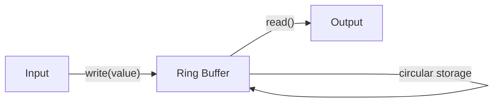

Creates a continuous loop of memory cells, similar to how Factorio's belt printers loop data around a circuit.

## Bit Packing

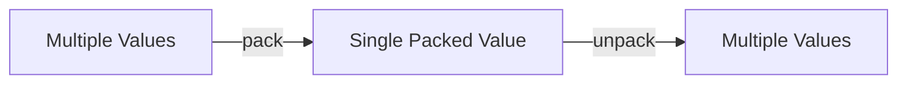

Compresses multiple values into a single value, like how Factorio's belt printers encode multiple pixel values into a single signal.

## Complete Processing System

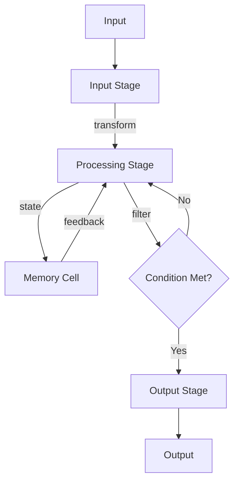

A full processing system combining multiple circuit patterns, similar to complex Factorio circuit networks that combine multiple components.

These diagrams illustrate how our circuit patterns translate the concepts from Factorio's visual programming system into functional programming constructs in our framework.