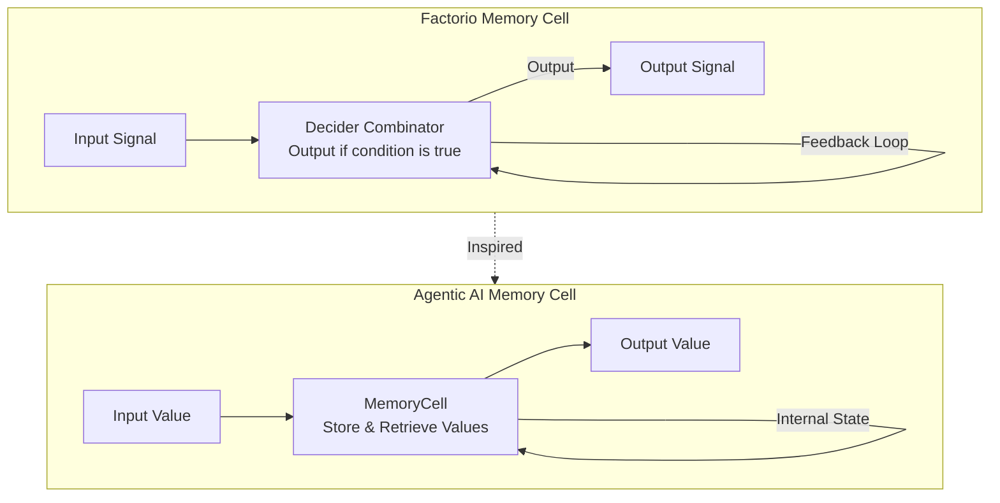
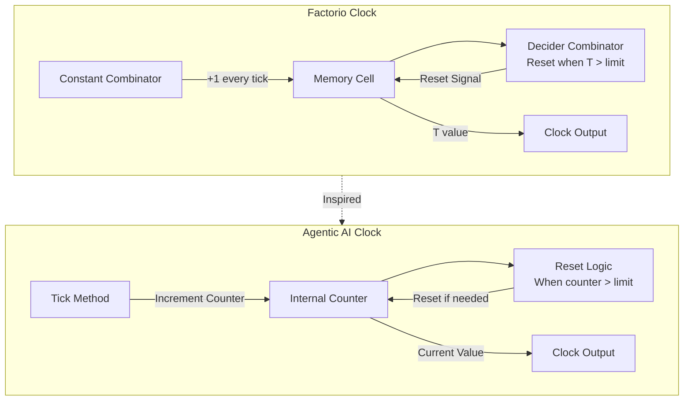
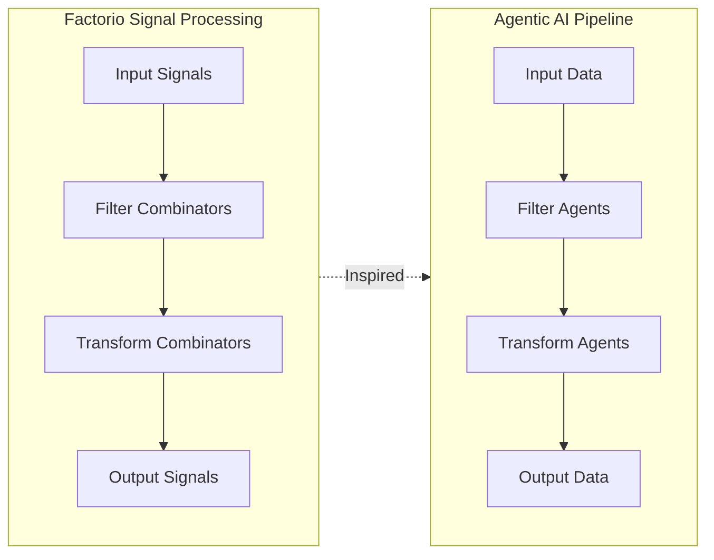
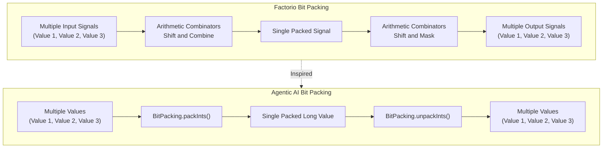
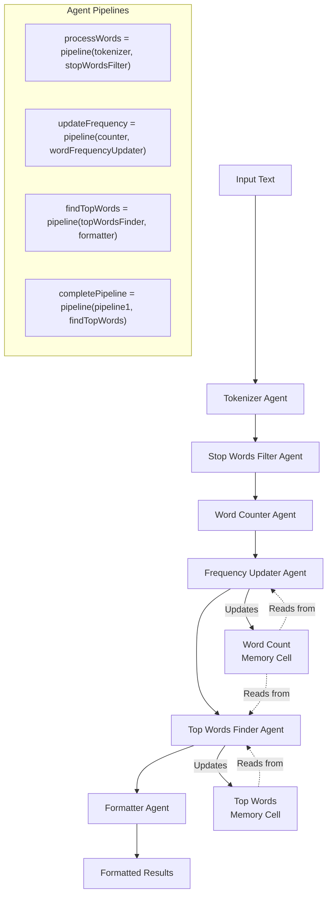
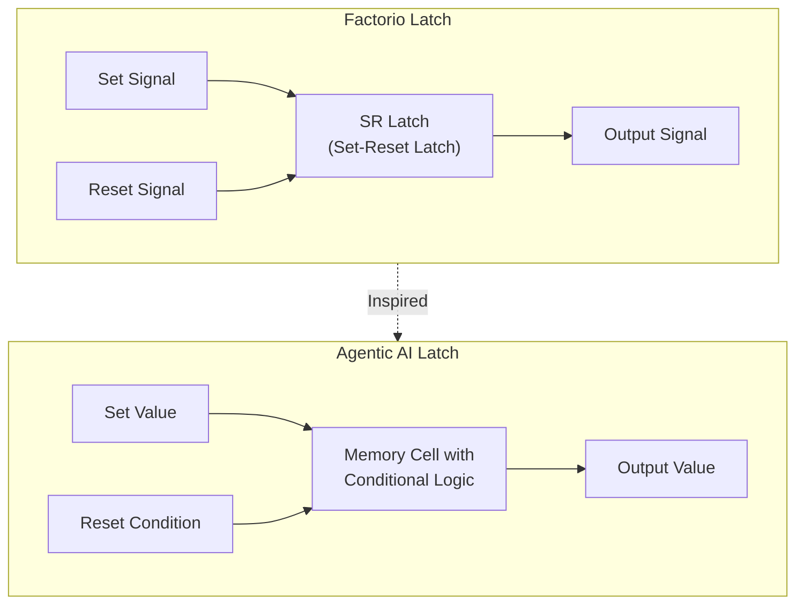

# Circuit Pattern Diagrams

This document contains visual representations of how Factorio circuit patterns are implemented in our Agentic AI framework.

## Memory Cell Comparison



## Clock Pattern



## Signal Processing Pipeline



## Bit Packing



## Text Processing Demo Architecture



## Latch Pattern



## Ring Buffer / Shift Register

```mermaid
flowchart LR
    subgraph Factorio["Factorio Shift Register"]
        F_Input["Input Signal"] --> F_Cell1["Memory Cell 1"]
        F_Cell1 --> F_Cell2["Memory Cell 2"]
        F_Cell2 --> F_Cell3["Memory Cell 3"]
        F_Cell3 --> F_Output["Output Signal"]
        F_Clock["Clock Signal"] -->|Triggers Shift| F_Cell1
        F_Clock -->|Triggers Shift| F_Cell2
        F_Clock -->|Triggers Shift| F_Cell3
    end
    
    subgraph AgenticAI["Agentic AI Sequential Processing"]
        A_Input["Input Data"] --> A_Agent1["Agent 1<br>First Transform"]
        A_Agent1 --> A_Agent2["Agent 2<br>Second Transform"]
        A_Agent2 --> A_Agent3["Agent 3<br>Third Transform"]
        A_Agent3 --> A_Output["Output Data"]
    end
    
    Factorio -.->|Inspired| AgenticAI