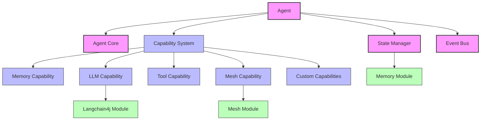

# ZIO Agentic AI Framework Agents Module

**Version:** 1.0.0  
**Last Updated:** April 19, 2025  
**Author:** ZIO Agentic AI Framework Team  

## Overview

The Agents module is a core component of the ZIO Agentic AI Framework, providing the foundation for creating intelligent, autonomous agents with a capability-based architecture. This module enables developers to build agents that can interact with external systems, process information, make decisions, and collaborate with other agents in a distributed mesh environment.

## Features

- **Capability-Based Architecture**: Extend agent functionality through composable capabilities
- **Lifecycle Management**: Create, initialize, pause, resume, and terminate agents
- **State Management**: Persist and retrieve agent state across sessions
- **LLM Integration**: Seamless integration with language models via the Langchain4j module
- **Tool Integration**: Connect agents to external tools and APIs
- **Event System**: React to and emit events for reactive agent behavior
- **Observability**: Monitor agent operations and internal state

## Architecture



## Core Components

### Agent

The central entity that encapsulates behavior, state, and capabilities:

```scala
trait Agent {
  // Identity
  def id: AgentId
  def name: Option[String]
  
  // Lifecycle
  def initialize: RIO[Any, Unit]
  def terminate: RIO[Any, Unit]
  def pause: RIO[Any, Unit]
  def resume: RIO[Any, Unit]
  
  // Capabilities
  def getCapability[C <: Capability](id: CapabilityId): Option[C]
  def addCapability[C <: Capability](capability: C): RIO[Any, Unit]
  def removeCapability(id: CapabilityId): RIO[Any, Unit]
  
  // Communication
  def processMessage(message: AgentMessage): RIO[Any, AgentResponse]
  def sendMessage(target: AgentId, content: String): RIO[Any, AgentResponse]
  
  // State
  def getState: RIO[Any, AgentState]
  def updateState(f: AgentState => AgentState): RIO[Any, Unit]
}
```

### Capability System

The extensible capability architecture that provides agent functionality:

```scala
trait Capability {
  def id: CapabilityId
  def initialize(agent: Agent): RIO[Any, Unit]
  def shutdown: RIO[Any, Unit]
}

// Example capabilities
trait MemoryCapability extends Capability {
  def remember(key: String, value: String): RIO[Any, Unit]
  def recall(key: String): RIO[Any, Option[String]]
}

trait LLMCapability extends Capability {
  def generate(prompt: String): RIO[Any, String]
  def chat(messages: List[ChatMessage]): RIO[Any, String]
}

trait ToolCapability extends Capability {
  def listTools: RIO[Any, List[Tool]]
  def registerTool(tool: Tool): RIO[Any, Unit]
  def executeTool(name: String, args: Map[String, String]): RIO[Any, ToolResult]
}
```

### Event System

The event system enables reactive agent behavior:

```scala
trait EventBus {
  def publish(event: AgentEvent): RIO[Any, Unit]
  def subscribe(filter: EventFilter): ZStream[Any, Nothing, AgentEvent]
}

sealed trait AgentEvent {
  def agentId: AgentId
  def timestamp: Instant
}

case class MessageReceivedEvent(agentId: AgentId, senderId: AgentId, content: String, timestamp: Instant) extends AgentEvent
case class MessageSentEvent(agentId: AgentId, recipientId: AgentId, content: String, timestamp: Instant) extends AgentEvent
case class CapabilityAddedEvent(agentId: AgentId, capabilityId: CapabilityId, timestamp: Instant) extends AgentEvent
case class StateChangedEvent(agentId: AgentId, timestamp: Instant) extends AgentEvent
```

## Usage Examples

### Creating a Simple Agent

```scala
import com.agenticai.agents._
import zio._

val program = for {
  // Create a new agent
  agent <- Agent.create("my-agent")
  
  // Add required capabilities
  _ <- agent.addCapability(MemoryCapability.default)
  _ <- agent.addCapability(LLMCapability.default)
  
  // Initialize the agent
  _ <- agent.initialize
  
  // Process a message
  response <- agent.processMessage(AgentMessage("Hello, agent!"))
  _ <- ZIO.logInfo(s"Agent responded: ${response.content}")
  
  // Clean up
  _ <- agent.terminate
} yield ()
```

### Creating an Agent with Custom Capability

```scala
import com.agenticai.agents._
import zio._

// Define a custom capability
case class WeatherCapability(id: CapabilityId = CapabilityId("weather")) extends Capability {
  def initialize(agent: Agent): RIO[Any, Unit] = ZIO.unit
  def shutdown: RIO[Any, Unit] = ZIO.unit
  
  def getCurrentWeather(location: String): RIO[Any, String] = 
    ZIO.succeed(s"The weather in $location is sunny.")
}

// Register and use the capability
val program = for {
  agent <- Agent.create("weather-agent")
  _ <- agent.addCapability(WeatherCapability())
  _ <- agent.initialize
  
  // Get weather capability and use it
  weatherCap <- ZIO.fromOption(agent.getCapability[WeatherCapability](CapabilityId("weather")))
    .orElseFail(new RuntimeException("Weather capability not found"))
  forecast <- weatherCap.getCurrentWeather("San Francisco")
  _ <- ZIO.logInfo(forecast)
  
  _ <- agent.terminate
} yield ()
```

### Building Multi-Agent Systems

```scala
import com.agenticai.agents._
import com.agenticai.mesh._
import zio._

val program = for {
  // Create mesh service
  mesh <- ZIO.service[MeshService]
  
  // Create two agents
  agentA <- Agent.create("agent-a")
  agentB <- Agent.create("agent-b")
  
  // Add capabilities
  _ <- agentA.addCapability(MemoryCapability.default)
  _ <- agentA.addCapability(LLMCapability.default)
  _ <- agentA.addCapability(MeshCapability.forMesh(mesh))
  
  _ <- agentB.addCapability(MemoryCapability.default)
  _ <- agentB.addCapability(LLMCapability.default)
  _ <- agentB.addCapability(MeshCapability.forMesh(mesh))
  
  // Initialize agents
  _ <- agentA.initialize
  _ <- agentB.initialize
  
  // Register with mesh
  _ <- mesh.registerAgent(agentA)
  _ <- mesh.registerAgent(agentB)
  
  // Agent A sends a message to Agent B
  response <- agentA.sendMessage(agentB.id, "Hello, Agent B!")
  _ <- ZIO.logInfo(s"Agent B responded: ${response.content}")
  
  // Clean up
  _ <- agentA.terminate
  _ <- agentB.terminate
} yield ()
```

## Extending Agents

The Agents module is designed to be extensible through custom capabilities and behaviors.

### Creating Custom Capabilities

To create a custom capability:

1. Define your capability trait extending `Capability`
2. Implement the required methods
3. Add any additional functionality
4. Register the capability with an agent

```scala
trait DataAnalysisCapability extends Capability {
  def analyze(data: List[Double]): RIO[Any, AnalysisResult]
  def forecast(data: List[Double], periods: Int): RIO[Any, List[Double]]
}

object DataAnalysisCapability {
  def default: DataAnalysisCapability = new DataAnalysisCapability {
    def id: CapabilityId = CapabilityId("data-analysis")
    def initialize(agent: Agent): RIO[Any, Unit] = ZIO.unit
    def shutdown: RIO[Any, Unit] = ZIO.unit
    
    def analyze(data: List[Double]): RIO[Any, AnalysisResult] = 
      ZIO.succeed(AnalysisResult(
        mean = data.sum / data.length,
        median = data.sorted.apply(data.length / 2),
        min = data.min,
        max = data.max
      ))
      
    def forecast(data: List[Double], periods: Int): RIO[Any, List[Double]] =
      // Implement forecasting logic
      ZIO.succeed(List.fill(periods)(data.sum / data.length))
  }
}
```

### Customizing Agent Behavior

To customize agent behavior:

1. Extend the `AgentBehavior` trait
2. Implement the message processing logic
3. Create an agent with your custom behavior

```scala
trait AgentBehavior {
  def processMessage(agent: Agent, message: AgentMessage): RIO[Any, AgentResponse]
}

object EchoAgentBehavior extends AgentBehavior {
  def processMessage(agent: Agent, message: AgentMessage): RIO[Any, AgentResponse] =
    ZIO.succeed(AgentResponse(s"Echo: ${message.content}"))
}

// Create an agent with custom behavior
val customAgent = for {
  agent <- Agent.createWithBehavior("echo-agent", EchoAgentBehavior)
  _ <- agent.initialize
} yield agent
```

## Configuration

Configure the Agents module through the standard ROO configuration system:

```hocon
# In application.conf
agents {
  default-capabilities = [
    "memory",
    "llm"
  ]
  
  lifecycle {
    init-timeout = 30 seconds
    termination-timeout = 10 seconds
  }
  
  state {
    persistence-enabled = true
    persistence-interval = 60 seconds
  }
  
  observability {
    metrics-enabled = true
    tracing-enabled = true
    log-level = "INFO"
  }
}
```

## Testing

The Agents module provides testing utilities to facilitate unit and integration tests:

```scala
import com.agenticai.agents.testing._
import zio.test._

object AgentSpec extends ZIOSpecDefault {
  def spec = suite("Agent")(
    test("should process messages correctly") {
      for {
        agent <- TestAgent.create()
        response <- agent.processMessage(AgentMessage("test"))
      } yield assertTrue(response.content.contains("test"))
    },
    
    test("should use capabilities") {
      for {
        agent <- TestAgent.create()
        _ <- agent.addCapability(TestCapability())
        cap <- ZIO.fromOption(agent.getCapability[TestCapability](CapabilityId("test")))
        result <- cap.testOperation()
      } yield assertTrue(result == "test")
    }
  )
}
```

## Performance Considerations

- **Memory Usage**: Monitor agent memory usage, especially with many agents
- **Capability Overhead**: Each capability adds some processing overhead
- **LLM Latency**: LLM operations may introduce significant latency
- **Concurrent Agents**: Tune ZIO runtime parameters for optimal concurrency

## Best Practices

1. **Start Minimal**: Begin with the minimal set of capabilities needed
2. **Use Layers**: Leverage ZIO layers for dependency injection
3. **Handle Errors**: Implement proper error handling for agent operations
4. **Test Thoroughly**: Create tests for all custom agent behaviors
5. **Monitor**: Implement monitoring for production agent systems

## Related Modules

- [Core Module](../core/README.md): Foundational data structures
- [Memory Module](../memory/README.md): Persistent storage
- [Mesh Module](../mesh/README.md): Agent communication
- [Langchain4j Module](../langchain4j/README.md): LLM integration

## Version History

### 1.0.0 (Current)

Initial stable release with the following features:
- Core agent infrastructure
- Capability-based architecture
- Event system
- State management
- LLM integration

### 0.9.0 (Beta)

- Added capability registry
- Added event bus
- Improved state management
- Enhanced testing utilities

### 0.5.0 (Alpha)

- Initial implementation of agents
- Basic capabilities
- Simple message handling