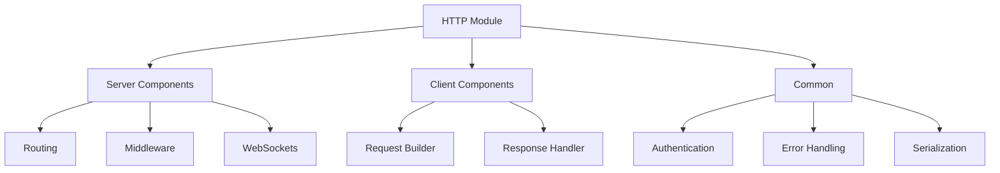

# ZIO Agentic AI Framework HTTP Module

**Version:** 1.0.0  
**Last Updated:** April 19, 2025  
**Author:** ZIO Agentic AI Framework Team  

## Overview

The HTTP module provides HTTP server and client capabilities for the ZIO Agentic AI Framework, enabling agent-based systems to interact with web services and expose HTTP APIs. It's built on ZIO HTTP and provides a purely functional interface for HTTP communication.

## Features

- **HTTP Server**: Create HTTP servers with routes for agent interaction
- **HTTP Client**: Make HTTP requests to external services
- **Websocket Support**: Bidirectional communication for real-time agent interactions
- **Request/Response Handling**: Type-safe handling of HTTP requests and responses
- **Middleware**: Authentication, logging, error handling, and more
- **JSON Integration**: Seamless JSON serialization/deserialization with zio-json
- **Streaming**: Efficient streaming of large data with ZIO Streams
- **Metrics**: Built-in metrics for monitoring HTTP services

## Architecture



## HTTP Server Usage

```scala
import com.agenticai.http.server.HttpServer
import com.agenticai.http.server.routes.Routes
import zio._

// Define routes
val routes = Routes.builder
  .get("/hello") { _ =>
    ZIO.succeed(Response.text("Hello, World!"))
  }
  .post("/agent/:id") { (req, params) =>
    for {
      agentId <- ZIO.succeed(params("id"))
      body <- req.body.asString
      response <- agentService.processMessage(agentId, body)
    } yield Response.json(response)
  }
  .build

// Create and start the server
val server = HttpServer.builder
  .port(8080)
  .routes(routes)
  .middleware(Middleware.cors, Middleware.logging)
  .build

// Run the server
val program = server.start *> ZIO.never

Unsafe.unsafely {
  Runtime.default.unsafe.run(program)
}
```

## HTTP Client Usage

```scala
import com.agenticai.http.client.HttpClient
import zio._

val client = HttpClient.default

val program = for {
  // Simple GET request
  response <- client.get("https://api.example.com/data")
  data <- response.body.asString
  
  // POST with JSON body
  jsonResponse <- client.post(
    "https://api.example.com/items",
    body = """{"name": "New Item", "value": 42}""",
    headers = Map("Content-Type" -> "application/json")
  )
  result <- jsonResponse.body.asString
} yield result

Unsafe.unsafely {
  Runtime.default.unsafe.run(program)
}
```

## Websocket Usage

```scala
import com.agenticai.http.server.WebSocketHandler
import com.agenticai.http.server.routes.Routes
import zio._
import zio.stream._

// Define websocket handler
val wsHandler = WebSocketHandler.build { channel =>
  for {
    // Send initial message
    _ <- channel.send("Connected to agent")
    
    // Process incoming messages
    _ <- channel.receive
      .tap(msg => ZIO.logInfo(s"Received: $msg"))
      .mapZIO(msg => agentService.processMessage("ws-agent", msg))
      .foreach(response => channel.send(response))
  } yield ()
}

// Add websocket route
val routes = Routes.builder
  // ... other routes
  .websocket("/ws/agent") { wsHandler }
  .build
```

## Integration with Agents

The HTTP module seamlessly integrates with the Agents module to expose agent functionality via HTTP:

```scala
import com.agenticai.agents.Agent
import com.agenticai.http.server.AgentRoutes
import zio._

val program = for {
  // Create an agent
  agent <- Agent.create("http-agent")
  
  // Generate routes for the agent
  routes <- AgentRoutes.forAgent(agent)
  
  // Create and start the server
  server <- HttpServer.builder
    .port(8080)
    .routes(routes)
    .build
    
  // Run forever
  _ <- server.start *> ZIO.never
} yield ()
```

## Configuration

Configure the HTTP module through the standard ZIO Agentic AI Framework configuration system:

```hocon
http {
  server {
    port = 8080
    host = "0.0.0.0"
    request-timeout = 30 seconds
  }
  
  client {
    connect-timeout = 10 seconds
    request-timeout = 30 seconds
    max-connections = 100
    follow-redirects = true
  }
  
  websocket {
    max-frame-size = 1048576
    ping-interval = 30 seconds
  }
}
```

## Testing

The HTTP module provides testing utilities to facilitate HTTP integration tests:

```scala
import com.agenticai.http.testing.HttpTestClient
import zio.test._

object HttpServerSpec extends ZIOSpecDefault {
  def spec = suite("HttpServer")(
    test("should handle requests correctly") {
      for {
        // Start test server with routes
        testServer <- HttpTestUtils.serverWithRoutes(routes)
        
        // Make request to test server
        response <- HttpTestClient.get(s"http://localhost:${testServer.port}/hello")
        body <- response.body.asString
      } yield assertTrue(body == "Hello, World!")
    }
  )
}
```

## Security Considerations

The HTTP module provides several security features:

- **CORS**: Configure Cross-Origin Resource Sharing
- **Authentication**: Integrate with various authentication schemes
- **CSRF Protection**: Built-in Cross-Site Request Forgery protection
- **Rate Limiting**: Protect against DoS attacks
- **TLS**: Configure SSL/TLS for secure communication

## Performance Tuning

For high-throughput applications, consider:

- Configuring thread pools and connection limits
- Using streaming for large payloads
- Implementing caching for frequently accessed resources
- Tuning ZIO Runtime parameters for HTTP workloads

## Troubleshooting

Common issues:

- **Connection refused**: Check server port and firewall settings
- **Timeout errors**: Adjust timeout configuration
- **Memory issues**: Configure appropriate buffer sizes for large payloads

Refer to the [HTTP Module Troubleshooting](../../docs/troubleshooting/HttpTroubleshooting.md) guide for more details.