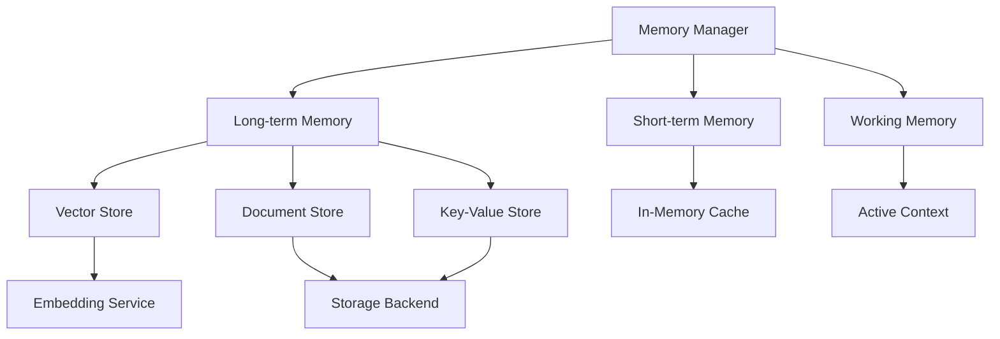

# ZIO Agentic AI Framework Memory Module

**Version:** 1.0.0  
**Last Updated:** April 19, 2025  
**Author:** ZIO Agentic AI Framework Team  

## Overview

The Memory module provides persistent and temporary storage capabilities for the ZIO Agentic AI Framework. It enables agents to store, retrieve, and reason about information across interactions and sessions, supporting both structured and unstructured data.

## Features

- **Multi-level Memory**: Short-term, working, and long-term memory abstractions
- **Semantic Storage**: Vector-based storage for semantic similarity queries
- **Structured Data**: Type-safe storage of structured data with schema validation
- **Memory Reasoning**: Tools for reasoning over stored information
- **ZIO Integration**: Pure functional implementation with ZIO
- **Pluggable Backends**: Support for various storage backends (in-memory, file, database)

## Architecture



## Usage

```scala
import com.agenticai.memory.MemorySystem
import com.agenticai.memory.store.DocumentStore
import zio._

val program = for {
  // Initialize the memory system
  memory <- MemorySystem.default
  
  // Store a document
  _ <- memory.documents.store("doc-1", "This is a test document")
  
  // Retrieve by ID
  doc <- memory.documents.retrieve("doc-1")
  
  // Search by semantic similarity
  results <- memory.documents.searchSimilar("test document", 5)
} yield results

// Run with ZIO runtime
Unsafe.unsafely {
  Runtime.default.unsafe.run(program)
}
```

## Integration

The Memory module integrates with:

- **Core**: For fundamental data structures and utilities
- **Agents**: To provide memory capabilities to agents
- **Mesh**: For distributed memory access patterns
- **Langchain4j**: For semantic search and embedding services

## Storage Backends

The Memory module supports multiple storage backends:

| Backend | Description | Use Case |
|---------|-------------|----------|
| In-Memory | Volatile storage in the JVM heap | Development, testing |
| File | Persistent storage in the filesystem | Single-instance deployment |
| Database | Persistent storage in a database | Production, multi-instance |
| Distributed | Shared storage across a cluster | Horizontal scaling |

## Configuration

Configure memory through the standard ZIO Agentic AI Framework configuration system:

```hocon
memory {
  default-backend = "file"
  
  backends {
    in-memory {
      enabled = true
    }
    
    file {
      enabled = true
      root-path = "/tmp/zio-agentic-ai-memory"
    }
    
    database {
      enabled = false
      url = "jdbc:postgresql://localhost/zio-agentic-ai"
      username = "zio-agentic-ai"
      password = "password"
    }
  }
  
  embeddings {
    service = "openai"
    dimensions = 1536
    model = "text-embedding-ada-002"
  }
}
```

## Testing

Memory implementations can be tested using the test utilities provided:

```scala
import com.agenticai.memory.testing.MemoryTestUtils
import zio.test._

object MemorySpec extends ZIOSpecDefault {
  def spec = suite("Memory")(
    test("should store and retrieve documents") {
      for {
        memory <- MemoryTestUtils.inMemorySystem
        _ <- memory.documents.store("test", "content")
        result <- memory.documents.retrieve("test")
      } yield assertTrue(result.contains("content"))
    }
  )
}
```

## Troubleshooting

Common issues:

- **Connection failures**: Check database connection parameters
- **Persistence errors**: Verify file permissions and paths
- **Memory leaks**: Monitor memory usage with in-memory backend

Refer to the [Memory System Troubleshooting](../../docs/troubleshooting/MemoryTroubleshooting.md) section in the troubleshooting guide for more details.